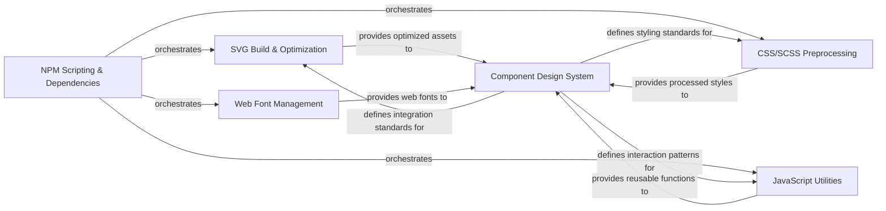

## Details

This subsystem, "Frontend Asset Build and Component System," is responsible for the entire pipeline of processing raw frontend assets (SVGs, CSS/SCSS, JavaScript, Web Fonts) and integrating them into a structured, reusable component library. It acts as a self-contained unit within the larger project, focusing on efficient asset delivery and consistent UI component development.

### NPM Scripting & Dependencies
Manages project dependencies and defines the scripts for building, testing, and deploying frontend assets. It serves as the central orchestrator for the entire frontend asset pipeline.

**Related Classes/Methods**:

- <a href="https://github.com/django/django/blob/main/package.json" target="_blank" rel="noopener noreferrer">`package.json`</a>

### SVG Build & Optimization
Processes raw SVG files to perform optimization (e.g., minification), generate SVG sprites, and potentially convert formats, ensuring icons are lightweight and performant for web use.

**Related Classes/Methods**: _None_

### CSS/SCSS Preprocessing
Compiles and transforms CSS/SCSS files, applying features like nesting, variables, mixins, and autoprefixing, to produce production-ready, optimized CSS.

**Related Classes/Methods**: _None_

### JavaScript Utilities
Provides reusable JavaScript functions and modules that support frontend interactions, dynamic loading, or other behaviors required by the icon toolkit or design system components.

**Related Classes/Methods**: _None_

### Web Font Management
Manages the inclusion, optimization, and delivery of web fonts, particularly relevant if icons are implemented as icon fonts. Ensures cross-browser compatibility and performance.

**Related Classes/Methods**: _None_

### Component Design System
Defines the architectural patterns, guidelines, and actual reusable UI components (e.g., React or Vue components) that integrate the processed SVG, CSS, and JavaScript assets into a cohesive and consistent UI library. It serves as the primary interface for consuming the icon toolkit.

**Related Classes/Methods**: _None_

### [FAQ](https://github.com/CodeBoarding/GeneratedOnBoardings/tree/main?tab=readme-ov-file#faq)