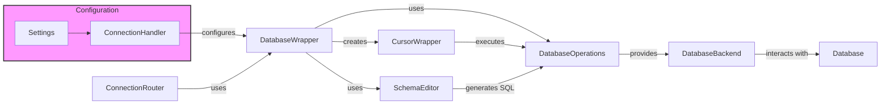

## Database Abstraction Layer Overview
This diagram illustrates the flow of data and control within Django's Database Abstraction Layer. It highlights the key components involved in handling database interactions, from connection management to query execution and schema alterations.

