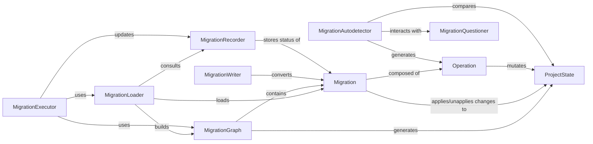

## Component Details

The `Database Migrations` component in Django is a sophisticated system designed to manage and apply changes to the database schema in a controlled and versioned manner. It leverages an in-memory representation of the application's models (`ProjectState`) to detect differences, generate migration files, and orchestrate their application to the database.

### MigrationLoader
This component is responsible for discovering and loading all migration files from installed applications on disk. It parses their dependencies and constructs a comprehensive `MigrationGraph`. It also identifies which migrations have already been applied to the database by consulting the `MigrationRecorder`.

**Related Classes/Methods**:

- <a href="https://github.com/django/django/blob/master/django/db/migrations/loader.py#L20-L417" target="_blank" rel="noopener noreferrer">`django.db.migrations.loader.MigrationLoader` (20:417)</a>

### ProjectState
Represents the complete in-memory schema state of all applications and their models at a specific point in time. This state is crucial for detecting differences between schema versions and for applying migration operations in a simulated environment. The `StateApps` class, a cached property within `ProjectState`, provides a stateful representation of the `Apps Registry` for schema introspection.

**Related Classes/Methods**:

- <a href="https://github.com/django/django/blob/master/django/db/migrations/state.py#L93-L601" target="_blank" rel="noopener noreferrer">`django.db.migrations.state.ProjectState` (93:601)</a>

### Migration
Encapsulates a single migration file. It defines a list of atomic `Operation` objects that specify the schema changes, along with metadata like dependencies on other migrations, migrations it replaces (for squashing), and whether it should run before other migrations. It provides methods to apply (`apply`) and unapply (`unapply`) its operations to a `ProjectState` and a `SchemaEditor`.

**Related Classes/Methods**:

- <a href="https://github.com/django/django/blob/master/django/db/migrations/migration.py#L8-L221" target="_blank" rel="noopener noreferrer">`django.db.migrations.migration.Migration` (8:221)</a>

### Operation
This is the base class for all atomic, reversible (where applicable) operations that can be applied to a database schema or an in-memory `ProjectState`. Concrete implementations (e.g., `CreateModel`, `AddField`, `AlterField`) define how to mutate the `ProjectState` (`state_forwards`) and how to perform the actual database changes (`database_forwards`, `database_backwards`).

**Related Classes/Methods**:

- <a href="https://github.com/django/django/blob/master/django/db/migrations/operations/base.py#L15-L176" target="_blank" rel="noopener noreferrer">`django.db.migrations.operations.base.Operation` (15:176)</a>

### MigrationGraph
Represents the directed acyclic graph (DAG) of all migrations, mapping their dependencies. It is built by the `MigrationLoader` and is essential for determining the correct order of migration application, detecting circular dependencies, and identifying conflicts. It can also generate a `ProjectState` up to a specific set of migration nodes.

**Related Classes/Methods**:

- <a href="https://github.com/django/django/blob/master/django/db/migrations/graph.py#L62-L332" target="_blank" rel="noopener noreferrer">`django.db.migrations.graph.MigrationGraph` (62:332)</a>

### MigrationExecutor
Orchestrates the application and unapplication of migrations to the database. It uses the `MigrationLoader` to get available migrations and the `MigrationGraph` to determine the precise sequence of operations needed to reach a target state. It interacts with the `MigrationRecorder` to update the database's record of applied migrations.

**Related Classes/Methods**:

- <a href="https://github.com/django/django/blob/master/django/db/migrations/executor.py#L9-L411" target="_blank" rel="noopener noreferrer">`django.db.migrations.executor.MigrationExecutor` (9:411)</a>

### MigrationAutodetector
The "brain" behind the `makemigrations` command. It compares two `ProjectState` instances (typically the current state of models in `models.py` and a historical `ProjectState` representing the last applied migrations) and generates the necessary `Operation` objects to bridge the differences. It interacts with the `MigrationQuestioner` to resolve ambiguities.

**Related Classes/Methods**:

- <a href="https://github.com/django/django/blob/master/django/db/migrations/autodetector.py#L41-L1962" target="_blank" rel="noopener noreferrer">`django.db.migrations.autodetector.MigrationAutodetector` (41:1962)</a>

### MigrationQuestioner
Provides an interface for interacting with the user during the `makemigrations` process. It asks for clarification on ambiguous changes, such as model or field renames, or when adding non-nullable fields without a default.

**Related Classes/Methods**:

- <a href="https://github.com/django/django/blob/master/django/db/migrations/questioner.py#L14-L86" target="_blank" rel="noopener noreferrer">`django.db.migrations.questioner.MigrationQuestioner` (14:86)</a>

### MigrationRecorder
Manages the `django_migrations` table in the database, which serves as the authoritative record of applied migrations. It ensures the table exists and provides methods to record when a migration is applied or unapplied.

**Related Classes/Methods**:

- <a href="https://github.com/django/django/blob/master/django/db/migrations/recorder.py#L8-L110" target="_blank" rel="noopener noreferrer">`django.db.migrations.recorder.MigrationRecorder` (8:110)</a>

### MigrationWriter
Takes a `Migration` instance and generates the Python source code for a new migration file. It serializes the `Operation` objects, handles imports, and formats the file content, including dependencies and other migration metadata.

**Related Classes/Methods**:

- <a href="https://github.com/django/django/blob/master/django/db/migrations/writer.py#L117-L301" target="_blank" rel="noopener noreferrer">`django.db.migrations.writer.MigrationWriter` (117:301)</a>

### [FAQ](https://github.com/CodeBoarding/GeneratedOnBoardings/tree/main?tab=readme-ov-file#faq)