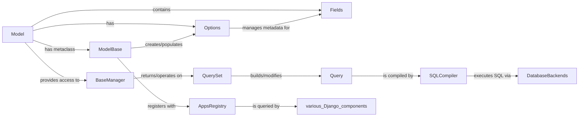

## Component Details

The `Database Models (ORM Core)` subsystem in Django is the heart of its Object-Relational Mapper. It provides a powerful and intuitive way to interact with databases using Python objects, abstracting away the complexities of SQL. The core components work in concert to define, manage, query, and persist data models.

### Model
The foundational class (`django.db.models.base.Model`) that developers inherit from to define their database tables as Python classes. Each instance of a `Model` subclass represents a row in the corresponding database table. It provides the high-level interface for interacting with individual database records, including methods for saving, deleting, and refreshing data.

**Related Classes/Methods**:

- <a href="https://github.com/django/django/blob/master/django/db/models/base.py#L480-L2407" target="_blank" rel="noopener noreferrer">`django.db.models.base.Model` (480:2407)</a>

### ModelBase
This is the metaclass (`django.db.models.base.ModelBase`) for all Django models. During the creation of any `Model` subclass, `ModelBase.__new__` is invoked. It's responsible for crucial setup tasks, including populating the `_meta` attribute (an `Options` instance) with model metadata, processing fields, and critically, registering the new model class with the `AppsRegistry`.

**Related Classes/Methods**:

- <a href="https://github.com/django/django/blob/master/django/db/models/base.py#L93-L457" target="_blank" rel="noopener noreferrer">`django.db.models.base.ModelBase` (93:457)</a>

### Options
Often accessed as `_meta` on a model class or instance, this class (`django.db.models.options.Options`) holds all the metadata about a model. This includes its database table name, field definitions, ordering, unique constraints, and relationships. It's the blueprint that guides the ORM's behavior for a specific model.

**Related Classes/Methods**:

- <a href="https://github.com/django/django/blob/master/django/db/models/options.py#L89-L1042" target="_blank" rel="noopener noreferrer">`django.db.models.options.Options` (89:1042)</a>

### Fields
This package (`django.db.models.fields`) contains a wide variety of field types (e.g., `CharField`, `IntegerField`, `DateField`, `ForeignKey`, `ManyToManyField`). Each field type defines how a specific piece of data is stored in the database, its validation rules, and how it interacts with the ORM, including database column type mapping.

**Related Classes/Methods**:

- `django.db.models.fields` (1:1)

### BaseManager
The base class for all model managers (`django.db.models.manager.BaseManager`), typically accessed via `MyModel.objects`. Managers provide the primary interface for database query operations (e.g., `all()`, `filter()`, `get()`, `create()`). They are the gateway to interacting with a model's data at a collection level.

**Related Classes/Methods**:

- <a href="https://github.com/django/django/blob/master/django/db/models/manager.py#L9-L172" target="_blank" rel="noopener noreferrer">`django.db.models.manager.BaseManager` (9:172)</a>

### QuerySet
Represents a collection of database queries (`django.db.models.query.QuerySet`). `QuerySet` objects are "lazy," meaning they don't hit the database until they are evaluated (e.g., iterated over, converted to a list, or a method like `get()` is called). They provide a powerful, chainable interface for building complex queries.

**Related Classes/Methods**:

- <a href="https://github.com/django/django/blob/master/django/db/models/query.py#L1-L1" target="_blank" rel="noopener noreferrer">`django.db.models.query.QuerySet` (1:1)</a>

### Query
This is the low-level SQL query builder (`django.db.models.sql.query.Query`). A `QuerySet` translates its high-level Python operations into a `Query` object, which represents the abstract structure of the SQL statement to be executed (e.g., SELECT, INSERT, UPDATE, DELETE clauses, joins, WHERE conditions).

**Related Classes/Methods**:

- <a href="https://github.com/django/django/blob/master/django/db/models/sql/query.py#L1-L1" target="_blank" rel="noopener noreferrer">`django.db.models.sql.query.Query` (1:1)</a>

### SQLCompiler
Responsible for taking a `Query` object and compiling it into a database-specific SQL string and its parameters (`django.db.models.sql.compiler.SQLCompiler`). Different database backends (e.g., PostgreSQL, MySQL, SQLite) have their own `SQLCompiler` implementations to handle dialect differences and optimize queries for that specific database.

**Related Classes/Methods**:

- <a href="https://github.com/django/django/blob/master/django/db/models/sql/compiler.py#L39-L1674" target="_blank" rel="noopener noreferrer">`django.db.models.sql.compiler.SQLCompiler` (39:1674)</a>

### AppsRegistry
Django's central registry of installed applications and their models (`django.apps.registry.AppsRegistry`). It maintains a complete record of all defined models, making them discoverable and accessible by other Django components (e.g., migrations, admin, contenttypes). `ModelBase` registers new models with this registry.

**Related Classes/Methods**:

- <a href="https://github.com/django/django/blob/master/django/apps/registry.py#L1-L1" target="_blank" rel="noopener noreferrer">`django.apps.registry.AppsRegistry` (1:1)</a>

### DatabaseBackends
This is an abstract component representing the various database-specific implementations (e.g., `django.db.backends.postgresql`, `django.db.backends.mysql`, `django.db.backends.sqlite3`). Each backend handles the actual communication with its respective database system, executing SQL queries and managing connections.

**Related Classes/Methods**:

- <a href="https://github.com/django/django/blob/master/django/template/backends/django.py#L1-L1" target="_blank" rel="noopener noreferrer">`django.db.backends` (1:1)</a>

### [FAQ](https://github.com/CodeBoarding/GeneratedOnBoardings/tree/main?tab=readme-ov-file#faq)