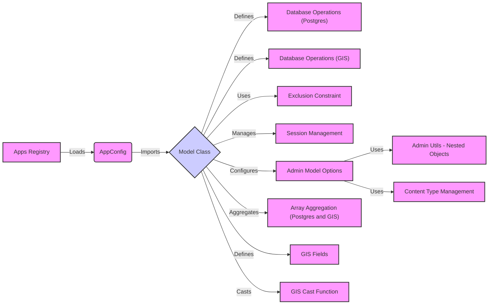

## Database Models Overview

This diagram illustrates the flow of data and interactions between key components involved in defining and managing database models in Django.

### Component Descriptions:

*   **Apps Registry**: Manages the configuration of Django applications, loading `AppConfig` instances. It loads the configuration for each installed app.
    *   **Relevant source files**: `django.apps.registry.Apps`

*   **AppConfig**: Represents the configuration of a single Django application, importing models defined within the app. It imports the models defined in the app's `models.py` file.
    *   **Relevant source files**: `django.apps.config.AppConfig`

*   **Model Class**: The base class for defining database models. It defines the structure and behavior for interacting with database tables. It's the central component around which other components interact.
    *   **Relevant source files**: `django.db.models.base.Model`

*   **Database Operations (Postgres)**: Handles database schema modifications, particularly for PostgreSQL-specific features.
    *   **Relevant source files**: `django.contrib.postgres.operations`

*   **Database Operations (GIS)**: Handles database schema modifications, particularly for GIS-specific features.
    *   **Relevant source files**: `django.contrib.gis.db.backends.postgis.operations`

*   **Exclusion Constraint**: Represents a database exclusion constraint, ensuring that certain combinations of values are not allowed in a table. It uses the `Model Class` to define the constraint.
    *   **Relevant source files**: `django.contrib.postgres.constraints.ExclusionConstraint`

*   **Session Management**: Manages user sessions, including saving and retrieving session data from the database. It uses the `Model Class` to define the session model.
    *   **Relevant source files**: `django.contrib.sessions.backends.db.SessionStore`, `django.contrib.sessions.models.Session`

*   **Admin Model Options**: Configures the behavior of models within the Django admin interface. It uses the `Model Class` to configure the admin interface for each model.
    *   **Relevant source files**: `django.contrib.admin.options.ModelAdmin`

*   **Admin Utils - Nested Objects**: Utility functions for handling nested objects in the Django admin, particularly for deletion operations. It uses the `Model Class` to collect nested objects.
    *   **Relevant source files**: `django.contrib.admin.utils.NestedObjects`

*   **Content Type Management**: Retrieves content types for models, used in the Django admin for logging and other purposes. It uses the `Model Class` to retrieve content types.
    *   **Relevant source files**: `django.contrib.contenttypes.models.ContentTypeManager`

*   **Array Aggregation (Postgres and GIS)**: Handles array aggregation in PostgreSQL and GIS contexts, defining the output field type. It uses the `Model Class` to define the aggregation.
    *   **Relevant source files**: `django.contrib.postgres.aggregates.general.ArrayAgg`, `django.contrib.gis.aggregates.general.ArrayAgg`

*   **GIS Fields**: Defines custom fields for storing geographic data. It's used by the `Model Class` to define GIS-specific fields.
    *   **Relevant source files**: `django.contrib.gis.db.models.fields`

*   **GIS Cast Function**: Implements the Cast function for GIS data types, allowing type conversions in database queries. It's used by the `Model Class` to cast GIS data types.
    *   **Relevant source files**: `django.contrib.gis.db.models.functions.comparison.Cast`
