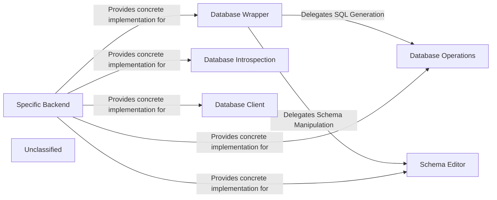

## Details

The Django database backend subsystem is designed around a set of abstract base classes that define a common interface for database operations. Each supported database engine provides a concrete implementation of these classes in a specific backend package. The `BaseDatabaseWrapper` acts as the central coordinator, aggregating functionality from other specialized components like `BaseDatabaseOperations` for SQL generation, `BaseDatabaseSchemaEditor` for migrations, `BaseDatabaseIntrospection` for schema discovery, and `BaseDatabaseClient` for command-line shell integration. This architecture allows the Django ORM to work seamlessly across different databases by abstracting away engine-specific details.

### Database Wrapper
The primary facade for all database interactions. It manages connections, transactions, and cursors, delegating database-specific operations to other components. It is the main entry point for the ORM.

**Related Classes/Methods**:

- <a href="https://github.com/django/django/blob/main/django/db/backends/base/base.py#L30-L792" target="_blank" rel="noopener noreferrer">`django.db.backends.base.base.BaseDatabaseWrapper`:30-792</a>

### Database Operations
Responsible for generating database-specific SQL syntax. It handles tasks like quoting names, formatting data types for queries, and constructing SQL clauses unique to a particular database engine.

**Related Classes/Methods**:

- <a href="https://github.com/django/django/blob/main/django/db/backends/base/operations.py#L16-L855" target="_blank" rel="noopener noreferrer">`django.db.backends.base.operations.BaseDatabaseOperations`:16-855</a>

### Schema Editor
Manages Data Definition Language (DDL). It provides the logic to create, alter, and delete tables, columns, and constraints, forming the core engine for the Django migration framework.

**Related Classes/Methods**:

- <a href="https://github.com/django/django/blob/main/django/db/backends/base/schema.py#L78-L2065" target="_blank" rel="noopener noreferrer">`django.db.backends.base.schema.BaseDatabaseSchemaEditor`:78-2065</a>

### Database Introspection
Provides metadata about the database schema. It is used to examine existing tables, columns, indexes, and relations, primarily serving the `inspectdb` management command.

**Related Classes/Methods**:

- <a href="https://github.com/django/django/blob/main/django/db/backends/base/introspection.py#L16-L228" target="_blank" rel="noopener noreferrer">`django.db.backends.base.introspection.BaseDatabaseIntrospection`:16-228</a>

### Database Client
Encapsulates the logic for interacting with the database's native command-line client. This component is used by the `dbshell` management command to provide direct shell access.

**Related Classes/Methods**:

- <a href="https://github.com/django/django/blob/main/django/db/backends/base/client.py#L5-L31" target="_blank" rel="noopener noreferrer">`django.db.backends.base.client.BaseDatabaseClient`:5-31</a>

### Specific Backend
A concrete implementation of the abstract base components for a specific database (e.g., PostgreSQL, MySQL). It inherits from the base classes and provides the actual implementation logic.

**Related Classes/Methods**:

- <a href="https://github.com/django/django/blob/main/django/db/backends/postgresql/base.py#L98-L556" target="_blank" rel="noopener noreferrer">`django.db.backends.postgresql.base.DatabaseWrapper`:98-556</a>
- <a href="https://github.com/django/django/blob/main/django/db/backends/mysql/base.py#L103-L443" target="_blank" rel="noopener noreferrer">`django.db.backends.mysql.base.DatabaseWrapper`:103-443</a>

### Unclassified
Component for all unclassified files and utility functions (Utility functions/External Libraries/Dependencies)

**Related Classes/Methods**: _None_

### [FAQ](https://github.com/CodeBoarding/GeneratedOnBoardings/tree/main?tab=readme-ov-file#faq)