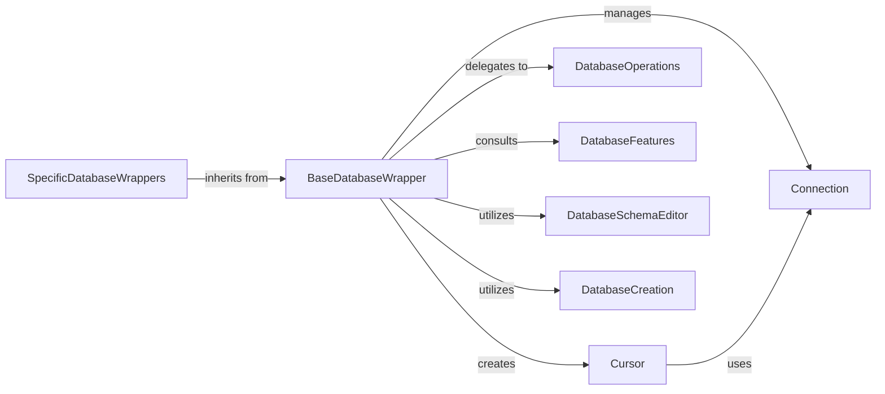

## Details

The Django database backend subsystem is designed around the `BaseDatabaseWrapper`, which serves as the central abstraction for all database interactions. Concrete `SpecificDatabaseWrappers` (e.g., for PostgreSQL, MySQL) extend this base, providing database-specific implementations while adhering to a common interface. The `BaseDatabaseWrapper` manages `Connection` objects, which represent the direct link to the database, and facilitates the creation of `Cursor` objects for executing SQL queries. To handle database-specific nuances, the `BaseDatabaseWrapper` delegates to `DatabaseOperations` for SQL generation and quoting, and consults `DatabaseFeatures` to understand the capabilities and limitations of the underlying database. Furthermore, the subsystem includes `DatabaseSchemaEditor` for managing schema migrations and `DatabaseCreation` for handling database setup and teardown, particularly for testing environments. This modular design ensures Django's flexibility and compatibility across various database systems.

Critical Interaction Pathways:
1.  **Connection Management:** `BaseDatabaseWrapper` manages the lifecycle of `Connection` objects, establishing and closing connections as needed.
2.  **Query Execution:** `BaseDatabaseWrapper` creates `Cursor` objects, which then use the `Connection` to execute SQL queries and fetch results.
3.  **Database-Specific Adaptations:** `BaseDatabaseWrapper` interacts with `DatabaseOperations` to generate correct SQL and with `DatabaseFeatures` to adapt behavior based on the specific database's capabilities.
4.  **Schema and Database Management:** `BaseDatabaseWrapper` utilizes `DatabaseSchemaEditor` for schema changes and `DatabaseCreation` for database setup/teardown, integrating these critical functions into the overall database interaction flow.

### BaseDatabaseWrapper
The foundational abstract class that defines the common interface for all database connections. It acts as the central orchestrator for database interactions, managing connection pooling, transaction control, and providing methods for creating cursors. This is crucial for a framework supporting multiple database types.

**Related Classes/Methods**:

- <a href="https://github.com/django/django//blob/django/db/backends/base/base.py#L30-L792" target="_blank" rel="noopener noreferrer">`django.db.backends.base.base.BaseDatabaseWrapper`:30-792</a>

### SpecificDatabaseWrappers
Concrete implementations of `BaseDatabaseWrapper` tailored for specific database systems (e.g., PostgreSQL, MySQL, SQLite). These components are essential for a flexible web framework that needs to support various database technologies. While there isn't a single `SpecificDatabaseWrapper` class, examples like `django.db.backends.postgresql.base.DatabaseWrapper` serve this role by inheriting from `BaseDatabaseWrapper`.

**Related Classes/Methods**:

- <a href="https://github.com/django/django//blob/django/db/backends/postgresql/base.py#L90-L549" target="_blank" rel="noopener noreferrer">`django.db.backends.postgresql.base.DatabaseWrapper`:90-549</a>

### Connection
Represents an active, low-level connection to the underlying database. It is typically managed by a `BaseDatabaseWrapper` instance and provides the direct interface for communication with the database.

**Related Classes/Methods**:

- <a href="https://github.com/django/django//blob/django/db/backends/base/base.py" target="_blank" rel="noopener noreferrer">`django.db.backends.base.base.Connection`</a>

### Cursor
An object used to execute SQL queries and fetch results from the database. It acts as the direct interface for sending commands to the database and retrieving data, operating over an active `Connection`.

**Related Classes/Methods**:

- <a href="https://github.com/django/django//blob/django/db/backends/base/base.py" target="_blank" rel="noopener noreferrer">`django.db.backends.base.base.Cursor`</a>

### DatabaseOperations
An abstract component (often a class or mixin) that provides database-specific SQL functions, quoting rules, and other operational details. This ensures that Django can generate correct and optimized SQL for each backend.

**Related Classes/Methods**:

- <a href="https://github.com/django/django//blob/django/db/backends/base/operations.py" target="_blank" rel="noopener noreferrer">`django.db.backends.base.operations.DatabaseOperations`</a>

### DatabaseFeatures
A component that exposes the capabilities and limitations of the underlying database. This allows Django to adapt its behavior, leverage specific database features, or work around limitations, ensuring compatibility and optimal performance.

**Related Classes/Methods**:

- <a href="https://github.com/django/django//blob/django/db/backends/base/features.py" target="_blank" rel="noopener noreferrer">`django.db.backends.base.features.DatabaseFeatures`</a>

### DatabaseSchemaEditor
Responsible for performing schema migrations, including adding, altering, and dropping tables and columns. This is a cornerstone feature of modern web frameworks for managing database evolution and applying changes defined in Django migrations.

**Related Classes/Methods**:

- <a href="https://github.com/django/django//blob/django/db/backends/base/schema.py" target="_blank" rel="noopener noreferrer">`django.db.backends.base.schema.DatabaseSchemaEditor`</a>

### DatabaseCreation
Manages the creation and destruction of databases, particularly for running tests. This is a critical component for automated testing in a web framework, ensuring a clean database state for each test run.

**Related Classes/Methods**:

- <a href="https://github.com/django/django//blob/django/db/backends/base/creation.py" target="_blank" rel="noopener noreferrer">`django.db.backends.base.creation.DatabaseCreation`</a>

### [FAQ](https://github.com/CodeBoarding/GeneratedOnBoardings/tree/main?tab=readme-ov-file#faq)