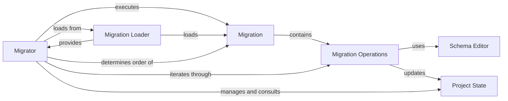

## Details

The Database Migrations subsystem in Django is responsible for managing database schema changes in a version-controlled manner. It ensures that the database schema evolves consistently with the application's models.

### Migration
Defines a single, versioned set of database schema changes. Each Migration object contains a list of Operation objects and manages dependencies on other migrations to ensure correct application order. This component represents the atomic unit of schema change.

**Related Classes/Methods**:

- <a href="https://github.com/django/django//blob/django/db/migrations/migration.py#L9-L222" target="_blank" rel="noopener noreferrer">`django.db.migrations.migration.Migration`:9-222</a>

### Migration Operations
Represents atomic units of database schema modification (e.g., CreateModel, AddField, AlterField, RunPython, RunSQL). Each operation knows how to apply and unapply itself to the database schema. These are the building blocks of a Migration.

**Related Classes/Methods**:

- <a href="https://github.com/django/django//blob/django/db/migrations/operations" target="_blank" rel="noopener noreferrer">`django.db.migrations.operations`</a>

### Migrator
The central orchestrator of the migration process. It determines the correct order in which migrations should be applied, resolves dependencies, and executes the Migration objects. This component acts as the execution engine for migrations.

**Related Classes/Methods**:

- <a href="https://github.com/django/django//blob/django/db/migrations/executor.py#L10-L414" target="_blank" rel="noopener noreferrer">`django.db.migrations.executor.MigrationExecutor`:10-414</a>

### Migration Loader
Discovers and loads migration files from all installed Django applications, building a comprehensive graph of all available migrations and their dependencies. This component is responsible for providing the Migrator with the necessary migration definitions.

**Related Classes/Methods**:

- <a href="https://github.com/django/django//blob/django/db/migrations/loader.py#L21-L422" target="_blank" rel="noopener noreferrer">`django.db.migrations.loader.MigrationLoader`:21-422</a>

### Project State
An in-memory representation of the database schema and Django models as they would exist after a set of migrations have been applied. It's crucial for dependency resolution and for generating new migrations (e.g., makemigrations). This component maintains the conceptual state of the database.

**Related Classes/Methods**:

- <a href="https://github.com/django/django//blob/django/db/migrations/state.py#L95-L603" target="_blank" rel="noopener noreferrer">`django.db.migrations.state.ProjectState`:95-603</a>

### Schema Editor
An abstraction layer that provides database-agnostic methods for performing DDL (Data Definition Language) operations (e.g., create_table, add_field, alter_field). Each database backend provides its own implementation of this editor, allowing migrations to be database-agnostic.

**Related Classes/Methods**:

- <a href="https://github.com/django/django//blob/django/db/backends/base/schema.py#L78-L2051" target="_blank" rel="noopener noreferrer">`django.db.backends.base.schema.BaseDatabaseSchemaEditor`:78-2051</a>

### [FAQ](https://github.com/CodeBoarding/GeneratedOnBoardings/tree/main?tab=readme-ov-file#faq)