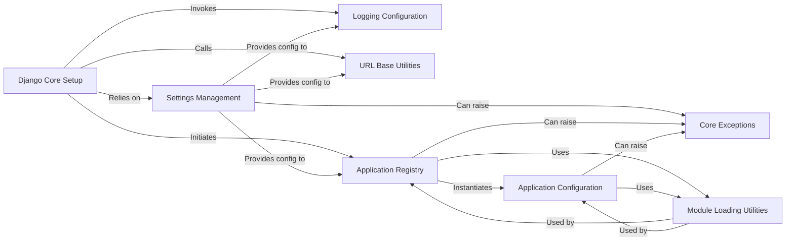

## Component Details

Here's a refined overview of the core components involved in Django's setup process, their responsibilities, and their interactions. These components are fundamental because they collectively establish the foundational environment for any Django application to run, from loading configurations to preparing the application registry.

### Django Core Setup
This component, primarily through the `django.setup()` function, acts as the central orchestrator for initializing the entire Django environment. It ensures that settings are loaded, logging is configured, and the application registry is populated, preparing the framework for handling requests or executing management commands.

**Related Classes/Methods**:

- <a href="https://github.com/django/django/blob/master/django/template/backends/django.py#L1-L1" target="_blank" rel="noopener noreferrer">`django.setup` (1:1)</a>

### Settings Management
Responsible for loading, validating, and providing access to Django's configuration values defined in the project's settings file. It's crucial for various aspects of the framework's operation, including logging, URL prefixing, and identifying installed applications.

**Related Classes/Methods**:

- <a href="https://github.com/django/django/blob/master/django/template/backends/django.py#L1-L1" target="_blank" rel="noopener noreferrer">`django.conf.settings` (1:1)</a>

### Logging Configuration
Manages the setup and configuration of the application's logging system. It ensures that log messages are handled according to the defined settings, providing a standardized way for the application to record events and debug information.

**Related Classes/Methods**:

- <a href="https://github.com/django/django/blob/master/django/utils/log.py#L66-L75" target="_blank" rel="noopener noreferrer">`django.utils.log.configure_logging` (66:75)</a>

### URL Base Utilities
Provides utility functions for managing and setting the base URL prefix for the Django application. This is essential for correct URL resolution and routing, ensuring that all generated URLs are consistent with the application's deployment environment.

**Related Classes/Methods**:

- <a href="https://github.com/django/django/blob/master/django/template/backends/django.py#L1-L1" target="_blank" rel="noopener noreferrer">`django.urls.set_script_prefix` (1:1)</a>

### Application Registry
This central component manages the lifecycle of all installed Django applications. It is responsible for discovering, loading, and providing access to `AppConfig` instances, ensuring that applications are properly initialized and their models are ready for use.

**Related Classes/Methods**:

- <a href="https://github.com/django/django/blob/master/django/apps/registry.py#L60-L126" target="_blank" rel="noopener noreferrer">`django.apps.registry.Apps.populate` (60:126)</a>
- <a href="https://github.com/django/django/blob/master/django/apps/registry.py#L369-L384" target="_blank" rel="noopener noreferrer">`django.apps.registry.Apps.clear_cache` (369:384)</a>
- <a href="https://github.com/django/django/blob/master/django/apps/registry.py#L144-L147" target="_blank" rel="noopener noreferrer">`django.apps.registry.Apps.get_app_configs` (144:147)</a>

### Application Configuration
Represents the configuration of a single Django application. It holds metadata about the application and is responsible for its initialization, including checking for submodules (like `models.py`, `admin.py`) and performing app-specific setup tasks.

**Related Classes/Methods**:

- <a href="https://github.com/django/django/blob/master/django/apps/config.py#L99-L221" target="_blank" rel="noopener noreferrer">`django.apps.config.AppConfig.create` (99:221)</a>

### Module Loading Utilities
A utility component that provides functions for dynamically importing Python modules, classes, or functions given their string path. It includes caching mechanisms for performance and is crucial for the dynamic discovery and loading of Django applications and their components.

**Related Classes/Methods**:

- <a href="https://github.com/django/django/blob/master/django/utils/module_loading.py#L18-L34" target="_blank" rel="noopener noreferrer">`django.utils.module_loading.import_string` (18:34)</a>
- <a href="https://github.com/django/django/blob/master/django/utils/module_loading.py#L7-L15" target="_blank" rel="noopener noreferrer">`django.utils.module_loading.cached_import` (7:15)</a>
- <a href="https://github.com/django/django/blob/master/django/utils/module_loading.py#L73-L88" target="_blank" rel="noopener noreferrer">`django.utils.module_loading.module_has_submodule` (73:88)</a>

### Core Exceptions
Defines standard exceptions used throughout the Django framework, particularly `ImproperlyConfigured`, which signals critical configuration errors during the setup process. These exceptions provide a structured way to handle and report fundamental issues.

**Related Classes/Methods**:

- <a href="https://github.com/django/django/blob/master/django/core/exceptions.py#L1-L1" target="_blank" rel="noopener noreferrer">`django.core.exceptions.ImproperlyConfigured` (1:1)</a>

### [FAQ](https://github.com/CodeBoarding/GeneratedOnBoardings/tree/main?tab=readme-ov-file#faq)