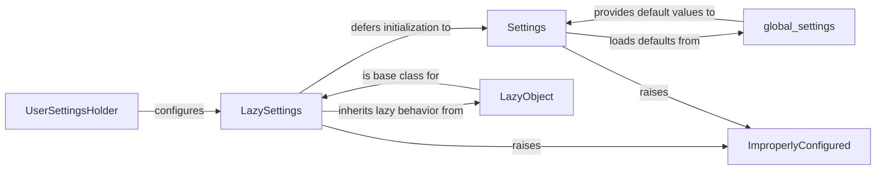

## Component Details

Analysis of the Django Settings Module components and their relationships.

### LazySettings
This is the primary interface through which Django applications access configuration settings. It acts as a proxy, deferring the loading of settings until an attribute is first accessed. This lazy evaluation optimizes startup time and allows for dynamic configuration based on environment variables (`DJANGO_SETTINGS_MODULE`) or programmatic calls. It manages the settings state and delegates attribute lookups to the underlying `Settings` object once configured.

**Related Classes/Methods**:

- `LazySettings` (1:1)

### Settings
This class holds the consolidated configuration values for a Django project. It is responsible for loading default settings from `global_settings.py` and then applying user-defined overrides (typically from a `settings.py` file). It also performs validation on critical settings, raising `ImproperlyConfigured` exceptions if essential configurations are missing or malformed, ensuring the application's operational integrity.

**Related Classes/Methods**:

- <a href="https://github.com/django/django/blob/master/tests/flatpages_tests/settings.py#L1-L1" target="_blank" rel="noopener noreferrer">`Settings` (1:1)</a>

### global_settings
This module contains all the default, built-in settings provided by Django. It serves as the baseline configuration for any Django project. User-defined `settings.py` files typically import from or override values defined in `global_settings.py`.

**Related Classes/Methods**:

- <a href="https://github.com/django/django/blob/master/django/conf/global_settings.py#L1-L1" target="_blank" rel="noopener noreferrer">`global_settings` (1:1)</a>

### ImproperlyConfigured
A custom exception class defined within Django's core exceptions. It is specifically raised when Django encounters a severe configuration problem that prevents the application from starting or functioning correctly. This helps developers quickly identify and resolve critical setup issues.

**Related Classes/Methods**:

- `ImproperlyConfigured` (1:1)

### LazyObject
A utility class from Django's `utils.functional` module that provides the core lazy-loading mechanism. `LazySettings` inherits from `LazyObject`, enabling it to defer the initialization of the actual settings object until one of its attributes is accessed, thus optimizing resource usage.

**Related Classes/Methods**:

- `LazyObject` (1:1)

### UserSettingsHolder
A lightweight internal class used by `LazySettings` during its configuration process. It temporarily stores user-provided settings, allowing `LazySettings.configure()` to set up the active settings object programmatically, which is particularly useful in testing environments or for specific management commands.

**Related Classes/Methods**:

- `UserSettingsHolder` (1:1)

### [FAQ](https://github.com/CodeBoarding/GeneratedOnBoardings/tree/main?tab=readme-ov-file#faq)