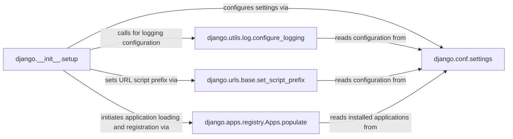

## Component Details

The `Django Setup` subsystem is the cornerstone of any Django application, responsible for orchestrating the initial configuration and loading of the entire Django environment. Its primary purpose is to transition Django from a raw Python process into a fully functional web framework capable of handling requests, managing data models, and utilizing various installed applications. This setup process is critical for ensuring that all necessary components are initialized and accessible before the application begins its operational lifecycle.

### django.__init__.setup
The core entry point for initializing the Django environment. It acts as the central orchestrator, coordinating the loading of settings, configuring logging, and populating the application registry.

**Related Classes/Methods**:

- <a href="https://github.com/django/django/blob/master/django/__init__.py#L7-L23" target="_blank" rel="noopener noreferrer">`django.__init__.setup` (7:23)</a>

### django.conf.settings
A module that encapsulates all project-specific configurations, including database settings, installed applications, middleware, and other crucial parameters. It provides a centralized access point for Django's operational parameters.

**Related Classes/Methods**:

- <a href="https://github.com/django/django/blob/master/django/template/backends/django.py#L1-L1" target="_blank" rel="noopener noreferrer">`django.conf.settings` (1:1)</a>
- <a href="https://github.com/django/django/blob/master/django/conf/global_settings.py#L1-L1" target="_blank" rel="noopener noreferrer">`django.conf.global_settings` (1:1)</a>

### django.utils.log.configure_logging
Responsible for setting up the application's logging infrastructure based on the configurations defined in `django.conf.settings`. It determines how log messages are captured, formatted, and routed.

**Related Classes/Methods**:

- <a href="https://github.com/django/django/blob/master/django/utils/log.py#L66-L75" target="_blank" rel="noopener noreferrer">`django.utils.log.configure_logging` (66:75)</a>

### django.urls.base.set_script_prefix
Configures the base URL path for the Django application. This is crucial for correct URL routing and generation, especially when the application is deployed under a sub-directory or behind a reverse proxy.

**Related Classes/Methods**:

- <a href="https://github.com/django/django/blob/master/django/urls/base.py#L119-L125" target="_blank" rel="noopener noreferrer">`django.urls.base.set_script_prefix` (119:125)</a>

### django.apps.registry.Apps.populate
The central mechanism for discovering, loading, and registering all installed Django applications and their models. This process builds the `Apps Registry`, which provides a runtime lookup for application configurations and their associated models.

**Related Classes/Methods**:

- <a href="https://github.com/django/django/blob/master/django/apps/registry.py#L60-L126" target="_blank" rel="noopener noreferrer">`django.apps.registry.Apps.populate` (60:126)</a>

### [FAQ](https://github.com/CodeBoarding/GeneratedOnBoardings/tree/main?tab=readme-ov-file#faq)