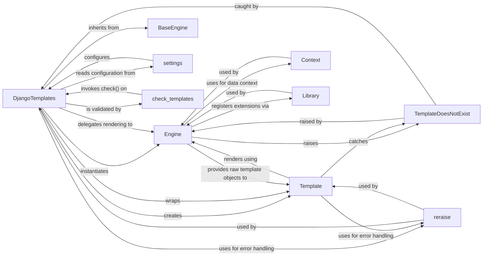

## Component Details

The `DjangoTemplates` component is a critical adapter within Django's template system, providing a unified interface for applications to interact with the Django template engine. It acts as the bridge between the high-level `settings.TEMPLATES` configuration and the low-level template rendering `Engine`. Its fundamental role is to initialize and manage the `Engine` instance based on settings, offer methods for loading and rendering templates, and integrate with Django's system check framework for configuration validation.

### DjangoTemplates
This class serves as the primary interface and adapter for Django applications to utilize the template engine. It processes configuration from `settings.TEMPLATES`, manages an internal `Engine` instance, and provides high-level methods for template loading (`get_template`) and string-based template creation (`from_string`). It also includes a `check` method for configuration validation, reporting issues via `CheckMessages`.

**Related Classes/Methods**:

- <a href="https://github.com/django/django/blob/master/django/template/backends/django.py#L0-L0" target="_blank" rel="noopener noreferrer">`django/template/backends/django.py` (0:0)</a>

### Engine
Django's core template rendering engine. It is responsible for the low-level operations of parsing template code, compiling templates into renderable objects, and managing template objects. It handles the discovery and loading of templates through configured loaders and processes template context.

**Related Classes/Methods**:

- <a href="https://github.com/django/django/blob/master/django/template/engine.py#L0-L0" target="_blank" rel="noopener noreferrer">`django/template/engine.py` (0:0)</a>

### Template
A lightweight wrapper class specific to the `DjangoTemplates` backend. It encapsulates the raw template objects returned by the `Engine` and provides a consistent `render` interface for applications, while also handling exceptions gracefully.

**Related Classes/Methods**:

- <a href="https://github.com/django/django/blob/master/django/template/backends/django.py#L0-L0" target="_blank" rel="noopener noreferrer">`django/template/backends/django.py` (0:0)</a>

### BaseEngine
An abstract base class that defines the common interface and fundamental functionalities that all Django template backends must adhere to. It ensures consistency and pluggability across different template engine implementations (e.g., Django's own, Jinja2). `DjangoTemplates` inherits from this class.

**Related Classes/Methods**:

- <a href="https://github.com/django/django/blob/master/django/template/backends/base.py#L0-L0" target="_blank" rel="noopener noreferrer">`django/template/backends/base.py` (0:0)</a>

### settings
Django's global configuration object, which stores project-wide settings, including template-related configurations defined in `TEMPLATES`. `DjangoTemplates` accesses these settings during its initialization to configure the template engine.

**Related Classes/Methods**:

- <a href="https://github.com/django/django/blob/master/django/conf/__init__.py#L0-L0" target="_blank" rel="noopener noreferrer">`django/conf/__init__.py` (0:0)</a>

### Context
Represents the data dictionary available to a template during rendering. It manages variable lookup, context processors, and the stack of contexts, providing the necessary data for the `Engine` to render templates.

**Related Classes/Methods**:

- <a href="https://github.com/django/django/blob/master/django/template/context.py#L0-L0" target="_blank" rel="noopener noreferrer">`django/template/context.py` (0:0)</a>

### Library
Provides the mechanism for registering custom template tags and filters, allowing developers to extend the functionality of the Django template language. The `Engine` uses `Library` instances to make these extensions available.

**Related Classes/Methods**:

- <a href="https://github.com/django/django/blob/master/django/template/library.py#L0-L0" target="_blank" rel="noopener noreferrer">`django/template/library.py` (0:0)</a>

### TemplateDoesNotExist
A specific exception raised when a requested template file cannot be found by the template engine or its configured loaders. It provides context about the attempted template paths, aiding in debugging. Both `DjangoTemplates` and `Template` handle this exception.

**Related Classes/Methods**:

- <a href="https://github.com/django/django/blob/master/django/template/base.py#L0-L0" target="_blank" rel="noopener noreferrer">`django/template/base.py` (0:0)</a>

### reraise
A utility function designed to re-raise an exception while preserving the original traceback. This is crucial for debugging, as it provides more informative error messages by maintaining the exception chain across different layers of the template system, particularly when `DjangoTemplates` or `Template` catch and re-raise exceptions from the `Engine`.

**Related Classes/Methods**:

- <a href="https://github.com/django/django/blob/master/django/utils/asyncio.py#L0-L0" target="_blank" rel="noopener noreferrer">`django/utils/asyncio.py` (0:0)</a>

### check_templates
A system check function that serves as an entry point for validating all configured template engines. It iterates through registered engines and invokes their respective `check()` methods to ensure proper configuration and report any issues, directly interacting with `DjangoTemplates`'s validation capabilities.

**Related Classes/Methods**:

- <a href="https://github.com/django/django/blob/master/django/template/backends/django.py#L0-L0" target="_blank" rel="noopener noreferrer">`django/template/backends/django.py` (0:0)</a>

### [FAQ](https://github.com/CodeBoarding/GeneratedOnBoardings/tree/main?tab=readme-ov-file#faq)