```mermaid
graph LR
    django_apps_registry_Apps["django.apps.registry.Apps"]
    django_apps_config_AppConfig["django.apps.config.AppConfig"]
    django_conf_LazySettings["django.conf.LazySettings"]
    django_core_management_ManagementUtility["django.core.management.ManagementUtility"]
    django_core_management_base_BaseCommand["django.core.management.base.BaseCommand"]
    django_core_cache_CacheHandler["django.core.cache.CacheHandler"]
    django_core_cache_backends_base_BaseCache["django.core.cache.backends.base.BaseCache"]
    django_core_exceptions_ImproperlyConfigured["django.core.exceptions.ImproperlyConfigured"]
    django_utils_functional_LazyObject["django.utils.functional.LazyObject"]
    django_utils_module_loading["django.utils.module_loading"]
    django_apps_registry_Apps -- "manages" --> django_apps_config_AppConfig
    django_apps_registry_Apps -- "provides information to" --> django_core_management_ManagementUtility
    django_apps_config_AppConfig -- "is registered by" --> django_apps_registry_Apps
    django_conf_LazySettings -- "uses" --> django_utils_functional_LazyObject
    django_conf_LazySettings -- "provides configuration to" --> django_core_management_ManagementUtility
    django_conf_LazySettings -- "provides configuration to" --> django_core_cache_CacheHandler
    django_core_management_ManagementUtility -- "executes" --> django_core_management_base_BaseCommand
    django_core_management_ManagementUtility -- "uses" --> django_conf_LazySettings
    django_core_management_base_BaseCommand -- "is invoked by" --> django_core_management_ManagementUtility
    django_core_cache_CacheHandler -- "configures and uses" --> django_core_cache_backends_base_BaseCache
    django_core_cache_CacheHandler -- "is configured by" --> django_conf_LazySettings
    django_core_cache_backends_base_BaseCache -- "is managed by" --> django_core_cache_CacheHandler
    django_core_exceptions_ImproperlyConfigured -- "indicates critical errors in" --> django_conf_LazySettings
    django_utils_functional_LazyObject -- "is inherited by" --> django_conf_LazySettings
    django_utils_module_loading -- "is used by" --> django_apps_registry_Apps
    django_utils_module_loading -- "is used by" --> django_core_cache_CacheHandler
```

## Details

This foundational component is the central nervous system of a Django project. It orchestrates the discovery and loading of installed applications, provides a unified and flexible system for managing project-wide settings, offers a robust command-line interface for administrative tasks, and integrates a pluggable caching framework to enhance application performance. It also defines core exception types for consistent error handling.

### django.apps.registry.Apps
The core registry responsible for managing the lifecycle of all installed Django applications. It loads application configurations, maintains a registry of models, and provides an API for introspection of application metadata.

**Related Classes/Methods**:

- <a href="https://github.com/django/django/django/apps/registry.py#L12-L433" target="_blank" rel="noopener noreferrer">`django.apps.registry.Apps` (12:433)</a>

### django.apps.config.AppConfig
A class that encapsulates the configuration for a single Django application. It allows developers to define application-specific metadata (like name, label) and provides hooks for startup tasks, such as registering signals or performing checks.

**Related Classes/Methods**:

- <a href="https://github.com/django/django/django/apps/config.py#L12-L273" target="_blank" rel="noopener noreferrer">`django.apps.config.AppConfig` (12:273)</a>

### django.conf.LazySettings
A proxy object that provides lazy access to Django's project settings. It defers the actual loading of settings from the `settings.py` file until a setting is first accessed, optimizing startup time and allowing for dynamic modification of settings.

**Related Classes/Methods**:

- <a href="https://github.com/django/django/django/template/backends/django.py#L1-L1" target="_blank" rel="noopener noreferrer">`django.conf.LazySettings` (1:1)</a>

### django.core.management.ManagementUtility
The primary entry point for executing Django's command-line administrative tasks (e.g., `runserver`, `migrate`, `createsuperuser`). It parses command-line arguments and dispatches them to the appropriate management commands.

**Related Classes/Methods**:

- `django.core.management.ManagementUtility` (1:1)

### django.core.management.base.BaseCommand
The abstract base class that all Django management commands must inherit from. It defines the standard structure and methods (like `add_arguments` for parsing command-line options and `handle` for executing the command's logic) for creating custom commands.

**Related Classes/Methods**:

- <a href="https://github.com/django/django/django/core/management/base.py#L1-L1" target="_blank" rel="noopener noreferrer">`django.core.management.base.BaseCommand` (1:1)</a>

### django.core.cache.CacheHandler
Manages the connections to various caching backends configured in the project settings. It acts as a facade, providing a unified interface to interact with different caching mechanisms (e.g., Memcached, Redis, database caching).

**Related Classes/Methods**:

- `django.core.cache.CacheHandler` (1:1)

### django.core.cache.backends.base.BaseCache
The abstract base class that defines the common interface for all cache backend implementations in Django. Concrete cache backends (e.g., `LocMemCache`, `DatabaseCache`) must implement the methods defined here.

**Related Classes/Methods**:

- <a href="https://github.com/django/django/django/core/cache/backends/base.py#L57-L389" target="_blank" rel="noopener noreferrer">`django.core.cache.backends.base.BaseCache` (57:389)</a>

### django.core.exceptions.ImproperlyConfigured
A specific exception class used throughout Django to signal critical configuration errors that prevent the application from starting or functioning correctly.

**Related Classes/Methods**:

- <a href="https://github.com/django/django/django/core/exceptions.py#L1-L1" target="_blank" rel="noopener noreferrer">`django.core.exceptions.ImproperlyConfigured` (1:1)</a>

### django.utils.functional.LazyObject
A utility class that enables lazy initialization of objects. The actual object is only created and its methods are called when it's first accessed, which is particularly useful for performance-sensitive components like settings.

**Related Classes/Methods**:

- <a href="https://github.com/django/django/django/utils/functional.py#L258-L371" target="_blank" rel="noopener noreferrer">`django.utils.functional.LazyObject` (258:371)</a>

### django.utils.module_loading
Provides helper functions for dynamically importing Python modules and classes given their string-based import paths. This is a cornerstone of Django's extensible architecture.

**Related Classes/Methods**:

- <a href="https://github.com/django/django/django/utils/module_loading.py#L1-L1" target="_blank" rel="noopener noreferrer">`django.utils.module_loading` (1:1)</a>

### [FAQ](https://github.com/CodeBoarding/GeneratedOnBoardings/tree/main?tab=readme-ov-file#faq)