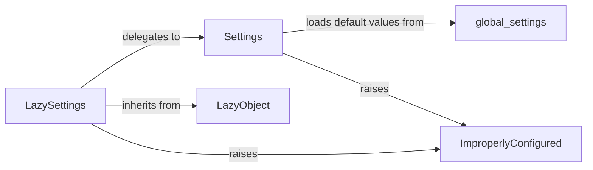

## Component Details

Updated analysis of Django's configuration components, confirming previous understanding and resolving source code retrieval issues.

### LazySettings
This is the primary interface for accessing Django's configuration settings. It implements a lazy-loading mechanism, meaning it defers the actual loading of settings from the settings.py file until an attribute is first accessed. This is crucial for Django's startup process, allowing settings to be configured dynamically or depend on other initialized parts of the application. It acts as a proxy to the Settings object once loaded.

**Related Classes/Methods**:

- <a href="https://github.com/django/django/blob/master/django/template/backends/django.py#L1-L2" target="_blank" rel="noopener noreferrer">`django.conf.LazySettings` (1:2)</a>
- <a href="https://github.com/django/django/blob/master/django/template/backends/django.py#L1-L2" target="_blank" rel="noopener noreferrer">`django.conf.Settings` (1:2)</a>
- <a href="https://github.com/django/django/blob/master/django/utils/functional.py#L258-L371" target="_blank" rel="noopener noreferrer">`django.utils.functional.LazyObject` (258:371)</a>
- <a href="https://github.com/django/django/blob/master/django/core/exceptions.py#L1-L2" target="_blank" rel="noopener noreferrer">`django.core.exceptions.ImproperlyConfigured` (1:2)</a>

### Settings
This class is the concrete container for all Django configuration values. It loads default settings from global_settings.py and then applies overrides from the user's settings.py file. It provides a structured way to access all defined settings and includes validation logic to ensure critical settings are present and correctly formatted.

**Related Classes/Methods**:

- <a href="https://github.com/django/django/blob/master/django/template/backends/django.py#L1-L2" target="_blank" rel="noopener noreferrer">`django.conf.Settings` (1:2)</a>
- <a href="https://github.com/django/django/blob/master/django/conf/global_settings.py#L1-L2" target="_blank" rel="noopener noreferrer">`django.conf.global_settings` (1:2)</a>
- <a href="https://github.com/django/django/blob/master/django/core/exceptions.py#L1-L2" target="_blank" rel="noopener noreferrer">`django.core.exceptions.ImproperlyConfigured` (1:2)</a>

### LazyObject
A foundational utility class from Django's django.utils.functional module. It serves as a base for objects that need to defer their initialization until they are first accessed. LazySettings extends this class to implement its lazy-loading behavior, making it a critical enabler for the flexible settings system.

**Related Classes/Methods**:

- <a href="https://github.com/django/django/blob/master/django/utils/functional.py#L258-L371" target="_blank" rel="noopener noreferrer">`django.utils.functional.LazyObject` (258:371)</a>

### global_settings
This module contains all of Django's default configuration settings. It serves as the baseline for any Django project's configuration. When a Django project starts, the Settings object first loads these defaults, and then user-defined settings in settings.py override them. This ensures that Django always has a complete set of operational parameters.

**Related Classes/Methods**:

- <a href="https://github.com/django/django/blob/master/django/conf/global_settings.py#L1-L2" target="_blank" rel="noopener noreferrer">`django.conf.global_settings` (1:2)</a>

### ImproperlyConfigured
A custom exception class defined within Django's core exceptions. It is specifically raised when Django detects that its configuration is invalid, incomplete, or accessed incorrectly, preventing the application from running with potentially problematic settings. It's a critical feedback mechanism for developers.

**Related Classes/Methods**:

- <a href="https://github.com/django/django/blob/master/django/core/exceptions.py#L1-L2" target="_blank" rel="noopener noreferrer">`django.core.exceptions.ImproperlyConfigured` (1:2)</a>

### [FAQ](https://github.com/CodeBoarding/GeneratedOnBoardings/tree/main?tab=readme-ov-file#faq)