```mermaid
graph LR
    django_setup["django.setup"]
    django_apps_registry_Apps["django.apps.registry.Apps"]
    django_apps_registry_Apps_populate["django.apps.registry.Apps.populate"]
    django_apps_config_AppConfig["django.apps.config.AppConfig"]
    django_utils_module_loading["django.utils.module_loading"]
    django_utils_log_configure_logging["django.utils.log.configure_logging"]
    django_urls_base_set_script_prefix["django.urls.base.set_script_prefix"]
    django_conf["django.conf"]
    django_core_exceptions_ImproperlyConfigured["django.core.exceptions.ImproperlyConfigured"]
    django_setup -- "calls" --> django_utils_log_configure_logging
    django_setup -- "calls" --> django_urls_base_set_script_prefix
    django_setup -- "calls" --> django_apps_registry_Apps_populate
    django_apps_registry_Apps -- "contains" --> django_apps_registry_Apps_populate
    django_apps_registry_Apps -- "manages" --> django_apps_config_AppConfig
    django_apps_registry_Apps_populate -- "creates" --> django_apps_config_AppConfig
    django_apps_registry_Apps_populate -- "uses" --> django_core_exceptions_ImproperlyConfigured
    django_apps_config_AppConfig -- "uses" --> django_utils_module_loading
    django_apps_config_AppConfig -- "can raise" --> django_core_exceptions_ImproperlyConfigured
    django_utils_log_configure_logging -- "depends on" --> django_conf
    django_conf -- "provides settings to" --> django_utils_log_configure_logging
    django_conf -- "provides settings to" --> django_apps_registry_Apps_populate
    django_core_exceptions_ImproperlyConfigured -- "is raised by" --> django_apps_registry_Apps_populate
    django_core_exceptions_ImproperlyConfigured -- "is raised by" --> django_apps_config_AppConfig
```

## Component Details

This overview details the core components involved in the `Django Setup` subsystem, focusing on their structure, flow, and purpose. The `django.setup` function serves as the primary entry point, orchestrating the initialization of the entire Django framework.

### django.setup
The primary entry point for initializing the Django environment. It orchestrates the loading of settings, configuration of logging, setting of URL prefixes, and crucially, the population of the application registry. It is fundamental as it's the single function that kicks off the entire Django framework's operational state.

**Related Classes/Methods**:

- <a href="https://github.com/django/django/blob/master/django/template/backends/django.py#L1-L1" target="_blank" rel="noopener noreferrer">`django.setup` (1:1)</a>

### django.apps.registry.Apps
This is the central registry that holds and manages the configuration for all installed Django applications. It provides a unified interface to access application-specific metadata and models. It is fundamental because it acts as the central repository for all application configurations, enabling Django to manage and access them efficiently.

**Related Classes/Methods**:

- <a href="https://github.com/django/django/blob/master/django/apps/registry.py#L12-L433" target="_blank" rel="noopener noreferrer">`django.apps.registry.Apps` (12:433)</a>

### django.apps.registry.Apps.populate
The core method within the `Apps` registry responsible for discovering, loading, and configuring all applications listed in `INSTALLED_APPS`. It ensures each application's `AppConfig` is initialized and its models are loaded. It is fundamental because it's the engine that brings all Django applications to life within the framework.

**Related Classes/Methods**:

- <a href="https://github.com/django/django/blob/master/django/apps/registry.py#L60-L126" target="_blank" rel="noopener noreferrer">`django.apps.registry.Apps.populate` (60:126)</a>

### django.apps.config.AppConfig
A class that represents the configuration of a single Django application. Each installed application has an `AppConfig` instance that stores metadata and provides hooks for initialization and model loading. It is fundamental as it encapsulates the specific configuration and behavior for each individual Django application.

**Related Classes/Methods**:

- <a href="https://github.com/django/django/blob/master/django/apps/config.py#L12-L273" target="_blank" rel="noopener noreferrer">`django.apps.config.AppConfig` (12:273)</a>

### django.utils.module_loading
A utility module providing functions for dynamically importing Python modules and retrieving objects (classes, functions) from them based on their dotted path strings. It is fundamental because it enables Django's pluggable application architecture by allowing dynamic discovery and loading of components.

**Related Classes/Methods**:

- <a href="https://github.com/django/django/blob/master/django/utils/module_loading.py#L1-L1" target="_blank" rel="noopener noreferrer">`django.utils.module_loading` (1:1)</a>

### django.utils.log.configure_logging
This function is responsible for setting up Django's logging system based on the `LOGGING` settings defined in the project. It ensures that application and system logs are handled correctly from the start of the Django process. It is fundamental for providing immediate feedback and debugging capabilities during application runtime.

**Related Classes/Methods**:

- <a href="https://github.com/django/django/blob/master/django/utils/log.py#L66-L75" target="_blank" rel="noopener noreferrer">`django.utils.log.configure_logging` (66:75)</a>

### django.urls.base.set_script_prefix
This function manages the script prefix used for URL resolution. It's crucial for correctly generating URLs, especially when a Django project is deployed under a subpath (e.g., `/my-app/`). It is fundamental for ensuring correct URL routing and generation in various deployment environments.

**Related Classes/Methods**:

- <a href="https://github.com/django/django/blob/master/django/urls/base.py#L119-L125" target="_blank" rel="noopener noreferrer">`django.urls.base.set_script_prefix` (119:125)</a>

### django.conf
Django's settings configuration module. It provides access to all project-wide settings, which dictate the behavior and configuration of the entire Django application. It is fundamental as it's the central source of truth for all configurable aspects of a Django project.

**Related Classes/Methods**:

- <a href="https://github.com/django/django/blob/master/django/template/backends/django.py#L1-L1" target="_blank" rel="noopener noreferrer">`django.conf` (1:1)</a>

### django.core.exceptions.ImproperlyConfigured
A standard Django exception that is raised when the project's settings or configuration are incorrect or incomplete. It's used to signal critical setup errors that prevent Django from functioning correctly. It is fundamental for robust error handling during the critical initialization phase.

**Related Classes/Methods**:

- <a href="https://github.com/django/django/blob/master/django/core/exceptions.py#L1-L1" target="_blank" rel="noopener noreferrer">`django.core.exceptions.ImproperlyConfigured` (1:1)</a>

### [FAQ](https://github.com/CodeBoarding/GeneratedOnBoardings/tree/main?tab=readme-ov-file#faq)