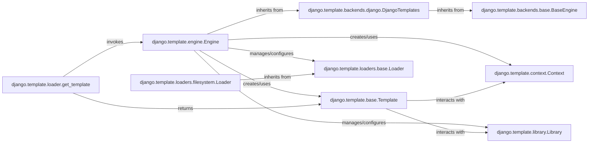

## Component Details

The `Engine` subsystem is responsible for managing the configuration, loading, compilation, and rendering of templates within Django. It provides the central API for interacting with the template system, ensuring extensibility and consistent behavior across different template backends.

### django.template.engine.Engine
The concrete implementation of Django's default template engine. It serves as the primary interface for configuring template loaders, built-in tags/filters, and custom template libraries, and for performing template loading, parsing, and rendering operations.

**Related Classes/Methods**:

- <a href="https://github.com/django/django/blob/master/django/template/engine.py#L12-L213" target="_blank" rel="noopener noreferrer">`django.template.engine.Engine` (12:213)</a>

### django.template.backends.base.BaseEngine
An abstract base class that defines the common interface and contract for all template engines in Django. It ensures a consistent API for template operations, regardless of the underlying template language implementation.

**Related Classes/Methods**:

- <a href="https://github.com/django/django/blob/master/django/template/backends/base.py#L6-L82" target="_blank" rel="noopener noreferrer">`django.template.backends.base.BaseEngine` (6:82)</a>

### django.template.backends.django.DjangoTemplates
A concrete implementation of `BaseEngine` specifically designed for Django's built-in template language. It handles Django-specific parsing and rendering logic and serves as the direct parent class for the `Engine` component.

**Related Classes/Methods**:

- <a href="https://github.com/django/django/blob/master/django/template/backends/django.py#L15-L89" target="_blank" rel="noopener noreferrer">`django.template.backends.django.DjangoTemplates` (15:89)</a>

### django.template.base.Template
Represents a compiled template. After parsing, the template source is transformed into this object, which encapsulates the parsed structure (a `NodeList` of template nodes) and is responsible for executing the template logic to produce the final output.

**Related Classes/Methods**:

- <a href="https://github.com/django/django/blob/master/django/template/base.py#L0-L0" target="_blank" rel="noopener noreferrer">`django.template.base.Template` (0:0)</a>

### django.template.context.Context
Manages the data (variables) available to a template during its rendering phase. It provides a stack-like structure to handle variable scope, ensuring correct resolution of variables within different template blocks.

**Related Classes/Methods**:

- <a href="https://github.com/django/django/blob/master/django/template/context.py#L137-L172" target="_blank" rel="noopener noreferrer">`django.template.context.Context` (137:172)</a>

### django.template.library.Library
Provides the mechanism for registering custom template tags and filters. Developers use instances of this class to extend the Django template language with their own Python functions.

**Related Classes/Methods**:

- <a href="https://github.com/django/django/blob/master/django/template/library.py#L15-L287" target="_blank" rel="noopener noreferrer">`django.template.library.Library` (15:287)</a>

### django.template.loaders.base.Loader
An abstract base class that defines the interface for all template loaders. Concrete loader implementations must inherit from this class to specify how template source files are located and read.

**Related Classes/Methods**:

- <a href="https://github.com/django/django/blob/master/django/template/loaders/base.py#L3-L50" target="_blank" rel="noopener noreferrer">`django.template.loaders.base.Loader` (3:50)</a>

### django.template.loaders.filesystem.Loader
A concrete implementation of `BaseLoader` that locates and reads template source files from a list of specified directories on the file system. It's a commonly used loader in Django projects.

**Related Classes/Methods**:

- <a href="https://github.com/django/django/blob/master/django/template/loaders/filesystem.py#L0-L0" target="_blank" rel="noopener noreferrer">`django.template.loaders.filesystem.Loader` (0:0)</a>

### django.template.loader.get_template
A high-level utility function that provides a convenient entry point for loading templates. It abstracts the underlying complexity by iterating through configured template engines and their loaders to find and return a compiled `Template` object.

**Related Classes/Methods**:

- <a href="https://github.com/django/django/blob/master/django/template/loader.py#L4-L18" target="_blank" rel="noopener noreferrer">`django.template.loader.get_template` (4:18)</a>

### [FAQ](https://github.com/CodeBoarding/GeneratedOnBoardings/tree/main?tab=readme-ov-file#faq)