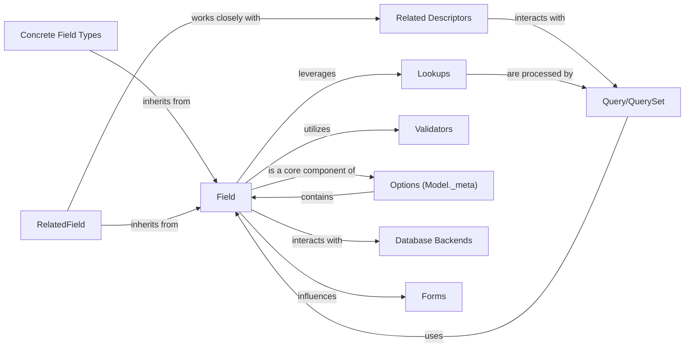

## Component Details

A refined overview of the `Fields` component in Django's ORM, focusing on its structure, flow, and purpose.

### Field
The abstract base class for all model field types. It encapsulates the core logic for data definition, validation, and database interaction. It defines common attributes such as `null`, `blank`, `primary_key`, `unique`, `choices`, `default`, `help_text`, and manages the conversion of Python values to database-ready formats and vice-versa. It also integrates with Django's system checks and form generation.

**Related Classes/Methods**:

- `django.db.models.fields.Field` (1:1)

### Concrete Field Types
Subclasses of `Field` that implement specific data types like `CharField`, `IntegerField`, `DateField`, `DateTimeField`, `EmailField`, `UUIDField`, `FileField`, `ImageField`, `JSONField`. Each concrete field type defines its specific database column type, validation rules, and how Python values are handled for that particular data type.

**Related Classes/Methods**:

- `django.db.models.fields.CharField` (1:1)
- <a href="https://github.com/django/django/blob/master/django/db/models/fields/files.py#L234-L375" target="_blank" rel="noopener noreferrer">`django.db.models.fields.files.FileField` (234:375)</a>
- <a href="https://github.com/django/django/blob/master/django/db/models/fields/json.py#L21-L147" target="_blank" rel="noopener noreferrer">`django.db.models.fields.json.JSONField` (21:147)</a>

### RelatedField
A specialized abstract base class for fields that establish relationships between different models (e.g., `ForeignKey`, `ManyToManyField`, `OneToOneField`). It extends `Field` by adding logic for managing foreign keys, defining relationship types, and handling related object access.

**Related Classes/Methods**:

- <a href="https://github.com/django/django/blob/master/django/db/models/fields/related.py#L88-L513" target="_blank" rel="noopener noreferrer">`django.db.models.fields.related.RelatedField` (88:513)</a>

### Related Descriptors
Python descriptor objects (e.g., `ForwardManyToOneDescriptor`, `ReverseManyToOneDescriptor`, `ManyToManyDescriptor`) that are dynamically attached to model classes when a `RelatedField` is defined. They provide the intuitive API for accessing related objects (e.g., `instance.related_object` or `instance.related_set.all()`), abstracting the underlying database queries.

**Related Classes/Methods**:

- <a href="https://github.com/django/django/blob/master/django/db/models/fields/related_descriptors.py#L1-L1" target="_blank" rel="noopener noreferrer">`django.db.models.fields.related_descriptors.ForwardManyToOneDescriptor` (1:1)</a>

### Lookups
Classes that define how database queries can filter or transform data based on field values. They translate Pythonic query syntax (e.g., `field__exact`, `field__contains`, `field__gt`) into the appropriate SQL conditions. Lookups are registered with `Field` instances.

**Related Classes/Methods**:

- <a href="https://github.com/django/django/blob/master/django/db/models/lookups.py#L27-L201" target="_blank" rel="noopener noreferrer">`django.db.models.lookups.Lookup` (27:201)</a>
- <a href="https://github.com/django/django/blob/master/django/db/models/fields/related_lookups.py#L96-L126" target="_blank" rel="noopener noreferrer">`django.db.models.fields.related_lookups.RelatedLookupMixin` (96:126)</a>

### Validators
A collection of reusable functions and classes that enforce data integrity rules on field values. Fields can have a list of validators that are run during the `clean` process.

**Related Classes/Methods**:

- <a href="https://github.com/django/django/blob/master/django/core/validators.py#L1-L1" target="_blank" rel="noopener noreferrer">`django.core.validators` (1:1)</a>

### Options (Model._meta)
An inner class (`Meta`) within each Django model that stores metadata about the model, including a registry of all its `Field` instances. `ModelBase` processes field definitions and populates this `Options` object.

**Related Classes/Methods**:

- <a href="https://github.com/django/django/blob/master/django/db/models/options.py#L89-L1042" target="_blank" rel="noopener noreferrer">`django.db.models.options.Options` (89:1042)</a>

### Database Backends
A set of modules that provide database-specific implementations for operations like determining column data types (`db_type`), handling database-specific checks (`db_check`), and managing connections. Fields interact with these backends to generate appropriate SQL.

**Related Classes/Methods**:

- <a href="https://github.com/django/django/blob/master/django/db/backends/base/base.py#L1-L1" target="_blank" rel="noopener noreferrer">`django.db.backends.base.base` (1:1)</a>
- <a href="https://github.com/django/django/blob/master/django/db/backends/postgresql/base.py#L1-L1" target="_blank" rel="noopener noreferrer">`django.db.backends.postgresql.base` (1:1)</a>

### Query/QuerySet
`Query` represents the SQL query to be executed, while `QuerySet` is an iterable that allows building and executing queries. Fields and Lookups are integral to how `Query` objects are constructed and how `QuerySet` objects filter and retrieve data.

**Related Classes/Methods**:

- <a href="https://github.com/django/django/blob/master/django/db/models/query.py#L1-L1" target="_blank" rel="noopener noreferrer">`django.db.models.query.Query` (1:1)</a>
- <a href="https://github.com/django/django/blob/master/django/db/models/query.py#L1-L1" target="_blank" rel="noopener noreferrer">`django.db.models.query.QuerySet` (1:1)</a>
- <a href="https://github.com/django/django/blob/master/django/db/models/sql/query.py#L1-L1" target="_blank" rel="noopener noreferrer">`django.db.models.sql.query.Query` (1:1)</a>

### Forms
Django's form system provides `Field` classes (e.g., `forms.CharField`, `forms.IntegerField`) that correspond to model fields. Model fields can generate their equivalent form fields using the `formfield()` method, facilitating automatic form creation from models.

**Related Classes/Methods**:

- <a href="https://github.com/django/django/blob/master/django/forms/fields.py#L1-L1" target="_blank" rel="noopener noreferrer">`django.forms.fields` (1:1)</a>

### [FAQ](https://github.com/CodeBoarding/GeneratedOnBoardings/tree/main?tab=readme-ov-file#faq)