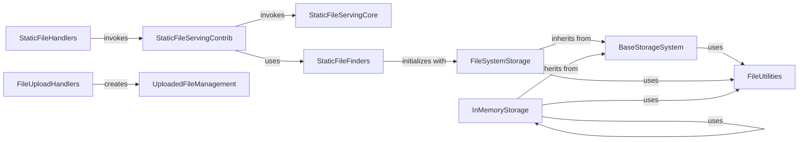

## Component Details

This graph illustrates the architecture of Django's File & Media Handling subsystem, which is responsible for serving static assets and managing user-uploaded media files. The core functionality revolves around serving static content, finding these files across various locations, and providing a flexible storage system. Additionally, it handles the intricacies of file uploads, from temporary storage to in-memory processing, and offers a suite of utility functions for common file operations. The main flow involves requests for static files being handled by specialized views and handlers, which in turn utilize file finders to locate the assets. User-uploaded files are processed by upload handlers and managed by dedicated classes, all interacting with a pluggable storage system that can be local filesystem-based or in-memory.

### StaticFileServingCore
This component is responsible for the fundamental serving of static files from a specified document root. It handles tasks such as resolving file paths, generating directory indexes when enabled, and managing HTTP caching headers to optimize content delivery. It forms the core logic for serving static content in Django.

**Related Classes/Methods**:

- <a href="https://github.com/django/django/blob/master/django/views/static.py#L28-L64" target="_blank" rel="noopener noreferrer">`django.views.static.serve` (28:64)</a>
- <a href="https://github.com/django/django/blob/master/django/views/static.py#L71-L100" target="_blank" rel="noopener noreferrer">`django.views.static.directory_index` (71:100)</a>
- <a href="https://github.com/django/django/blob/master/django/views/static.py#L103-L122" target="_blank" rel="noopener noreferrer">`django.views.static.was_modified_since` (103:122)</a>

### StaticFileServingContrib
This component provides a specialized view for serving static files within the `django.contrib.staticfiles` application. It acts as an intermediary, utilizing the core static file serving logic and integrating with static file finders to locate the appropriate files. It is primarily intended for development environments.

**Related Classes/Methods**:

- <a href="https://github.com/django/django/blob/master/django/contrib/staticfiles/views.py#L16-L40" target="_blank" rel="noopener noreferrer">`django.contrib.staticfiles.views.serve` (16:40)</a>

### StaticFileHandlers
This component integrates the static file serving capabilities into Django's request handling pipeline. It includes mixins and concrete handler classes for both WSGI and ASGI environments, allowing Django to intercept and serve static file requests before passing others to the main application.

**Related Classes/Methods**:

- <a href="https://github.com/django/django/blob/master/django/contrib/staticfiles/handlers.py#L15-L64" target="_blank" rel="noopener noreferrer">`django.contrib.staticfiles.handlers.StaticFilesHandlerMixin` (15:64)</a>
- <a href="https://github.com/django/django/blob/master/django/contrib/staticfiles/handlers.py#L67-L81" target="_blank" rel="noopener noreferrer">`django.contrib.staticfiles.handlers.StaticFilesHandler` (67:81)</a>
- <a href="https://github.com/django/django/blob/master/django/contrib/staticfiles/handlers.py#L84-L115" target="_blank" rel="noopener noreferrer">`django.contrib.staticfiles.handlers.ASGIStaticFilesHandler` (84:115)</a>

### StaticFileFinders
This component is responsible for discovering and locating static files across various configured directories and installed applications within a Django project. It provides mechanisms to search for static assets, which are then served by other components.

**Related Classes/Methods**:

- <a href="https://github.com/django/django/blob/master/django/contrib/staticfiles/finders.py#L86-L195" target="_blank" rel="noopener noreferrer">`django.contrib.staticfiles.finders.FileSystemFinder` (86:195)</a>
- <a href="https://github.com/django/django/blob/master/django/contrib/staticfiles/finders.py#L198-L265" target="_blank" rel="noopener noreferrer">`django.contrib.staticfiles.finders.AppDirectoriesFinder` (198:265)</a>
- <a href="https://github.com/django/django/blob/master/django/contrib/staticfiles/finders.py#L321-L336" target="_blank" rel="noopener noreferrer">`django.contrib.staticfiles.finders.DefaultStorageFinder` (321:336)</a>
- <a href="https://github.com/django/django/blob/master/django/contrib/staticfiles/finders.py#L341-L363" target="_blank" rel="noopener noreferrer">`django.contrib.staticfiles.finders.find` (341:363)</a>
- <a href="https://github.com/django/django/blob/master/django/contrib/staticfiles/finders.py#L366-L368" target="_blank" rel="noopener noreferrer">`django.contrib.staticfiles.finders.get_finders` (366:368)</a>

### BaseStorageSystem
This component defines the abstract base class for all file storage systems in Django. It establishes a common interface for operations such as saving, deleting, checking existence, and generating valid filenames, ensuring consistency across different storage backends.

**Related Classes/Methods**:

- <a href="https://github.com/django/django/blob/master/django/core/files/storage/base.py#L11-L206" target="_blank" rel="noopener noreferrer">`django.core.files.storage.base.Storage` (11:206)</a>

### FileSystemStorage
This component is a concrete implementation of the base storage system that manages files directly on the local filesystem. It handles the physical storage, retrieval, and manipulation of files within the server's file structure.

**Related Classes/Methods**:

- <a href="https://github.com/django/django/blob/master/django/core/files/storage/filesystem.py#L19-L228" target="_blank" rel="noopener noreferrer">`django.core.files.storage.filesystem.FileSystemStorage` (19:228)</a>

### InMemoryStorage
This component provides an in-memory implementation of the file storage system. It stores files temporarily in the application's memory, making it suitable for testing, development, or scenarios where persistent storage is not required. It includes internal nodes for representing files and directories in memory.

**Related Classes/Methods**:

- <a href="https://github.com/django/django/blob/master/django/core/files/storage/memory.py#L168-L293" target="_blank" rel="noopener noreferrer">`django.core.files.storage.memory.InMemoryStorage` (168:293)</a>
- <a href="https://github.com/django/django/blob/master/django/core/files/storage/memory.py#L40-L78" target="_blank" rel="noopener noreferrer">`django.core.files.storage.memory.InMemoryFileNode` (40:78)</a>
- <a href="https://github.com/django/django/blob/master/django/core/files/storage/memory.py#L81-L164" target="_blank" rel="noopener noreferrer">`django.core.files.storage.memory.InMemoryDirNode` (81:164)</a>

### UploadedFileManagement
This component deals with the representation and basic operations of files that have been uploaded through web forms. It provides classes to encapsulate uploaded file data, whether stored temporarily on disk or entirely in memory.

**Related Classes/Methods**:

- <a href="https://github.com/django/django/blob/master/django/core/files/uploadedfile.py#L21-L67" target="_blank" rel="noopener noreferrer">`django.core.files.uploadedfile.UploadedFile` (21:67)</a>
- <a href="https://github.com/django/django/blob/master/django/core/files/uploadedfile.py#L70-L93" target="_blank" rel="noopener noreferrer">`django.core.files.uploadedfile.TemporaryUploadedFile` (70:93)</a>
- <a href="https://github.com/django/django/blob/master/django/core/files/uploadedfile.py#L96-L124" target="_blank" rel="noopener noreferrer">`django.core.files.uploadedfile.InMemoryUploadedFile` (96:124)</a>
- <a href="https://github.com/django/django/blob/master/django/core/files/uploadedfile.py#L127-L150" target="_blank" rel="noopener noreferrer">`django.core.files.uploadedfile.SimpleUploadedFile` (127:150)</a>

### FileUploadHandlers
This component defines the mechanisms for processing and handling the raw data stream of uploaded files. It determines how the uploaded content is received, parsed, and ultimately stored, either temporarily or permanently, by interacting with the uploaded file management components.

**Related Classes/Methods**:

- <a href="https://github.com/django/django/blob/master/django/core/files/uploadhandler.py#L161-L190" target="_blank" rel="noopener noreferrer">`django.core.files.uploadhandler.TemporaryFileUploadHandler` (161:190)</a>
- <a href="https://github.com/django/django/blob/master/django/core/files/uploadhandler.py#L193-L236" target="_blank" rel="noopener noreferrer">`django.core.files.uploadhandler.MemoryFileUploadHandler` (193:236)</a>

### FileUtilities
This component provides a collection of general utility functions that support various file-related operations across the Django framework. These utilities include validating filenames, safely moving files, and other common file system interactions.

**Related Classes/Methods**:

- <a href="https://github.com/django/django/blob/master/django/core/files/utils.py#L7-L23" target="_blank" rel="noopener noreferrer">`django.core.files.utils.validate_file_name` (7:23)</a>
- <a href="https://github.com/django/django/blob/master/django/core/files/move.py#L16-L91" target="_blank" rel="noopener noreferrer">`django.core.files.move.file_move_safe` (16:91)</a>
- `django.core.files.locks.lock` (full file reference)
- `django.core.files.locks.unlock` (full file reference)
- <a href="https://github.com/django/django/blob/master/django/utils/_os.py#L9-L35" target="_blank" rel="noopener noreferrer">`django.utils._os.safe_join` (9:35)</a>
- <a href="https://github.com/django/django/blob/master/django/utils/text.py#L270-L283" target="_blank" rel="noopener noreferrer">`django.utils.text.get_valid_filename` (270:283)</a>
- <a href="https://github.com/django/django/blob/master/django/utils/crypto.py#L51-L62" target="_blank" rel="noopener noreferrer">`django.utils.crypto.get_random_string` (51:62)</a>
- <a href="https://github.com/django/django/blob/master/django/utils/encoding.py#L233-L245" target="_blank" rel="noopener noreferrer">`django.utils.encoding.filepath_to_uri` (233:245)</a>

### [FAQ](https://github.com/CodeBoarding/GeneratedOnBoardings/tree/main?tab=readme-ov-file#faq)