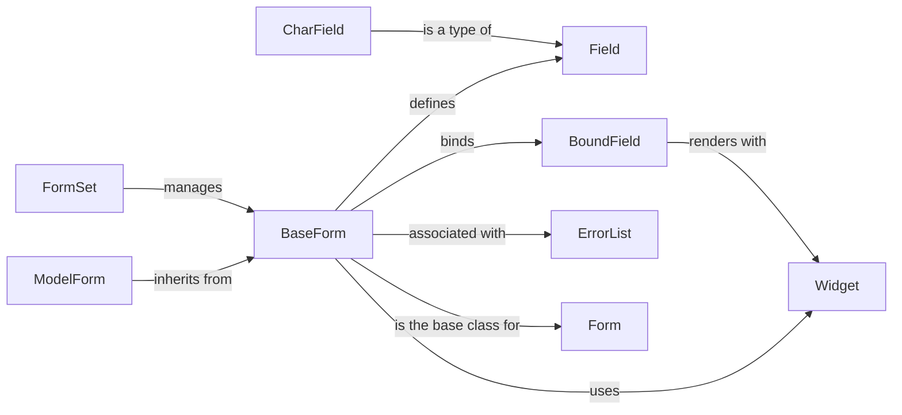

## Component Details

The Django Forms component provides a robust system for creating, processing, and validating HTML forms. It offers a structured approach to handling user input, ensuring data integrity, and simplifying form rendering. The core of the system revolves around defining forms as Python classes, specifying fields with associated widgets and validation rules. ModelForms further streamline development by automatically generating forms from Django models. The component handles data binding, validation, and rendering, making it easier to build interactive web applications.

### BaseForm
The BaseForm class is the foundation for all forms in Django. It provides the core functionality for form processing, including data binding, validation, and rendering. It manages form fields, errors, and cleaned data, serving as the central point for form operations.
- **Related Classes/Methods**: `django.django.forms.forms.BaseForm`

### Field
The Field class is the base class for form fields. It defines the validation and cleaning logic for individual fields. It also handles the rendering of the field's widget, ensuring data conforms to expected formats and constraints.
- **Related Classes/Methods**: `django.django.forms.fields.Field`

### Widget
The Widget class is the base class for form widgets. It defines how form fields are rendered in HTML. Different widgets cater to various field types, such as text inputs, select boxes, and checkboxes, providing flexibility in form presentation.
- **Related Classes/Methods**: `django.django.forms.widgets.Widget`

### BoundField
The BoundField class represents a field bound to a specific form, combining a Field instance with a Form instance. It offers methods for rendering the field and accessing its value and errors, bridging the gap between form definition and runtime data.
- **Related Classes/Methods**: `django.django.forms.boundfield.BoundField`

### ModelForm
The ModelForm class is a form automatically generated from a Django model, simplifying the creation of forms for creating and updating model instances. It streamlines the process of mapping model fields to form fields.
- **Related Classes/Methods**: `django.django.forms.models.BaseModelForm`, `django.django.forms.models.ModelFormMetaclass`

### FormSet
The FormSet class is a collection of forms displayed and processed together, useful for managing multiple instances of the same form. It simplifies handling scenarios where multiple related objects need to be created or updated simultaneously.
- **Related Classes/Methods**: `django.django.forms.formsets.BaseFormSet`

### ErrorList
The ErrorList class is a list-like data structure storing errors associated with a form or field, providing methods for rendering errors in HTML and presenting validation feedback to the user.
- **Related Classes/Methods**: `django.django.forms.utils.ErrorList`
