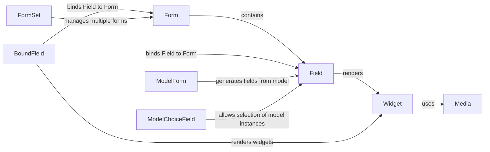

## Component Details

### Form
The Form class is a central component for creating and managing HTML forms. It encapsulates form fields, validation logic, and rendering capabilities. It handles user input, validates data against defined field types and constraints, and generates HTML output for displaying the form in templates. Forms can be bound to data, allowing for pre-population and modification of existing data. It serves as a container for fields and provides methods for accessing and manipulating them.
- **Related Classes/Methods**: `django.forms.forms.Form`

### Field
The Field class serves as the base class for all form fields. It defines the fundamental validation logic and provides methods for cleaning and converting data. Each field type (e.g., CharField, IntegerField) inherits from Field and implements specific validation and data handling tailored to its type. Fields are responsible for rendering the appropriate HTML input element and handling user input. It defines the basic validation logic and provides methods for cleaning and converting data.
- **Related Classes/Methods**: `django.forms.fields.Field`

### Widget
The Widget class is the base class for all form widgets, responsible for rendering HTML input elements. It defines the basic rendering logic and provides methods for handling attributes and values. Different widget types (e.g., TextInput, Textarea, Select) inherit from Widget and implement specific rendering logic for their corresponding HTML elements. Widgets are used by fields to generate the HTML output for user input.
- **Related Classes/Methods**: `django.forms.widgets.Widget`

### BoundField
The BoundField class binds a Field instance to a specific Form instance. It provides access to the field's value, errors, and rendering methods within the context of a form. BoundField is responsible for rendering the field's widget and displaying any validation errors associated with the field. It acts as an intermediary between the Form, Field, and Widget, providing a convenient way to access and manipulate field-related data in templates.
- **Related Classes/Methods**: `django.forms.boundfield.BoundField`

### ModelForm
The ModelForm class simplifies the creation of forms that are directly tied to Django models. It automatically generates form fields based on the model's fields, reducing the amount of boilerplate code required to create forms for data entry and modification. ModelForms provide a convenient way to create, update, and delete model instances through forms. It uses ModelFormMetaclass to create form fields based on the model's fields.
- **Related Classes/Methods**: `django.forms.models.ModelForm`, `django.forms.models.ModelFormMetaclass`, `django.forms.models.BaseModelForm`

### FormSet
The FormSet class manages a collection of forms, typically used for handling multiple instances of the same form on a single page. It provides methods for validating and processing multiple forms simultaneously. FormSets are useful for creating dynamic forms where the number of forms can vary based on user input or data requirements. It is especially useful when dealing with multiple related objects.
- **Related Classes/Methods**: `django.forms.formsets.BaseFormSet`

### ModelChoiceField
The ModelChoiceField class is a specialized form field that allows users to select a single model instance from a queryset. It renders a select element populated with the available choices from the queryset. ModelChoiceField is commonly used for creating foreign key relationships in forms, allowing users to choose related objects from a list.
- **Related Classes/Methods**: `django.forms.models.ModelChoiceField`

### Media
The Media class is responsible for defining and managing the CSS and JavaScript resources associated with a form or widget. It allows you to specify the media files required for a form to function correctly, ensuring that the necessary styles and scripts are included when the form is rendered. The Media class simplifies the management of form-related assets and promotes code reusability.
- **Related Classes/Methods**: `django.forms.widgets.Media`
