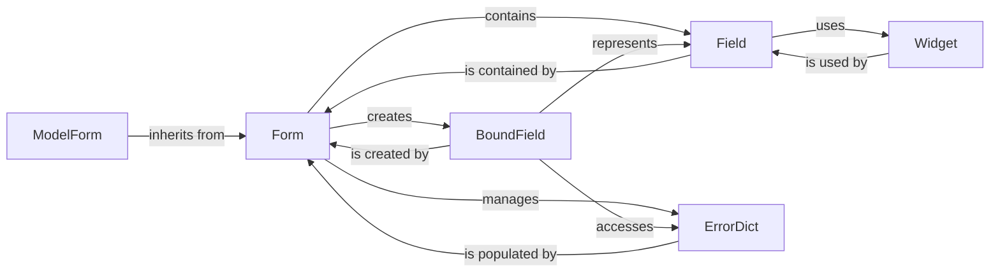

## Component Details

The Django Forms subsystem is a powerful and flexible framework for handling user input in web applications. It provides a structured way to define forms, validate data, render HTML, and interact with Django's ORM. The core design emphasizes separation of concerns, allowing developers to manage data logic, presentation, and validation independently.

### Form
The Form class is the central orchestrator of the form handling process. It acts as a container for Field instances, managing their declaration, processing submitted data, performing comprehensive validation across all fields, and coordinating the rendering of the form and its associated errors. It provides the primary interface for developers to define and interact with user input.

**Related Classes/Methods**:

- <a href="https://github.com/django/django/blob/master/django/forms/forms.py#L0-L0" target="_blank" rel="noopener noreferrer">`django.forms.forms.Form` (0:0)</a>

### Field
The Field class represents a single input element within a form. It defines the data type expected, handles the conversion of raw input to appropriate Python objects (to_python), applies specific validation rules (validate, run_validators), and manages field-specific error messages. Each Field has a default Widget associated with it for its HTML representation.

**Related Classes/Methods**:

- <a href="https://github.com/django/django/blob/master/django/forms/fields.py#L0-L0" target="_blank" rel="noopener noreferrer">`django.forms.fields.Field` (0:0)</a>
- <a href="https://github.com/django/django/blob/master/django/forms/fields.py#L0-L0" target="_blank" rel="noopener noreferrer">`django.forms.fields.Field:to_python` (0:0)</a>
- <a href="https://github.com/django/django/blob/master/django/forms/fields.py#L0-L0" target="_blank" rel="noopener noreferrer">`django.forms.fields.Field:validate` (0:0)</a>
- <a href="https://github.com/django/django/blob/master/django/forms/fields.py#L0-L0" target="_blank" rel="noopener noreferrer">`django.forms.fields.Field:run_validators` (0:0)</a>

### Widget
The Widget class is solely responsible for the HTML rendering of a Field. It determines how a field appears in the browser, managing HTML attributes and rendering logic (render method). This separation ensures that the presentation layer is decoupled from the data validation and cleaning logic of the Field.

**Related Classes/Methods**:

- <a href="https://github.com/django/django/blob/master/django/forms/widgets.py#L0-L0" target="_blank" rel="noopener noreferrer">`django.forms.widgets.Widget` (0:0)</a>
- <a href="https://github.com/django/django/blob/master/django/forms/widgets.py#L0-L0" target="_blank" rel="noopener noreferrer">`django.forms.widgets.Widget:render` (0:0)</a>

### BoundField
BoundField is an intermediary object that links a Field instance to a specific Form instance and its submitted data. It provides convenient, context-aware access to the field's current value, associated errors, and methods for rendering the field within the context of the form. It acts as an adapter, simplifying template rendering by providing all necessary information for a single field.

**Related Classes/Methods**:

- <a href="https://github.com/django/django/blob/master/django/forms/boundfield.py#L12-L322" target="_blank" rel="noopener noreferrer">`django.forms.boundfield.BoundField` (12:322)</a>

### ErrorDict
ErrorDict is a dictionary-like object specifically designed to store and manage validation errors for an entire form. Its keys are the names of the form fields, and its values are ErrorList instances, which contain the actual error messages for that particular field. It provides methods for rendering these errors in various formats (e.g., as HTML unordered lists).

**Related Classes/Methods**:

- <a href="https://github.com/django/django/blob/master/django/forms/utils.py#L112-L137" target="_blank" rel="noopener noreferrer">`django.forms.utils.ErrorDict` (112:137)</a>

### ModelForm
ModelForm is a specialized subclass of Form that provides seamless integration with Django's Object-Relational Mapper (ORM). It automatically generates form fields based on a Django model's definition and offers convenient methods for saving the form data directly back to a model instance, significantly simplifying common CRUD (Create, Read, Update, Delete) operations.

**Related Classes/Methods**:

- <a href="https://github.com/django/django/blob/master/django/forms/models.py#L0-L0" target="_blank" rel="noopener noreferrer">`django.forms.models.ModelForm` (0:0)</a>

### [FAQ](https://github.com/CodeBoarding/GeneratedOnBoardings/tree/main?tab=readme-ov-file#faq)