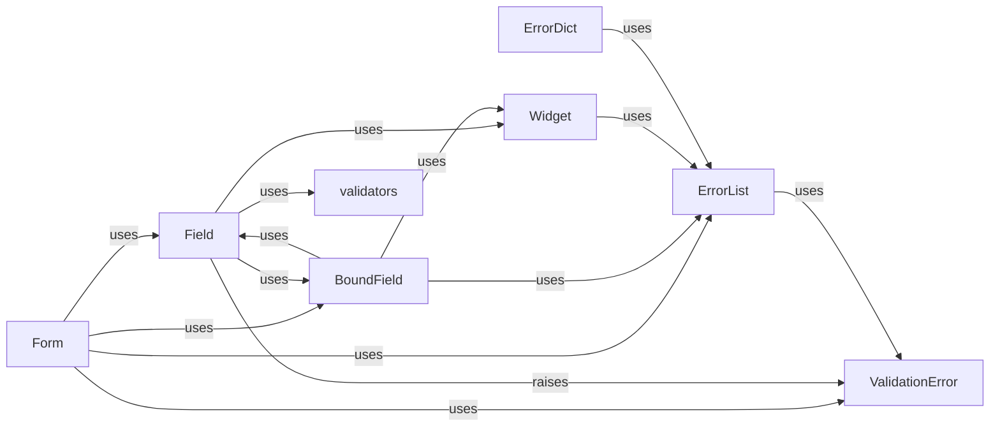

## Component Details

The `Form Fields` subsystem in Django is a crucial part of the forms API, responsible for defining, validating, and rendering individual pieces of input data. It provides an abstraction layer over raw HTML inputs, allowing developers to work with Python objects and leverage Django's robust validation mechanisms.

### Field
The abstract base class (`django.forms.fields.Field`) for all form fields. It defines the fundamental interface and common logic for handling a single piece of form data. This includes data type conversion (e.g., string to integer, date), initial data validation, and interaction with its rendering widget. It manages `default_validators` and `error_messages`.

**Related Classes/Methods**:

- <a href="https://github.com/django/django/blob/master/django/forms/fields.py#L0-L0" target="_blank" rel="noopener noreferrer">`django.forms.fields.Field` (0:0)</a>

### Form
The primary class (`django.forms.forms.Form`) for defining a collection of `Field` instances. It orchestrates the overall form processing, including data cleaning, validation across multiple fields, and error handling. It acts as the central hub that binds data to fields, manages errors, and prepares the form for rendering.

**Related Classes/Methods**:

- <a href="https://github.com/django/django/blob/master/django/forms/forms.py#L0-L0" target="_blank" rel="noopener noreferrer">`django.forms.forms.Form` (0:0)</a>

### BoundField
Represents a `Field` that has been "bound" to a `Form` instance and potentially contains submitted data. It provides methods for accessing the field's value, errors, and rendering its HTML. It acts as an intermediary between the `Field` definition and its usage within a specific form, making it easier to work with fields in templates.

**Related Classes/Methods**:

- <a href="https://github.com/django/django/blob/master/django/forms/boundfield.py#L12-L322" target="_blank" rel="noopener noreferrer">`django.forms.boundfield.BoundField` (12:322)</a>

### Widget
An abstract base class (`django.forms.widgets.Widget`) for HTML input widgets. Widgets are solely responsible for rendering the HTML representation of a form field and extracting data from the HTML input. Each `Field` instance is associated with a `Widget` (e.g., `TextInput`, `Select`).

**Related Classes/Methods**:

- <a href="https://github.com/django/django/blob/master/django/forms/widgets.py#L0-L0" target="_blank" rel="noopener noreferrer">`django.forms.widgets.Widget` (0:0)</a>

### ValidationError
A specialized exception class (`django.core.exceptions.ValidationError`) used throughout Django's forms and models to signal that data has failed validation. It can hold one or more error messages, providing detailed feedback on validation failures.

**Related Classes/Methods**:

- <a href="https://github.com/django/django/blob/master/django/core/exceptions.py#L0-L0" target="_blank" rel="noopener noreferrer">`django.core.exceptions.ValidationError` (0:0)</a>

### ErrorList
These utility classes (`django.forms.utils.ErrorList`, `django.forms.utils.ErrorDict`) are used to store and manage validation error messages. `ErrorList` is a list-like object for field-specific errors, while `ErrorDict` is a dictionary-like object for form-wide errors, mapping field names to `ErrorList` instances.

**Related Classes/Methods**:

- <a href="https://github.com/django/django/blob/master/django/forms/utils.py#L140-L208" target="_blank" rel="noopener noreferrer">`django.forms.utils.ErrorList` (140:208)</a>

### ErrorDict
These utility classes (`django.forms.utils.ErrorList`, `django.forms.utils.ErrorDict`) are used to store and manage validation error messages. `ErrorList` is a list-like object for field-specific errors, while `ErrorDict` is a dictionary-like object for form-wide errors, mapping field names to `ErrorList` instances.

**Related Classes/Methods**:

- <a href="https://github.com/django/django/blob/master/django/forms/utils.py#L112-L137" target="_blank" rel="noopener noreferrer">`django.forms.utils.ErrorDict` (112:137)</a>

### validators
This module (`django.core.validators`) contains a collection of reusable validation functions that can be applied to `Field` instances. These functions check if a value meets specific criteria (e.g., email format, minimum length, URL).

**Related Classes/Methods**:

- <a href="https://github.com/django/django/blob/master/django/core/validators.py#L0-L0" target="_blank" rel="noopener noreferrer">`django.core.validators` (0:0)</a>

### [FAQ](https://github.com/CodeBoarding/GeneratedOnBoardings/tree/main?tab=readme-ov-file#faq)