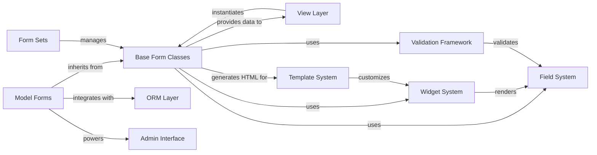

## Details

Django's Form System is a comprehensive framework that bridges user input and application data models. It provides structured components for creating, validating, and processing HTML forms. The system consists of several interconnected components: Base Form Classes that provide the foundation for form handling; Model Forms that create forms directly from Django models; Form Sets for managing collections of related forms; the Field System for defining individual form fields; the Widget System for HTML rendering; and the Validation Framework for ensuring data integrity. These components work together and integrate with Django's ORM Layer, View Layer, Template System, and Admin Interface to enable rapid development while maintaining data integrity and security through robust validation mechanisms.

### Base Form Classes
Foundation for all form handling, including field management, validation, and rendering. Provides field declaration, data binding, validation, error handling, and HTML rendering capabilities.

**Related Classes/Methods**:

- `django.forms.forms.Form`

### Model Forms
Creates forms directly from Django models, automating field creation and data saving. Provides model-to-form mapping, automatic field generation, and model instance saving.

**Related Classes/Methods**:

- `django.forms.models.ModelForm`

### Form Sets
Manages collections of related forms, enabling handling of multiple form instances simultaneously. Provides form collection management, validation across multiple forms, and dynamic form addition/removal.

**Related Classes/Methods**:

- <a href="https://github.com/django/django/blob/main/django/forms/formsets.py#L51-L530" target="_blank" rel="noopener noreferrer">`django.forms.formsets.BaseFormSet` (51:530)</a>

### Field System
Defines individual form fields with type-specific validation and processing. Provides data validation, type conversion, and error messaging.

**Related Classes/Methods**:

- `django.forms.fields.Field`

### Widget System
Handles HTML rendering for form fields. Provides HTML generation, rendering customization, and JavaScript integration.

**Related Classes/Methods**:

- `django.forms.widgets.Widget`

### Validation Framework
Provides reusable validation logic for form fields. Includes built-in validators, custom validation hooks, and cross-field validation.

**Related Classes/Methods**:

- `django.forms.validators`

### ORM Layer
Django's Object-Relational Mapping system that handles database interactions and model definitions.

**Related Classes/Methods**:

- `django.db.models`

### View Layer
Handles HTTP requests and responses, processes form data, and renders templates.

**Related Classes/Methods**:

- `django.views`

### Template System [[Expand]](./Template_System.md)
Renders HTML templates with dynamic data, including form rendering.

**Related Classes/Methods**:

- `django.template`

### Admin Interface [[Expand]](./Admin_Interface.md)
Django's automatic admin interface that leverages forms for CRUD operations.

**Related Classes/Methods**:

- `django.contrib.admin`

### [FAQ](https://github.com/CodeBoarding/GeneratedOnBoardings/tree/main?tab=readme-ov-file#faq)