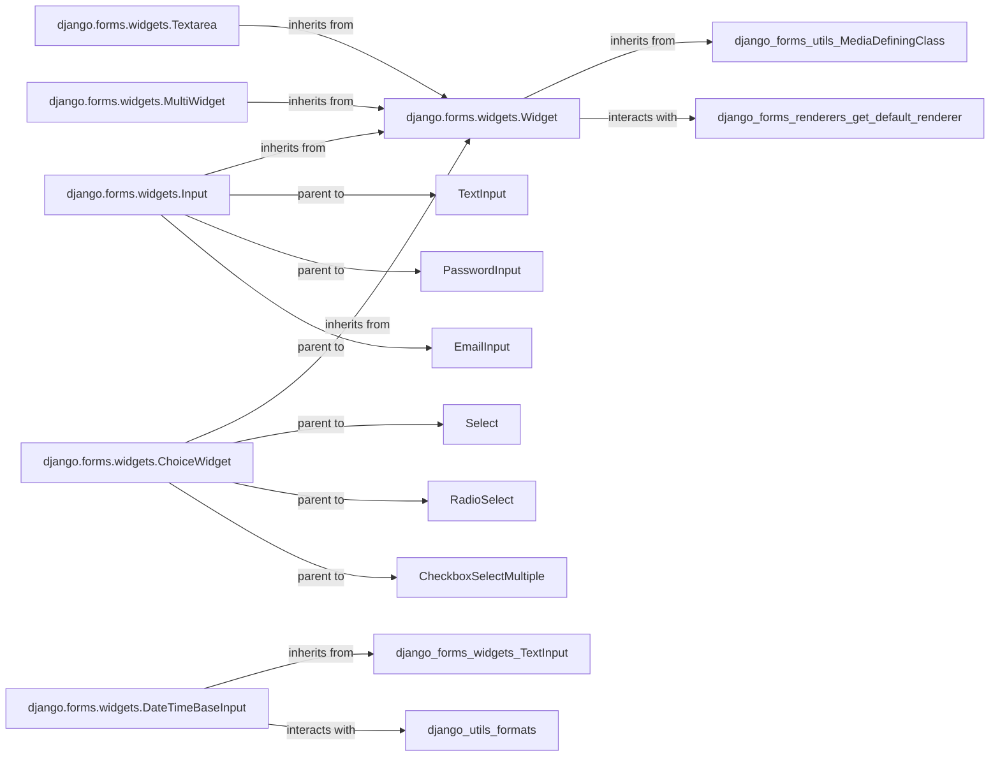

## Component Details

The Form Widgets subsystem in Django is responsible for the HTML representation of form fields. It dictates how a field appears in the browser (e.g., <input type="text">, <select>, <textarea>) and handles the conversion of Python values into HTML-friendly strings for display. This subsystem is fundamental because it bridges the gap between Python data and the user interface, ensuring that data can be both presented to and collected from the user in a standardized and customizable manner.

### django.forms.widgets.Widget
This is the abstract base class for all Django form widgets. It defines the core interface and common logic for rendering HTML input elements, managing attributes, preparing values for display, and orchestrating the rendering process. It serves as the primary contract for all widgets.

**Related Classes/Methods**: _None_

### django.forms.widgets.Input
A concrete foundational widget class that serves as the base for most single-value HTML <input> elements (e.g., text, password, email, number). It encapsulates the common rendering logic for various input types by defining an input_type attribute.

**Related Classes/Methods**: _None_

### django.forms.widgets.Textarea
A specialized widget class dedicated to rendering the HTML <textarea> element, which allows for multi-line text input. It extends the basic Widget functionality by setting default dimensions.

**Related Classes/Methods**: _None_

### django.forms.widgets.ChoiceWidget
An abstract base class for widgets that present a list of choices to the user, such as dropdowns (<select>) or radio buttons (<input type="radio">). It provides common logic for handling options, including grouping and creating individual option contexts.

**Related Classes/Methods**: _None_

### django.forms.widgets.MultiWidget
A specialized widget designed to combine multiple individual sub-widgets into a single logical form field. This is crucial for complex data types that are represented by several distinct HTML input elements (e.g., a single DateTimeField split into separate date and time inputs). Subclasses must implement a decompress method.

**Related Classes/Methods**: _None_

### django.forms.widgets.DateTimeBaseInput
A base class for widgets that handle date and/or time input. It extends TextInput and provides common parsing and formatting logic for temporal data, leveraging Django's formats module for localization.

**Related Classes/Methods**: _None_

### [FAQ](https://github.com/CodeBoarding/GeneratedOnBoardings/tree/main?tab=readme-ov-file#faq)