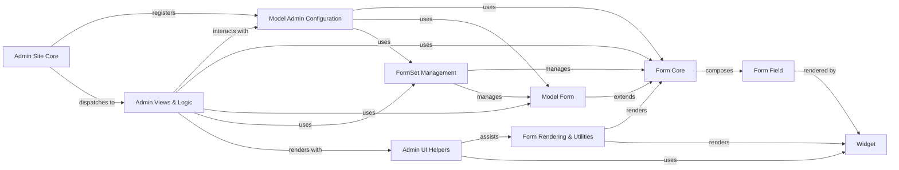

## Component Details

The 'Forms & Admin Interface' subsystem in Django provides a robust framework for handling HTML forms, encompassing form definition, data validation, error handling, and rendering. It streamlines user input processing and integration with database models. Additionally, it includes Django's automatically generated administrative interface, offering a powerful and flexible way to manage application data through a web-based UI. The core flow involves defining forms and fields, rendering them with widgets, processing user input, validating data, and then either saving to models or displaying errors. The admin interface extends this by providing automated CRUD operations for registered models, leveraging the form components for data entry and modification, and offering a customizable, secure management portal.

### Form Core
The foundational component for all forms in Django, providing the basic structure and mechanisms for data binding, validation, error management, and rendering. It handles the lifecycle of a form, from initialization with data to cleaning and error reporting.

**Related Classes/Methods**:

- <a href="https://github.com/django/django/blob/master/django/forms/forms.py#L1-L1" target="_blank" rel="noopener noreferrer">`django.forms.forms.BaseForm` (1:1)</a>
- <a href="https://github.com/django/django/blob/master/django/forms/forms.py#L432-L433" target="_blank" rel="noopener noreferrer">`django.forms.forms.Form` (432:433)</a>

### Model Form
This component extends the Form Core to facilitate interaction with Django models. It automates the creation of form fields from model fields, handles saving model instances, and integrates model-level validation (unique constraints, etc.) into the form's validation process.

**Related Classes/Methods**:

- <a href="https://github.com/django/django/blob/master/django/forms/models.py#L1-L1" target="_blank" rel="noopener noreferrer">`django.forms.models.BaseModelForm` (1:1)</a>
- <a href="https://github.com/django/django/blob/master/django/forms/models.py#L1-L1" target="_blank" rel="noopener noreferrer">`django.forms.models.model_to_dict` (1:1)</a>
- <a href="https://github.com/django/django/blob/master/django/forms/models.py#L1-L1" target="_blank" rel="noopener noreferrer">`django.forms.models.construct_instance` (1:1)</a>

### Form Field
Represents a single data input element within a form. It defines the data type, validation rules, and how the data is converted to Python objects. Each field is associated with a widget for rendering its HTML representation.

**Related Classes/Methods**:

- <a href="https://github.com/django/django/blob/master/django/forms/fields.py#L1-L1" target="_blank" rel="noopener noreferrer">`django.forms.fields.Field` (1:1)</a>
- <a href="https://github.com/django/django/blob/master/django/forms/fields.py#L1-L1" target="_blank" rel="noopener noreferrer">`django.forms.fields.CharField` (1:1)</a>
- <a href="https://github.com/django/django/blob/master/django/forms/fields.py#L1-L1" target="_blank" rel="noopener noreferrer">`django.forms.fields.IntegerField` (1:1)</a>
- <a href="https://github.com/django/django/blob/master/django/forms/models.py#L1-L1" target="_blank" rel="noopener noreferrer">`django.forms.models.ModelChoiceField` (1:1)</a>

### Widget
This component is responsible for the HTML representation of form fields. It dictates how a field is rendered in the browser and how its value is extracted from the incoming request data (e.g., POST data). It also manages associated CSS and JavaScript assets.

**Related Classes/Methods**:

- <a href="https://github.com/django/django/blob/master/django/forms/widgets.py#L1-L1" target="_blank" rel="noopener noreferrer">`django.forms.widgets.Widget` (1:1)</a>
- <a href="https://github.com/django/django/blob/master/django/forms/widgets.py#L1-L1" target="_blank" rel="noopener noreferrer">`django.forms.widgets.Media` (1:1)</a>

### FormSet Management
Provides mechanisms for handling collections of forms, enabling the management of multiple instances of the same form or model forms, including inline editing of related objects.

**Related Classes/Methods**:

- <a href="https://github.com/django/django/blob/master/django/forms/formsets.py#L51-L530" target="_blank" rel="noopener noreferrer">`django.forms.formsets.BaseFormSet` (51:530)</a>
- <a href="https://github.com/django/django/blob/master/django/forms/models.py#L1-L1" target="_blank" rel="noopener noreferrer">`django.forms.models.BaseModelFormSet` (1:1)</a>
- <a href="https://github.com/django/django/blob/master/django/forms/models.py#L1-L1" target="_blank" rel="noopener noreferrer">`django.forms.models.BaseInlineFormSet` (1:1)</a>

### Form Rendering & Utilities
Encapsulates the logic for rendering forms and their elements into HTML, managing error display, and providing general utility functions for form processing.

**Related Classes/Methods**:

- <a href="https://github.com/django/django/blob/master/django/forms/renderers.py#L16-L28" target="_blank" rel="noopener noreferrer">`django.forms.renderers.BaseRenderer` (16:28)</a>
- <a href="https://github.com/django/django/blob/master/django/forms/utils.py#L140-L208" target="_blank" rel="noopener noreferrer">`django.forms.utils.ErrorList` (140:208)</a>
- <a href="https://github.com/django/django/blob/master/django/forms/boundfield.py#L12-L322" target="_blank" rel="noopener noreferrer">`django.forms.boundfield.BoundField` (12:322)</a>

### Admin Site Core
The central hub of the Django administrative interface, responsible for registering models, managing admin URLs, and providing the overall structure and authentication for the admin.

**Related Classes/Methods**:

- <a href="https://github.com/django/django/blob/master/django/contrib/admin/sites.py#L29-L605" target="_blank" rel="noopener noreferrer">`django.contrib.admin.sites.AdminSite` (29:605)</a>

### Model Admin Configuration
Defines the customizable behavior and appearance of models within the Django admin. It allows developers to specify how model data is listed, filtered, searched, and edited.

**Related Classes/Methods**:

- <a href="https://github.com/django/django/blob/master/django/contrib/admin/options.py#L634-L2340" target="_blank" rel="noopener noreferrer">`django.contrib.admin.options.ModelAdmin` (634:2340)</a>
- <a href="https://github.com/django/django/blob/master/django/contrib/admin/options.py#L2343-L2549" target="_blank" rel="noopener noreferrer">`django.contrib.admin.options.InlineModelAdmin` (2343:2549)</a>

### Admin Views & Logic
Implements the view functions and classes that handle HTTP requests and generate responses for the various pages in the Django admin, such as change lists, detail forms, and history.

**Related Classes/Methods**:

- <a href="https://github.com/django/django/blob/master/django/contrib/admin/views/main.py#L1-L1" target="_blank" rel="noopener noreferrer">`django.contrib.admin.views.main` (1:1)</a>
- <a href="https://github.com/django/django/blob/master/django/contrib/admin/views/autocomplete.py#L1-L1" target="_blank" rel="noopener noreferrer">`django.contrib.admin.views.autocomplete` (1:1)</a>

### Admin UI Helpers
Provides a set of helper classes, functions, and template tags specifically designed to assist in the rendering and interaction of the Django admin user interface, including form layout and dynamic elements.

**Related Classes/Methods**:

- <a href="https://github.com/django/django/blob/master/django/contrib/admin/helpers.py#L1-L1" target="_blank" rel="noopener noreferrer">`django.contrib.admin.helpers` (1:1)</a>
- <a href="https://github.com/django/django/blob/master/django/contrib/admin/utils.py#L1-L1" target="_blank" rel="noopener noreferrer">`django.contrib.admin.utils` (1:1)</a>
- <a href="https://github.com/django/django/blob/master/django/contrib/admin/widgets.py#L1-L1" target="_blank" rel="noopener noreferrer">`django.contrib.admin.widgets` (1:1)</a>
- `django.contrib.admin.templatetags` (1:1)

### [FAQ](https://github.com/CodeBoarding/GeneratedOnBoardings/tree/main?tab=readme-ov-file#faq)