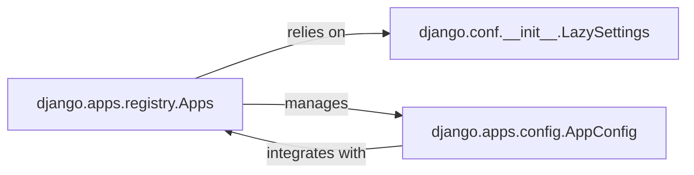

## Details

The `Framework Configuration` subsystem in Django is crucial for setting up the project's environment, managing global settings, and registering individual applications. It acts as the foundational layer upon which the entire Django application operates.

### django.conf.__init__.LazySettings
This component is the cornerstone for managing all project-wide settings. It implements a lazy-loading pattern, meaning settings are only loaded into memory when they are first accessed. This design allows for dynamic configuration adjustments and overrides during the framework's startup, making the configuration process flexible and efficient. It encapsulates the logic for reading and providing access to values defined in the `settings.py` file.

**Related Classes/Methods**:

- <a href="https://github.com/django/django//blob/django/conf/__init__.py#L39-L148" target="_blank" rel="noopener noreferrer">`django.conf.__init__.LazySettings`:39-148</a>

### django.apps.registry.Apps
As the central registry, this component is responsible for discovering, loading, and managing the lifecycle of all installed Django applications within a project. It ensures that applications are properly initialized and ready for use by the framework. It provides a unified interface to access `AppConfig` instances, which represent the configuration for individual applications. This component is vital for Django's modularity, allowing applications to be self-contained and easily integrated.

**Related Classes/Methods**:

- <a href="https://github.com/django/django//blob/django/apps/registry.py" target="_blank" rel="noopener noreferrer">`django.apps.registry.Apps`</a>

### django.apps.config.AppConfig
This component represents the configuration for a single Django application. Every installed application has an associated `AppConfig` instance, which allows developers to define application-specific metadata (like verbose names), specify initialization logic (e.g., connecting signals, performing setup tasks), and integrate the application seamlessly into the Django framework's lifecycle. It acts as the entry point for an application's configuration within the `Apps` registry.

**Related Classes/Methods**:

- <a href="https://github.com/django/django//blob/django/apps/config.py#L13-L274" target="_blank" rel="noopener noreferrer">`django.apps.config.AppConfig`:13-274</a>

### [FAQ](https://github.com/CodeBoarding/GeneratedOnBoardings/tree/main?tab=readme-ov-file#faq)