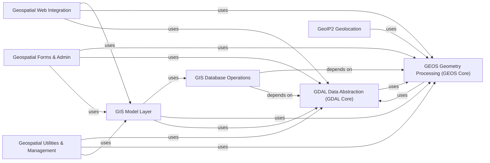

## Component Details

The Geographic Information Systems (GIS) subsystem in Django extends the ORM and administrative interface to support geographic data types and spatial queries. It integrates with external GIS libraries like GDAL for data abstraction and GEOS for geometry processing. The system provides specialized model fields, database operations for various GIS-enabled backends, and utilities for web integration (e.g., GeoJSON, KML), forms, admin interfaces, and management commands for geospatial data handling. The core purpose is to enable seamless development of location-aware applications within the Django framework.

### GDAL Data Abstraction (GDAL Core)
This component provides an interface to the GDAL (Geospatial Data Abstraction Library) for reading and writing various geospatial data formats. It includes classes for drivers, fields, features, layers, and fundamental geometry types, enabling interaction with diverse geospatial data sources.

**Related Classes/Methods**:

- `django.contrib.gis.gdal.driver` (full file reference)
- `django.contrib.gis.gdal.field` (full file reference)
- `django.contrib.gis.gdal.feature` (full file reference)
- `django.contrib.gis.gdal.layer` (full file reference)
- `django.contrib.gis.gdal.geometries` (full file reference)
- `django.contrib.gis.gdal.geomtype` (full file reference)
- `django.contrib.gis.gdal.libgdal` (full file reference)
- `django.contrib.gis.gdal.error` (full file reference)
- `django.contrib.gis.gdal.srs` (full file reference)
- `django.contrib.gis.gdal.datasource` (full file reference)
- `django.contrib.gis.gdal.envelope` (full file reference)
- `django.contrib.gis.gdal.prototypes` (full file reference)
- `django.contrib.gis.gdal.raster` (full file reference)
- <a href="https://github.com/django/django/blob/master/django/contrib/gis/gdal/base.py#L5-L6" target="_blank" rel="noopener noreferrer">`django.contrib.gis.gdal.base.GDALBase` (5:6)</a>
- <a href="https://github.com/django/django/blob/master/django/contrib/gis/gdal/datasource.py#L51-L129" target="_blank" rel="noopener noreferrer">`django.contrib.gis.gdal.datasource.DataSource` (51:129)</a>
- <a href="https://github.com/django/django/blob/master/django/contrib/gis/gdal/driver.py#L9-L94" target="_blank" rel="noopener noreferrer">`django.contrib.gis.gdal.driver.Driver` (9:94)</a>
- <a href="https://github.com/django/django/blob/master/django/contrib/gis/gdal/feature.py#L14-L120" target="_blank" rel="noopener noreferrer">`django.contrib.gis.gdal.feature.Feature` (14:120)</a>
- <a href="https://github.com/django/django/blob/master/django/contrib/gis/gdal/field.py#L14-L131" target="_blank" rel="noopener noreferrer">`django.contrib.gis.gdal.field.Field` (14:131)</a>
- <a href="https://github.com/django/django/blob/master/django/contrib/gis/gdal/geometries.py#L61-L581" target="_blank" rel="noopener noreferrer">`django.contrib.gis.gdal.geometries.OGRGeometry` (61:581)</a>
- <a href="https://github.com/django/django/blob/master/django/contrib/gis/gdal/layer.py#L21-L234" target="_blank" rel="noopener noreferrer">`django.contrib.gis.gdal.layer.Layer` (21:234)</a>
- <a href="https://github.com/django/django/blob/master/django/contrib/gis/gdal/raster/band.py#L17-L254" target="_blank" rel="noopener noreferrer">`django.contrib.gis.gdal.raster.band.GDALBand` (17:254)</a>
- <a href="https://github.com/django/django/blob/master/django/contrib/gis/gdal/raster/source.py#L70-L541" target="_blank" rel="noopener noreferrer">`django.contrib.gis.gdal.raster.source.GDALRaster` (70:541)</a>
- <a href="https://github.com/django/django/blob/master/django/contrib/gis/gdal/srs.py#L346-L362" target="_blank" rel="noopener noreferrer">`django.contrib.gis.gdal.srs.CoordTransform` (346:362)</a>
- <a href="https://github.com/django/django/blob/master/django/contrib/gis/gdal/srs.py#L45-L343" target="_blank" rel="noopener noreferrer">`django.contrib.gis.gdal.srs.SpatialReference` (45:343)</a>

### GEOS Geometry Processing (GEOS Core)
This component integrates with the GEOS (Geometry Engine - Open Source) library, providing robust geometric operations, spatial predicates, and data structures for points, lines, polygons, and collections. It handles WKB/WKT serialization and deserialization, forming the backbone for geometric computations.

**Related Classes/Methods**:

- `django.contrib.gis.geos.collections` (full file reference)
- `django.contrib.gis.geos.io` (full file reference)
- `django.contrib.gis.geos.geometry` (full file reference)
- `django.contrib.gis.geos.factory` (full file reference)
- `django.contrib.gis.geos.polygon` (full file reference)
- `django.contrib.gis.geos.linestring` (full file reference)
- `django.contrib.gis.geos.coordseq` (full file reference)
- `django.contrib.gis.geos.point` (full file reference)
- `django.contrib.gis.geos.prepared` (full file reference)
- `django.contrib.gis.geos.libgeos` (full file reference)
- `django.contrib.gis.geos.mutable_list` (full file reference)
- `django.contrib.gis.geos.prototypes` (full file reference)
- <a href="https://github.com/django/django/blob/master/django/contrib/gis/geos/base.py#L5-L6" target="_blank" rel="noopener noreferrer">`django.contrib.gis.geos.base.GEOSBase` (5:6)</a>
- <a href="https://github.com/django/django/blob/master/django/contrib/gis/geos/collections.py#L14-L92" target="_blank" rel="noopener noreferrer">`django.contrib.gis.geos.collections.GeometryCollection` (14:92)</a>
- <a href="https://github.com/django/django/blob/master/django/contrib/gis/geos/collections.py#L101-L103" target="_blank" rel="noopener noreferrer">`django.contrib.gis.geos.collections.MultiLineString` (101:103)</a>
- <a href="https://github.com/django/django/blob/master/django/contrib/gis/geos/collections.py#L96-L98" target="_blank" rel="noopener noreferrer">`django.contrib.gis.geos.collections.MultiPoint` (96:98)</a>
- <a href="https://github.com/django/django/blob/master/django/contrib/gis/geos/collections.py#L106-L108" target="_blank" rel="noopener noreferrer">`django.contrib.gis.geos.collections.MultiPolygon` (106:108)</a>
- <a href="https://github.com/django/django/blob/master/django/contrib/gis/geos/coordseq.py#L16-L211" target="_blank" rel="noopener noreferrer">`django.contrib.gis.geos.coordseq.GEOSCoordSeq` (16:211)</a>
- <a href="https://github.com/django/django/blob/master/django/contrib/gis/geos/geometry.py#L727-L787" target="_blank" rel="noopener noreferrer">`django.contrib.gis.geos.geometry.GEOSGeometry` (727:787)</a>
- <a href="https://github.com/django/django/blob/master/django/contrib/gis/geos/linestring.py#L9-L181" target="_blank" rel="noopener noreferrer">`django.contrib.gis.geos.linestring.LineString` (9:181)</a>
- <a href="https://github.com/django/django/blob/master/django/contrib/gis/geos/linestring.py#L185-L193" target="_blank" rel="noopener noreferrer">`django.contrib.gis.geos.linestring.LinearRing` (185:193)</a>
- <a href="https://github.com/django/django/blob/master/django/contrib/gis/geos/point.py#L9-L162" target="_blank" rel="noopener noreferrer">`django.contrib.gis.geos.point.Point` (9:162)</a>
- <a href="https://github.com/django/django/blob/master/django/contrib/gis/geos/polygon.py#L7-L189" target="_blank" rel="noopener noreferrer">`django.contrib.gis.geos.polygon.Polygon` (7:189)</a>
- <a href="https://github.com/django/django/blob/master/django/contrib/gis/geos/prepared.py#L5-L51" target="_blank" rel="noopener noreferrer">`django.contrib.gis.geos.prepared.PreparedGeometry` (5:51)</a>

### GIS Database Operations
This component provides the database-specific implementations for handling geospatial data, including operations, adapters, introspection, and schema modifications for various GIS-enabled databases such as PostGIS, Oracle, MySQL, and SpatiaLite. It ensures seamless interaction between Django's ORM and the underlying spatial database.

**Related Classes/Methods**:

- `django.contrib.gis.db.backends.postgis` (full file reference)
- `django.contrib.gis.db.backends.oracle` (full file reference)
- `django.contrib.gis.db.backends.mysql` (full file reference)
- `django.contrib.gis.db.backends.spatialite` (full file reference)
- `django.contrib.gis.db.backends.base` (full file reference)
- <a href="https://github.com/django/django/blob/master/django/contrib/gis/db/backends/mysql/base.py#L9-L14" target="_blank" rel="noopener noreferrer">`django.contrib.gis.db.backends.mysql.base.DatabaseWrapper` (9:14)</a>
- <a href="https://github.com/django/django/blob/master/django/contrib/gis/db/backends/mysql/features.py#L6-L21" target="_blank" rel="noopener noreferrer">`django.contrib.gis.db.backends.mysql.features.DatabaseFeatures` (6:21)</a>
- <a href="https://github.com/django/django/blob/master/django/contrib/gis/db/backends/mysql/introspection.py#L7-L33" target="_blank" rel="noopener noreferrer">`django.contrib.gis.db.backends.mysql.introspection.MySQLIntrospection` (7:33)</a>
- <a href="https://github.com/django/django/blob/master/django/contrib/gis/db/backends/mysql/operations.py#L12-L147" target="_blank" rel="noopener noreferrer">`django.contrib.gis.db.backends.mysql.operations.MySQLOperations` (12:147)</a>
- <a href="https://github.com/django/django/blob/master/django/contrib/gis/db/backends/mysql/schema.py#L10-L112" target="_blank" rel="noopener noreferrer">`django.contrib.gis.db.backends.mysql.schema.MySQLGISSchemaEditor` (10:112)</a>
- <a href="https://github.com/django/django/blob/master/django/contrib/gis/db/backends/oracle/adapter.py#L7-L62" target="_blank" rel="noopener noreferrer">`django.contrib.gis.db.backends.oracle.adapter.OracleSpatialAdapter` (7:62)</a>
- <a href="https://github.com/django/django/blob/master/django/contrib/gis/db/backends/oracle/base.py#L9-L14" target="_blank" rel="noopener noreferrer">`django.contrib.gis.db.backends.oracle.base.DatabaseWrapper` (9:14)</a>
- <a href="https://github.com/django/django/blob/master/django/contrib/gis/db/backends/oracle/features.py#L8-L28" target="_blank" rel="noopener noreferrer">`django.contrib.gis.db.backends.oracle.features.DatabaseFeatures` (8:28)</a>
- <a href="https://github.com/django/django/blob/master/django/contrib/gis/db/backends/oracle/introspection.py#L7-L47" target="_blank" rel="noopener noreferrer">`django.contrib.gis.db.backends.oracle.introspection.OracleIntrospection` (7:47)</a>
- <a href="https://github.com/django/django/blob/master/django/contrib/gis/db/backends/oracle/models.py#L15-L45" target="_blank" rel="noopener noreferrer">`django.contrib.gis.db.backends.oracle.models.OracleGeometryColumns` (15:45)</a>
- <a href="https://github.com/django/django/blob/master/django/contrib/gis/db/backends/oracle/models.py#L48-L67" target="_blank" rel="noopener noreferrer">`django.contrib.gis.db.backends.oracle.models.OracleSpatialRefSys` (48:67)</a>
- <a href="https://github.com/django/django/blob/master/django/contrib/gis/db/backends/oracle/operations.py#L57-L248" target="_blank" rel="noopener noreferrer">`django.contrib.gis.db.backends.oracle.operations.OracleOperations` (57:248)</a>
- <a href="https://github.com/django/django/blob/master/django/contrib/gis/db/backends/oracle/schema.py#L6-L151" target="_blank" rel="noopener noreferrer">`django.contrib.gis.db.backends.oracle.schema.OracleGISSchemaEditor` (6:151)</a>
- <a href="https://github.com/django/django/blob/master/django/contrib/gis/db/backends/postgis/base.py#L91-L161" target="_blank" rel="noopener noreferrer">`django.contrib.gis.db.backends.postgis.base.DatabaseWrapper` (91:161)</a>
- <a href="https://github.com/django/django/blob/master/django/contrib/gis/db/backends/postgis/features.py#L7-L13" target="_blank" rel="noopener noreferrer">`django.contrib.gis.db.backends.postgis.features.DatabaseFeatures` (7:13)</a>
- <a href="https://github.com/django/django/blob/master/django/contrib/gis/db/backends/postgis/introspection.py#L5-L72" target="_blank" rel="noopener noreferrer">`django.contrib.gis.db.backends.postgis.introspection.PostGISIntrospection` (5:72)</a>
- <a href="https://github.com/django/django/blob/master/django/contrib/gis/db/backends/postgis/models.py#L9-L51" target="_blank" rel="noopener noreferrer">`django.contrib.gis.db.backends.postgis.models.PostGISGeometryColumns` (9:51)</a>
- <a href="https://github.com/django/django/blob/master/django/contrib/gis/db/backends/postgis/models.py#L54-L73" target="_blank" rel="noopener noreferrer">`django.contrib.gis.db.backends.postgis.models.PostGISSpatialRefSys` (54:73)</a>
- <a href="https://github.com/django/django/blob/master/django/contrib/gis/db/backends/postgis/operations.py#L115-L423" target="_blank" rel="noopener noreferrer">`django.contrib.gis.db.backends.postgis.operations.PostGISOperations` (115:423)</a>
- <a href="https://github.com/django/django/blob/master/django/contrib/gis/db/backends/postgis/schema.py#L6-L124" target="_blank" rel="noopener noreferrer">`django.contrib.gis.db.backends.postgis.schema.PostGISSchemaEditor` (6:124)</a>
- <a href="https://github.com/django/django/blob/master/django/contrib/gis/db/backends/spatialite/adapter.py#L5-L10" target="_blank" rel="noopener noreferrer">`django.contrib.gis.db.backends.spatialite.adapter.SpatiaLiteAdapter` (5:10)</a>
- <a href="https://github.com/django/django/blob/master/django/contrib/gis/db/backends/spatialite/base.py#L14-L79" target="_blank" rel="noopener noreferrer">`django.contrib.gis.db.backends.spatialite.base.DatabaseWrapper` (14:79)</a>
- <a href="https://github.com/django/django/blob/master/django/contrib/gis/db/backends/spatialite/client.py#L4-L5" target="_blank" rel="noopener noreferrer">`django.contrib.gis.db.backends.spatialite.client.SpatiaLiteClient` (4:5)</a>
- <a href="https://github.com/django/django/blob/master/django/contrib/gis/db/backends/spatialite/features.py#L8-L26" target="_blank" rel="noopener noreferrer">`django.contrib.gis.db.backends.spatialite.features.DatabaseFeatures` (8:26)</a>
- <a href="https://github.com/django/django/blob/master/django/contrib/gis/db/backends/spatialite/introspection.py#L26-L82" target="_blank" rel="noopener noreferrer">`django.contrib.gis.db.backends.spatialite.introspection.SpatiaLiteIntrospection` (26:82)</a>
- <a href="https://github.com/django/django/blob/master/django/contrib/gis/db/backends/spatialite/models.py#L9-L49" target="_blank" rel="noopener noreferrer">`django.contrib.gis.db.backends.spatialite.models.SpatialiteGeometryColumns` (9:49)</a>
- <a href="https://github.com/django/django/blob/master/django/contrib/gis/db/backends/spatialite/models.py#L52-L71" target="_blank" rel="noopener noreferrer">`django.contrib.gis.db.backends.spatialite.models.SpatialiteSpatialRefSys` (52:71)</a>
- <a href="https://github.com/django/django/blob/master/django/contrib/gis/db/backends/spatialite/operations.py#L25-L231" target="_blank" rel="noopener noreferrer">`django.contrib.gis.db.backends.spatialite.operations.SpatiaLiteOperations` (25:231)</a>
- <a href="https://github.com/django/django/blob/master/django/contrib/gis/db/backends/spatialite/schema.py#L5-L194" target="_blank" rel="noopener noreferrer">`django.contrib.gis.db.backends.spatialite.schema.SpatialiteSchemaEditor` (5:194)</a>

### GIS Model Layer
This component extends Django's ORM with geospatial capabilities, providing specialized model fields (GeometryField, RasterField), lookups for spatial queries, and database functions/aggregates for geometric operations. It allows developers to define and query spatial data directly within Django models.

**Related Classes/Methods**:

- `django.contrib.gis.db.models.lookups` (full file reference)
- `django.contrib.gis.db.models.fields` (full file reference)
- `django.contrib.gis.db.models.proxy` (full file reference)
- `django.contrib.gis.db.models.functions` (full file reference)
- `django.contrib.gis.db.models.aggregates` (full file reference)
- `django.contrib.gis.db.models.sql.conversion` (full file reference)
- <a href="https://github.com/django/django/blob/master/django/contrib/gis/db/models/aggregates.py#L60-L62" target="_blank" rel="noopener noreferrer">`django.contrib.gis.db.models.aggregates.Collect` (60:62)</a>
- <a href="https://github.com/django/django/blob/master/django/contrib/gis/db/models/aggregates.py#L65-L73" target="_blank" rel="noopener noreferrer">`django.contrib.gis.db.models.aggregates.Extent` (65:73)</a>
- <a href="https://github.com/django/django/blob/master/django/contrib/gis/db/models/aggregates.py#L76-L84" target="_blank" rel="noopener noreferrer">`django.contrib.gis.db.models.aggregates.Extent3D` (76:84)</a>
- <a href="https://github.com/django/django/blob/master/django/contrib/gis/db/models/aggregates.py#L13-L57" target="_blank" rel="noopener noreferrer">`django.contrib.gis.db.models.aggregates.GeoAggregate` (13:57)</a>
- <a href="https://github.com/django/django/blob/master/django/contrib/gis/db/models/aggregates.py#L87-L89" target="_blank" rel="noopener noreferrer">`django.contrib.gis.db.models.aggregates.MakeLine` (87:89)</a>
- <a href="https://github.com/django/django/blob/master/django/contrib/gis/db/models/aggregates.py#L92-L94" target="_blank" rel="noopener noreferrer">`django.contrib.gis.db.models.aggregates.Union` (92:94)</a>
- <a href="https://github.com/django/django/blob/master/django/contrib/gis/db/models/fields.py#L368-L372" target="_blank" rel="noopener noreferrer">`django.contrib.gis.db.models.fields.GeometryCollectionField` (368:372)</a>
- <a href="https://github.com/django/django/blob/master/django/contrib/gis/db/models/fields.py#L225-L322" target="_blank" rel="noopener noreferrer">`django.contrib.gis.db.models.fields.GeometryField` (225:322)</a>
- <a href="https://github.com/django/django/blob/master/django/contrib/gis/db/models/fields.py#L333-L337" target="_blank" rel="noopener noreferrer">`django.contrib.gis.db.models.fields.LineStringField` (333:337)</a>
- <a href="https://github.com/django/django/blob/master/django/contrib/gis/db/models/fields.py#L354-L358" target="_blank" rel="noopener noreferrer">`django.contrib.gis.db.models.fields.MultiLineStringField` (354:358)</a>
- <a href="https://github.com/django/django/blob/master/django/contrib/gis/db/models/fields.py#L347-L351" target="_blank" rel="noopener noreferrer">`django.contrib.gis.db.models.fields.MultiPointField` (347:351)</a>
- <a href="https://github.com/django/django/blob/master/django/contrib/gis/db/models/fields.py#L361-L365" target="_blank" rel="noopener noreferrer">`django.contrib.gis.db.models.fields.MultiPolygonField` (361:365)</a>
- <a href="https://github.com/django/django/blob/master/django/contrib/gis/db/models/fields.py#L326-L330" target="_blank" rel="noopener noreferrer">`django.contrib.gis.db.models.fields.PointField` (326:330)</a>
- <a href="https://github.com/django/django/blob/master/django/contrib/gis/db/models/fields.py#L340-L344" target="_blank" rel="noopener noreferrer">`django.contrib.gis.db.models.fields.PolygonField` (340:344)</a>
- <a href="https://github.com/django/django/blob/master/django/contrib/gis/db/models/fields.py#L388-L434" target="_blank" rel="noopener noreferrer">`django.contrib.gis.db.models.fields.RasterField` (388:434)</a>
- <a href="https://github.com/django/django/blob/master/django/contrib/gis/db/models/functions.py#L158-L178" target="_blank" rel="noopener noreferrer">`django.contrib.gis.db.models.functions.Area` (158:178)</a>
- <a href="https://github.com/django/django/blob/master/django/contrib/gis/db/models/functions.py#L211-L231" target="_blank" rel="noopener noreferrer">`django.contrib.gis.db.models.functions.AsGML` (211:231)</a>
- <a href="https://github.com/django/django/blob/master/django/contrib/gis/db/models/functions.py#L187-L208" target="_blank" rel="noopener noreferrer">`django.contrib.gis.db.models.functions.AsGeoJSON` (187:208)</a>
- <a href="https://github.com/django/django/blob/master/django/contrib/gis/db/models/functions.py#L234-L241" target="_blank" rel="noopener noreferrer">`django.contrib.gis.db.models.functions.AsKML` (234:241)</a>
- <a href="https://github.com/django/django/blob/master/django/contrib/gis/db/models/functions.py#L244-L256" target="_blank" rel="noopener noreferrer">`django.contrib.gis.db.models.functions.AsSVG` (244:256)</a>
- <a href="https://github.com/django/django/blob/master/django/contrib/gis/db/models/functions.py#L259-L261" target="_blank" rel="noopener noreferrer">`django.contrib.gis.db.models.functions.AsWKB` (259:261)</a>
- <a href="https://github.com/django/django/blob/master/django/contrib/gis/db/models/functions.py#L264-L266" target="_blank" rel="noopener noreferrer">`django.contrib.gis.db.models.functions.AsWKT` (264:266)</a>
- <a href="https://github.com/django/django/blob/master/django/contrib/gis/db/models/functions.py#L181-L184" target="_blank" rel="noopener noreferrer">`django.contrib.gis.db.models.functions.Azimuth` (181:184)</a>
- <a href="https://github.com/django/django/blob/master/django/contrib/gis/db/models/functions.py#L269-L285" target="_blank" rel="noopener noreferrer">`django.contrib.gis.db.models.functions.BoundingCircle` (269:285)</a>
- <a href="https://github.com/django/django/blob/master/django/contrib/gis/db/models/functions.py#L288-L289" target="_blank" rel="noopener noreferrer">`django.contrib.gis.db.models.functions.Centroid` (288:289)</a>
- <a href="https://github.com/django/django/blob/master/django/contrib/gis/db/models/functions.py#L292-L294" target="_blank" rel="noopener noreferrer">`django.contrib.gis.db.models.functions.ClosestPoint` (292:294)</a>
- <a href="https://github.com/django/django/blob/master/django/contrib/gis/db/models/functions.py#L297-L299" target="_blank" rel="noopener noreferrer">`django.contrib.gis.db.models.functions.Difference` (297:299)</a>
- <a href="https://github.com/django/django/blob/master/django/contrib/gis/db/models/functions.py#L311-L359" target="_blank" rel="noopener noreferrer">`django.contrib.gis.db.models.functions.Distance` (311:359)</a>
- <a href="https://github.com/django/django/blob/master/django/contrib/gis/db/models/functions.py#L362-L363" target="_blank" rel="noopener noreferrer">`django.contrib.gis.db.models.functions.Envelope` (362:363)</a>
- <a href="https://github.com/django/django/blob/master/django/contrib/gis/db/models/functions.py#L366-L367" target="_blank" rel="noopener noreferrer">`django.contrib.gis.db.models.functions.ForcePolygonCW` (366:367)</a>
- <a href="https://github.com/django/django/blob/master/django/contrib/gis/db/models/functions.py#L370-L388" target="_blank" rel="noopener noreferrer">`django.contrib.gis.db.models.functions.FromWKB` (370:388)</a>
- <a href="https://github.com/django/django/blob/master/django/contrib/gis/db/models/functions.py#L391-L392" target="_blank" rel="noopener noreferrer">`django.contrib.gis.db.models.functions.FromWKT` (391:392)</a>
- <a href="https://github.com/django/django/blob/master/django/contrib/gis/db/models/functions.py#L111-L112" target="_blank" rel="noopener noreferrer">`django.contrib.gis.db.models.functions.GeoFunc` (111:112)</a>
- <a href="https://github.com/django/django/blob/master/django/contrib/gis/db/models/functions.py#L395-L409" target="_blank" rel="noopener noreferrer">`django.contrib.gis.db.models.functions.GeoHash` (395:409)</a>
- <a href="https://github.com/django/django/blob/master/django/contrib/gis/db/models/functions.py#L115-L118" target="_blank" rel="noopener noreferrer">`django.contrib.gis.db.models.functions.GeomOutputGeoFunc` (115:118)</a>
- <a href="https://github.com/django/django/blob/master/django/contrib/gis/db/models/functions.py#L412-L417" target="_blank" rel="noopener noreferrer">`django.contrib.gis.db.models.functions.GeometryDistance` (412:417)</a>
- <a href="https://github.com/django/django/blob/master/django/contrib/gis/db/models/functions.py#L420-L422" target="_blank" rel="noopener noreferrer">`django.contrib.gis.db.models.functions.Intersection` (420:422)</a>
- <a href="https://github.com/django/django/blob/master/django/contrib/gis/db/models/functions.py#L426-L428" target="_blank" rel="noopener noreferrer">`django.contrib.gis.db.models.functions.IsEmpty` (426:428)</a>
- <a href="https://github.com/django/django/blob/master/django/contrib/gis/db/models/functions.py#L432-L438" target="_blank" rel="noopener noreferrer">`django.contrib.gis.db.models.functions.IsValid` (432:438)</a>
- <a href="https://github.com/django/django/blob/master/django/contrib/gis/db/models/functions.py#L441-L477" target="_blank" rel="noopener noreferrer">`django.contrib.gis.db.models.functions.Length` (441:477)</a>
- <a href="https://github.com/django/django/blob/master/django/contrib/gis/db/models/functions.py#L480-L483" target="_blank" rel="noopener noreferrer">`django.contrib.gis.db.models.functions.LineLocatePoint` (480:483)</a>
- <a href="https://github.com/django/django/blob/master/django/contrib/gis/db/models/functions.py#L486-L487" target="_blank" rel="noopener noreferrer">`django.contrib.gis.db.models.functions.MakeValid` (486:487)</a>
- <a href="https://github.com/django/django/blob/master/django/contrib/gis/db/models/functions.py#L490-L492" target="_blank" rel="noopener noreferrer">`django.contrib.gis.db.models.functions.MemSize` (490:492)</a>
- <a href="https://github.com/django/django/blob/master/django/contrib/gis/db/models/functions.py#L495-L497" target="_blank" rel="noopener noreferrer">`django.contrib.gis.db.models.functions.NumGeometries` (495:497)</a>
- <a href="https://github.com/django/django/blob/master/django/contrib/gis/db/models/functions.py#L500-L502" target="_blank" rel="noopener noreferrer">`django.contrib.gis.db.models.functions.NumPoints` (500:502)</a>
- <a href="https://github.com/django/django/blob/master/django/contrib/gis/db/models/functions.py#L505-L522" target="_blank" rel="noopener noreferrer">`django.contrib.gis.db.models.functions.Perimeter` (505:522)</a>
- <a href="https://github.com/django/django/blob/master/django/contrib/gis/db/models/functions.py#L525-L526" target="_blank" rel="noopener noreferrer">`django.contrib.gis.db.models.functions.PointOnSurface` (525:526)</a>
- <a href="https://github.com/django/django/blob/master/django/contrib/gis/db/models/functions.py#L529-L530" target="_blank" rel="noopener noreferrer">`django.contrib.gis.db.models.functions.Reverse` (529:530)</a>
- <a href="https://github.com/django/django/blob/master/django/contrib/gis/db/models/functions.py#L533-L543" target="_blank" rel="noopener noreferrer">`django.contrib.gis.db.models.functions.Rotate` (533:543)</a>
- <a href="https://github.com/django/django/blob/master/django/contrib/gis/db/models/functions.py#L546-L555" target="_blank" rel="noopener noreferrer">`django.contrib.gis.db.models.functions.Scale` (546:555)</a>
- <a href="https://github.com/django/django/blob/master/django/contrib/gis/db/models/functions.py#L558-L574" target="_blank" rel="noopener noreferrer">`django.contrib.gis.db.models.functions.SnapToGrid` (558:574)</a>
- <a href="https://github.com/django/django/blob/master/django/contrib/gis/db/models/functions.py#L577-L579" target="_blank" rel="noopener noreferrer">`django.contrib.gis.db.models.functions.SymDifference` (577:579)</a>
- <a href="https://github.com/django/django/blob/master/django/contrib/gis/db/models/functions.py#L593-L599" target="_blank" rel="noopener noreferrer">`django.contrib.gis.db.models.functions.Translate` (593:599)</a>
- <a href="https://github.com/django/django/blob/master/django/contrib/gis/db/models/functions.py#L602-L604" target="_blank" rel="noopener noreferrer">`django.contrib.gis.db.models.functions.Union` (602:604)</a>
- <a href="https://github.com/django/django/blob/master/django/contrib/gis/db/models/lookups.py#L193-L199" target="_blank" rel="noopener noreferrer">`django.contrib.gis.db.models.lookups.BBContainsLookup` (193:199)</a>
- <a href="https://github.com/django/django/blob/master/django/contrib/gis/db/models/lookups.py#L203-L209" target="_blank" rel="noopener noreferrer">`django.contrib.gis.db.models.lookups.BBOverlapsLookup` (203:209)</a>
- <a href="https://github.com/django/django/blob/master/django/contrib/gis/db/models/lookups.py#L213-L219" target="_blank" rel="noopener noreferrer">`django.contrib.gis.db.models.lookups.ContainedLookup` (213:219)</a>
- <a href="https://github.com/django/django/blob/master/django/contrib/gis/db/models/lookups.py#L228-L229" target="_blank" rel="noopener noreferrer">`django.contrib.gis.db.models.lookups.ContainsLookup` (228:229)</a>
- <a href="https://github.com/django/django/blob/master/django/contrib/gis/db/models/lookups.py#L233-L234" target="_blank" rel="noopener noreferrer">`django.contrib.gis.db.models.lookups.ContainsProperlyLookup` (233:234)</a>
- <a href="https://github.com/django/django/blob/master/django/contrib/gis/db/models/lookups.py#L238-L239" target="_blank" rel="noopener noreferrer">`django.contrib.gis.db.models.lookups.CoveredByLookup` (238:239)</a>
- <a href="https://github.com/django/django/blob/master/django/contrib/gis/db/models/lookups.py#L243-L244" target="_blank" rel="noopener noreferrer">`django.contrib.gis.db.models.lookups.CoversLookup` (243:244)</a>
- <a href="https://github.com/django/django/blob/master/django/contrib/gis/db/models/lookups.py#L248-L249" target="_blank" rel="noopener noreferrer">`django.contrib.gis.db.models.lookups.CrossesLookup` (248:249)</a>
- <a href="https://github.com/django/django/blob/master/django/contrib/gis/db/models/lookups.py#L334-L355" target="_blank" rel="noopener noreferrer">`django.contrib.gis.db.models.lookups.DWithinLookup` (334:355)</a>
- <a href="https://github.com/django/django/blob/master/django/contrib/gis/db/models/lookups.py#L253-L254" target="_blank" rel="noopener noreferrer">`django.contrib.gis.db.models.lookups.DisjointLookup` (253:254)</a>
- <a href="https://github.com/django/django/blob/master/django/contrib/gis/db/models/lookups.py#L381-L383" target="_blank" rel="noopener noreferrer">`django.contrib.gis.db.models.lookups.DistanceGTELookup` (381:383)</a>
- <a href="https://github.com/django/django/blob/master/django/contrib/gis/db/models/lookups.py#L375-L377" target="_blank" rel="noopener noreferrer">`django.contrib.gis.db.models.lookups.DistanceGTLookup` (375:377)</a>
- <a href="https://github.com/django/django/blob/master/django/contrib/gis/db/models/lookups.py#L393-L395" target="_blank" rel="noopener noreferrer">`django.contrib.gis.db.models.lookups.DistanceLTELookup` (393:395)</a>
- <a href="https://github.com/django/django/blob/master/django/contrib/gis/db/models/lookups.py#L387-L389" target="_blank" rel="noopener noreferrer">`django.contrib.gis.db.models.lookups.DistanceLTLookup` (387:389)</a>
- <a href="https://github.com/django/django/blob/master/django/contrib/gis/db/models/lookups.py#L300-L330" target="_blank" rel="noopener noreferrer">`django.contrib.gis.db.models.lookups.DistanceLookupBase` (300:330)</a>
- <a href="https://github.com/django/django/blob/master/django/contrib/gis/db/models/lookups.py#L358-L371" target="_blank" rel="noopener noreferrer">`django.contrib.gis.db.models.lookups.DistanceLookupFromFunction` (358:371)</a>
- <a href="https://github.com/django/django/blob/master/django/contrib/gis/db/models/lookups.py#L258-L259" target="_blank" rel="noopener noreferrer">`django.contrib.gis.db.models.lookups.EqualsLookup` (258:259)</a>
- <a href="https://github.com/django/django/blob/master/django/contrib/gis/db/models/lookups.py#L14-L90" target="_blank" rel="noopener noreferrer">`django.contrib.gis.db.models.lookups.GISLookup` (14:90)</a>
- <a href="https://github.com/django/django/blob/master/django/contrib/gis/db/models/lookups.py#L263-L264" target="_blank" rel="noopener noreferrer">`django.contrib.gis.db.models.lookups.IntersectsLookup` (263:264)</a>
- <a href="https://github.com/django/django/blob/master/django/contrib/gis/db/models/lookups.py#L139-L145" target="_blank" rel="noopener noreferrer">`django.contrib.gis.db.models.lookups.LeftLookup` (139:145)</a>
- <a href="https://github.com/django/django/blob/master/django/contrib/gis/db/models/lookups.py#L129-L135" target="_blank" rel="noopener noreferrer">`django.contrib.gis.db.models.lookups.OverlapsAboveLookup` (129:135)</a>
- <a href="https://github.com/django/django/blob/master/django/contrib/gis/db/models/lookups.py#L119-L125" target="_blank" rel="noopener noreferrer">`django.contrib.gis.db.models.lookups.OverlapsBelowLookup` (119:125)</a>
- <a href="https://github.com/django/django/blob/master/django/contrib/gis/db/models/lookups.py#L99-L105" target="_blank" rel="noopener noreferrer">`django.contrib.gis.db.models.lookups.OverlapsLeftLookup` (99:105)</a>
- <a href="https://github.com/django/django/blob/master/django/contrib/gis/db/models/lookups.py#L268-L269" target="_blank" rel="noopener noreferrer">`django.contrib.gis.db.models.lookups.OverlapsLookup` (268:269)</a>
- <a href="https://github.com/django/django/blob/master/django/contrib/gis/db/models/lookups.py#L109-L115" target="_blank" rel="noopener noreferrer">`django.contrib.gis.db.models.lookups.OverlapsRightLookup` (109:115)</a>
- <a href="https://github.com/django/django/blob/master/django/contrib/gis/db/models/lookups.py#L9-L11" target="_blank" rel="noopener noreferrer">`django.contrib.gis.db.models.lookups.RasterBandTransform` (9:11)</a>
- <a href="https://github.com/django/django/blob/master/django/contrib/gis/db/models/lookups.py#L273-L287" target="_blank" rel="noopener noreferrer">`django.contrib.gis.db.models.lookups.RelateLookup` (273:287)</a>
- <a href="https://github.com/django/django/blob/master/django/contrib/gis/db/models/lookups.py#L149-L155" target="_blank" rel="noopener noreferrer">`django.contrib.gis.db.models.lookups.RightLookup` (149:155)</a>
- <a href="https://github.com/django/django/blob/master/django/contrib/gis/db/models/lookups.py#L179-L186" target="_blank" rel="noopener noreferrer">`django.contrib.gis.db.models.lookups.SameAsLookup` (179:186)</a>
- <a href="https://github.com/django/django/blob/master/django/contrib/gis/db/models/lookups.py#L169-L175" target="_blank" rel="noopener noreferrer">`django.contrib.gis.db.models.lookups.StrictlyAboveLookup` (169:175)</a>
- <a href="https://github.com/django/django/blob/master/django/contrib/gis/db/models/lookups.py#L159-L165" target="_blank" rel="noopener noreferrer">`django.contrib.gis.db.models.lookups.StrictlyBelowLookup` (159:165)</a>
- <a href="https://github.com/django/django/blob/master/django/contrib/gis/db/models/lookups.py#L291-L292" target="_blank" rel="noopener noreferrer">`django.contrib.gis.db.models.lookups.TouchesLookup` (291:292)</a>
- <a href="https://github.com/django/django/blob/master/django/contrib/gis/db/models/lookups.py#L296-L297" target="_blank" rel="noopener noreferrer">`django.contrib.gis.db.models.lookups.WithinLookup` (296:297)</a>
- <a href="https://github.com/django/django/blob/master/django/contrib/gis/db/models/proxy.py#L12-L84" target="_blank" rel="noopener noreferrer">`django.contrib.gis.db.models.proxy.SpatialProxy` (12:84)</a>

### Geospatial Web Integration
This component provides functionalities for integrating geospatial data with web applications, including views for KML/KMZ, sitemaps, and GeoJSON serialization. It facilitates the presentation and exchange of spatial information over the web.

**Related Classes/Methods**:

- `django.contrib.gis.views` (full file reference)
- `django.contrib.gis.sitemaps` (full file reference)
- `django.contrib.gis.serializers.geojson` (full file reference)
- `django.contrib.gis.feeds` (full file reference)
- <a href="https://github.com/django/django/blob/master/django/contrib/gis/feeds.py#L137-L151" target="_blank" rel="noopener noreferrer">`django.contrib.gis.feeds.Feed` (137:151)</a>
- <a href="https://github.com/django/django/blob/master/django/contrib/gis/feeds.py#L106-L118" target="_blank" rel="noopener noreferrer">`django.contrib.gis.feeds.GeoAtom1Feed` (106:118)</a>
- <a href="https://github.com/django/django/blob/master/django/contrib/gis/feeds.py#L91-L103" target="_blank" rel="noopener noreferrer">`django.contrib.gis.feeds.GeoRSSFeed` (91:103)</a>
- <a href="https://github.com/django/django/blob/master/django/contrib/gis/feeds.py#L121-L133" target="_blank" rel="noopener noreferrer">`django.contrib.gis.feeds.W3CGeoFeed` (121:133)</a>
- <a href="https://github.com/django/django/blob/master/django/contrib/gis/serializers/geojson.py#L8-L72" target="_blank" rel="noopener noreferrer">`django.contrib.gis.serializers.geojson.Serializer` (8:72)</a>
- <a href="https://github.com/django/django/blob/master/django/contrib/gis/sitemaps/kml.py#L77-L78" target="_blank" rel="noopener noreferrer">`django.contrib.gis.sitemaps.kml.KMZSitemap` (77:78)</a>

### Geospatial Forms & Admin
This component provides Django form widgets and fields specifically designed for handling geospatial data input, and integrates GIS capabilities into the Django admin interface. It simplifies the process of creating and managing spatial data through Django's built-in administration.

**Related Classes/Methods**:

- `django.contrib.gis.forms.widgets` (full file reference)
- `django.contrib.gis.forms.fields` (full file reference)
- `django.contrib.gis.admin.options` (full file reference)
- <a href="https://github.com/django/django/blob/master/django/contrib/gis/admin/options.py#L20-L21" target="_blank" rel="noopener noreferrer">`django.contrib.gis.admin.options.GISModelAdmin` (20:21)</a>
- <a href="https://github.com/django/django/blob/master/django/contrib/gis/forms/fields.py#L119-L120" target="_blank" rel="noopener noreferrer">`django.contrib.gis.forms.fields.GeometryCollectionField` (119:120)</a>
- <a href="https://github.com/django/django/blob/master/django/contrib/gis/forms/fields.py#L10-L116" target="_blank" rel="noopener noreferrer">`django.contrib.gis.forms.fields.GeometryField` (10:116)</a>
- <a href="https://github.com/django/django/blob/master/django/contrib/gis/forms/fields.py#L131-L132" target="_blank" rel="noopener noreferrer">`django.contrib.gis.forms.fields.LineStringField` (131:132)</a>
- <a href="https://github.com/django/django/blob/master/django/contrib/gis/forms/fields.py#L135-L136" target="_blank" rel="noopener noreferrer">`django.contrib.gis.forms.fields.MultiLineStringField` (135:136)</a>
- <a href="https://github.com/django/django/blob/master/django/contrib/gis/forms/fields.py#L127-L128" target="_blank" rel="noopener noreferrer">`django.contrib.gis.forms.fields.MultiPointField` (127:128)</a>
- <a href="https://github.com/django/django/blob/master/django/contrib/gis/forms/fields.py#L143-L144" target="_blank" rel="noopener noreferrer">`django.contrib.gis.forms.fields.MultiPolygonField` (143:144)</a>
- <a href="https://github.com/django/django/blob/master/django/contrib/gis/forms/fields.py#L123-L124" target="_blank" rel="noopener noreferrer">`django.contrib.gis.forms.fields.PointField` (123:124)</a>
- <a href="https://github.com/django/django/blob/master/django/contrib/gis/forms/fields.py#L139-L140" target="_blank" rel="noopener noreferrer">`django.contrib.gis.forms.fields.PolygonField` (139:140)</a>
- <a href="https://github.com/django/django/blob/master/django/contrib/gis/forms/widgets.py#L13-L80" target="_blank" rel="noopener noreferrer">`django.contrib.gis.forms.widgets.BaseGeometryWidget` (13:80)</a>
- <a href="https://github.com/django/django/blob/master/django/contrib/gis/forms/widgets.py#L110-L125" target="_blank" rel="noopener noreferrer">`django.contrib.gis.forms.widgets.OSMWidget` (110:125)</a>
- <a href="https://github.com/django/django/blob/master/django/contrib/gis/forms/widgets.py#L83-L107" target="_blank" rel="noopener noreferrer">`django.contrib.gis.forms.widgets.OpenLayersWidget` (83:107)</a>

### Geospatial Utilities & Management
This component offers various utility functions for common GIS tasks, such as layer mapping for importing external geospatial data, and Django management commands for inspecting and generating model mappings from geospatial files. It also includes classes for handling geographic measurements like distance and area.

**Related Classes/Methods**:

- `django.contrib.gis.utils.layermapping` (full file reference)
- <a href="https://github.com/django/django/blob/master/django/contrib/gis/utils/ogrinfo.py#L11-L53" target="_blank" rel="noopener noreferrer">`django.contrib.gis.utils.ogrinfo` (11:53)</a>
- <a href="https://github.com/django/django/blob/master/django/contrib/gis/utils/ogrinspect.py#L59-L127" target="_blank" rel="noopener noreferrer">`django.contrib.gis.utils.ogrinspect` (59:127)</a>
- `django.contrib.gis.utils.srs` (full file reference)
- `django.contrib.gis.measure` (full file reference)
- `django.contrib.gis.management.commands` (full file reference)
- <a href="https://github.com/django/django/blob/master/django/contrib/gis/management/commands/inspectdb.py#L4-L18" target="_blank" rel="noopener noreferrer">`django.contrib.gis.management.commands.inspectdb.Command` (4:18)</a>
- <a href="https://github.com/django/django/blob/master/django/contrib/gis/management/commands/ogrinspect.py#L35-L164" target="_blank" rel="noopener noreferrer">`django.contrib.gis.management.commands.ogrinspect.Command` (35:164)</a>
- <a href="https://github.com/django/django/blob/master/django/contrib/gis/measure.py#L347-L368" target="_blank" rel="noopener noreferrer">`django.contrib.gis.measure.Area` (347:368)</a>
- <a href="https://github.com/django/django/blob/master/django/contrib/gis/measure.py#L248-L344" target="_blank" rel="noopener noreferrer">`django.contrib.gis.measure.Distance` (248:344)</a>
- <a href="https://github.com/django/django/blob/master/django/contrib/gis/utils/layermapping.py#L46-L47" target="_blank" rel="noopener noreferrer">`django.contrib.gis.utils.layermapping.InvalidDecimal` (46:47)</a>
- <a href="https://github.com/django/django/blob/master/django/contrib/gis/utils/layermapping.py#L50-L51" target="_blank" rel="noopener noreferrer">`django.contrib.gis.utils.layermapping.InvalidInteger` (50:51)</a>
- <a href="https://github.com/django/django/blob/master/django/contrib/gis/utils/layermapping.py#L42-L43" target="_blank" rel="noopener noreferrer">`django.contrib.gis.utils.layermapping.InvalidString` (42:43)</a>
- <a href="https://github.com/django/django/blob/master/django/contrib/gis/utils/layermapping.py#L54-L55" target="_blank" rel="noopener noreferrer">`django.contrib.gis.utils.layermapping.MissingForeignKey` (54:55)</a>

### GeoIP2 Geolocation
This component provides integration with the GeoIP2 library for performing IP-based geolocation lookups. It allows applications to determine the geographic location of users based on their IP addresses.

**Related Classes/Methods**:

- `django.contrib.gis.geoip2` (full file reference)

### [FAQ](https://github.com/CodeBoarding/GeneratedOnBoardings/tree/main?tab=readme-ov-file#faq)