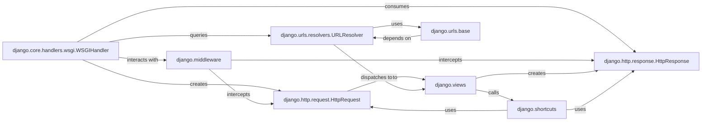

## Component Details

This subsystem forms the backbone of Django's web communication, managing the entire lifecycle of an HTTP request from its arrival to the dispatch of a response. It encompasses the initial handling of raw requests, their transformation into structured objects, routing to appropriate handlers, and the construction of responses, all while allowing for flexible interception via middleware.

### django.core.handlers.wsgi.WSGIHandler
Serves as the primary entry point for WSGI-compatible web servers. It orchestrates the entire request-response cycle. Upon receiving a raw WSGI `environ` dictionary, it creates an `HttpRequest` object, passes it through the middleware chain, dispatches it to the resolved view, and then processes the resulting `HttpResponse` before sending it back to the server.

**Related Classes/Methods**:

- <a href="https://github.com/django/django/blob/master/django/core/handlers/wsgi.py#L112-L143" target="_blank" rel="noopener noreferrer">`django.core.handlers.wsgi.WSGIHandler` (112:143)</a>

### django.http.request.HttpRequest
An object that encapsulates all information about an incoming HTTP request. This includes HTTP headers, GET and POST parameters, cookies, session data, and uploaded files. It provides a standardized, Pythonic interface for accessing request details within Django.

**Related Classes/Methods**:

- <a href="https://github.com/django/django/blob/master/django/http/request.py#L52-L469" target="_blank" rel="noopener noreferrer">`django.http.request.HttpRequest` (52:469)</a>

### django.http.response.HttpResponse
An object used to construct and represent the HTTP response sent back to the client. It allows setting the response content, HTTP status code, and response headers, including cookies. Various subclasses (e.g., `JsonResponse`, `RedirectResponse`) provide specialized response types.

**Related Classes/Methods**:

- <a href="https://github.com/django/django/blob/master/django/http/response.py#L364-L434" target="_blank" rel="noopener noreferrer">`django.http.response.HttpResponse` (364:434)</a>

### django.urls.resolvers.URLResolver
The core component of Django's URL routing system. It takes an incoming URL path from an `HttpRequest` and matches it against the defined URL patterns (`urlpatterns`) to find the corresponding view function or class that should handle the request.

**Related Classes/Methods**:

- <a href="https://github.com/django/django/blob/master/django/urls/resolvers.py#L1-L1" target="_blank" rel="noopener noreferrer">`django.urls.resolvers.URLResolver` (1:1)</a>

### django.middleware
Provides a pluggable framework for "middleware" components. Middleware functions or classes sit between the web server and Django's view layer, allowing for global processing of requests and responses. They can perform actions like modifying requests, adding response headers, handling sessions, authentication, and CSRF protection.

**Related Classes/Methods**:

- <a href="https://github.com/django/django/blob/master/django/template/backends/django.py#L1-L1" target="_blank" rel="noopener noreferrer">`django.middleware` (1:1)</a>

### django.views
This package contains the fundamental building blocks for handling web requests and generating responses. It encompasses both simple function-based views and a comprehensive set of class-based generic views (`django.views.generic`) that provide reusable implementations for common web patterns.

**Related Classes/Methods**:

- <a href="https://github.com/django/django/blob/master/django/template/backends/django.py#L1-L1" target="_blank" rel="noopener noreferrer">`django.views` (1:1)</a>

### django.urls.base
Provides essential utility functions for URL manipulation, most notably `reverse()`. This function allows developers to dynamically generate URLs based on a view's name and arguments, promoting maintainable and flexible URL structures by avoiding hardcoded URLs.

**Related Classes/Methods**:

- <a href="https://github.com/django/django/blob/master/django/urls/base.py#L1-L1" target="_blank" rel="noopener noreferrer">`django.urls.base` (1:1)</a>

### django.shortcuts
A module offering convenience functions that simplify common web development tasks within Django views. These shortcuts include `render()` for rendering templates with context, `redirect()` for issuing HTTP redirects, and `get_object_or_404()` for retrieving database objects or raising a 404 error.

**Related Classes/Methods**:

- <a href="https://github.com/django/django/blob/master/django/shortcuts.py#L1-L1" target="_blank" rel="noopener noreferrer">`django.shortcuts` (1:1)</a>

### [FAQ](https://github.com/CodeBoarding/GeneratedOnBoardings/tree/main?tab=readme-ov-file#faq)