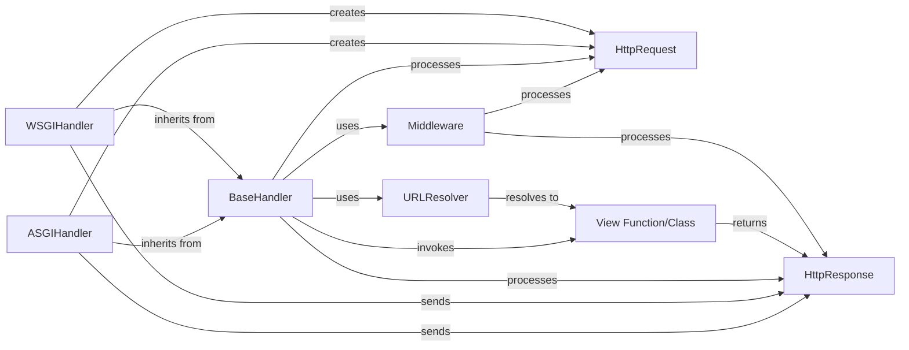

## Component Details

This composite component encapsulates the entire web communication flow within Django. It handles receiving an incoming `HttpRequest`, applies global logic through `Middleware`, resolves the URL to the appropriate view using `URLResolver`, and finally generates and sends an `HttpResponse` back to the client. It is the core of Django's web-serving capabilities, providing a structured and extensible way to process web requests.

### HttpRequest
This is the fundamental object representing an incoming HTTP request from a client. It encapsulates all request-specific data, including headers, GET/POST parameters, cookies, the request body, and file uploads. It provides a consistent interface for accessing this information throughout the request-response cycle.

**Related Classes/Methods**:

- <a href="https://github.com/django/django/blob/master/django/http/request.py#L52-L469" target="_blank" rel="noopener noreferrer">`django.http.request.HttpRequest` (52:469)</a>

### HttpResponse
This object represents the HTTP response that Django sends back to the client. It contains the response content, status code, and HTTP headers. Views and middleware construct and modify this object before it's ultimately serialized and sent.

**Related Classes/Methods**:

- <a href="https://github.com/django/django/blob/master/django/http/response.py#L364-L434" target="_blank" rel="noopener noreferrer">`django.http.response.HttpResponse` (364:434)</a>

### BaseHandler
This abstract base class serves as the central orchestrator of the request/response lifecycle in Django. It defines the core logic for loading and applying middleware, resolving the URL to find the appropriate view, invoking the view, and handling exceptions that occur during this process. It acts as the backbone for both synchronous (WSGI) and asynchronous (ASGI) request handling.

**Related Classes/Methods**:

- <a href="https://github.com/django/django/blob/master/django/core/handlers/base.py#L19-L364" target="_blank" rel="noopener noreferrer">`django.core.handlers.base.BaseHandler` (19:364)</a>

### WSGIHandler
A concrete implementation of `BaseHandler` specifically designed for the WSGI (Web Server Gateway Interface) protocol. It is the entry point for traditional synchronous Django applications, responsible for adapting the raw WSGI environment into a Django `HttpRequest` object and converting the resulting `HttpResponse` object back into a format suitable for WSGI servers.

**Related Classes/Methods**:

- <a href="https://github.com/django/django/blob/master/django/core/handlers/wsgi.py#L112-L143" target="_blank" rel="noopener noreferrer">`django.core.handlers.wsgi.WSGIHandler` (112:143)</a>

### ASGIHandler
A concrete implementation of `BaseHandler` for the ASGI (Asynchronous Server Gateway Interface) protocol. It serves as the entry point for asynchronous Django applications, handling asynchronous request and response processing, including reading request bodies and sending responses over ASGI channels.

**Related Classes/Methods**:

- <a href="https://github.com/django/django/blob/master/django/core/handlers/asgi.py#L138-L380" target="_blank" rel="noopener noreferrer">`django.core.handlers.asgi.ASGIHandler` (138:380)</a>

### Middleware
Middleware components are hooks into Django's request/response processing. They are classes or functions that can process requests before they reach the view, process responses before they are sent to the client, or handle exceptions. They form a chain that `BaseHandler` iterates through, allowing for global logic application.

**Related Classes/Methods**:

- <a href="https://github.com/django/django/blob/master/django/middleware/common.py#L12-L114" target="_blank" rel="noopener noreferrer">`django.middleware.common.CommonMiddleware` (12:114)</a>

### URLResolver
This is the core component responsible for URL routing. It takes an incoming URL path from the `HttpRequest` and matches it against the project's defined URL patterns to identify the correct View Function/Class that should handle the request. It also supports URL reversal.

**Related Classes/Methods**:

- <a href="https://github.com/django/django/blob/master/django/urls/resolvers.py#L1-L1" target="_blank" rel="noopener noreferrer">`django.urls.resolvers.URLResolver` (1:1)</a>

### View Function/Class
This represents the application-specific business logic. It's a callable (either a Python function or a method of a class-based view) that receives an `HttpRequest` object as input. Its primary responsibility is to process the request, interact with the application's models (if necessary), and return an `HttpResponse` object. While not a Django framework class itself, it is the ultimate destination for a resolved URL and the core of an application's response generation.

**Related Classes/Methods**:

- `myapp.views.MyView` (1:1)

### [FAQ](https://github.com/CodeBoarding/GeneratedOnBoardings/tree/main?tab=readme-ov-file#faq)