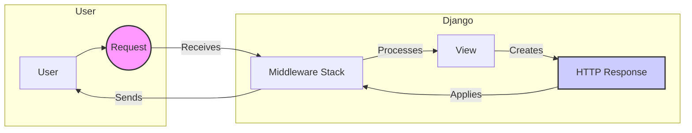

## HTTP Response Component Overview

This component is responsible for creating and sending HTTP responses in Django. It handles various types of responses, including standard responses, redirects, JSON responses, and streaming responses. The core of this component lies in the `django.http.response` module.

Here's a data flow diagram illustrating the role of the HTTP Response component within the Django framework:

### Component Descriptions:

*   **Request (R):** Represents an incoming HTTP request from the user. It contains information about the request, such as the URL, headers, and body. It initiates the flow by being received by the Django middleware.

*   **Middleware Stack (MW):** A series of components that process the request and response. Middleware can perform tasks such as authentication, session management, and request/response modification. It processes the request before it reaches the view and applies changes to the response before it's sent to the user.

*   **View (V):** A callable that receives a request and returns a response. It's the core logic of the application, responsible for handling the request and generating the appropriate response. The view creates an HTTP Response object based on the application logic.

*   **HTTP Response (HR):** Represents an outgoing HTTP response to the user. It contains information about the response, such as the status code, headers, and body. This component is responsible for constructing the HTTP response object. Relevant source files: `django.http.response`

*   **User (U):** The end user who initiates the request and receives the response.

