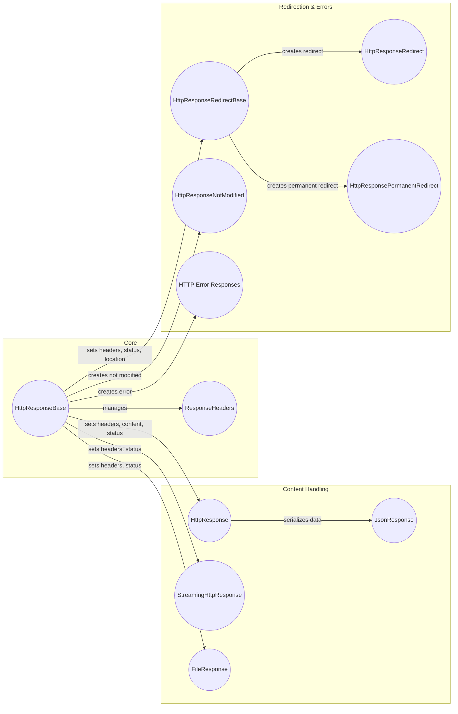

## HTTP Response Handling in Django

This diagram illustrates the flow of creating and sending HTTP responses in Django. It covers the core components involved, from the base `HttpResponseBase` to specialized responses like `JsonResponse` and `FileResponse`.

### Component Descriptions:

*   **HttpResponseBase:** The foundation for all HTTP responses in Django. It provides the basic interface for setting headers, content type, and status code. It interacts with `ResponseHeaders` to manage the response headers.
    *   Relevant source files: `django/http/response.py`

*   **ResponseHeaders:** Manages the HTTP response headers as a case-insensitive dictionary. It's used by `HttpResponseBase` and its subclasses to set and retrieve header values.
    *   Relevant source files: `django/http/response.py`

*   **HttpResponse:** A standard HTTP response with string content. It inherits from `HttpResponseBase` and adds functionality for reading, appending, and replacing the content. It uses `HttpResponseBase` to set headers and status.
    *   Relevant source files: `django/http/response.py`

*   **StreamingHttpResponse:** An HTTP response for streaming large amounts of data. It takes an iterator as content and sends data in chunks. It inherits from `HttpResponseBase` and uses it to set headers and status.
    *   Relevant source files: `django/http/response.py`

*   **FileResponse:** A specialized `StreamingHttpResponse` optimized for serving files. It automatically sets the `Content-Type` and `Content-Disposition` headers. It inherits from `StreamingHttpResponse` and uses it for streaming the file content.
    *   Relevant source files: `django/http/response.py`

*   **JsonResponse:** An HTTP response that serializes data to JSON. It inherits from `HttpResponse` and sets the `Content-Type` to `application/json`. It uses `HttpResponse` to set headers and status.
    *   Relevant source files: `django/http/response.py`

*   **HttpResponseRedirectBase:** Base class for HTTP redirect responses. It sets the `Location` header and the status code (301 or 302). It inherits from `HttpResponseBase`.
    *   Relevant source files: `django/http/response.py`

*   **HttpResponseRedirect:** An HTTP redirect response with a temporary redirect (status code 302).
    *   Relevant source files: `django/http/response.py`

*   **HttpResponsePermanentRedirect:** An HTTP redirect response with a permanent redirect (status code 301).
    *   Relevant source files: `django/http/response.py`

*   **HttpResponseNotModified:** An HTTP response indicating that the requested resource has not been modified (status code 304). It inherits from `HttpResponseBase`.
    *   Relevant source files: `django/http/response.py`

*   **HTTP Error Responses:** A collection of HTTP error responses, such as `HttpResponseBadRequest`, `HttpResponseNotFound`, `HttpResponseForbidden`, etc. They all inherit from `HttpResponseBase` and set the appropriate status code.
    *   Relevant source files: `django/http/response.py`