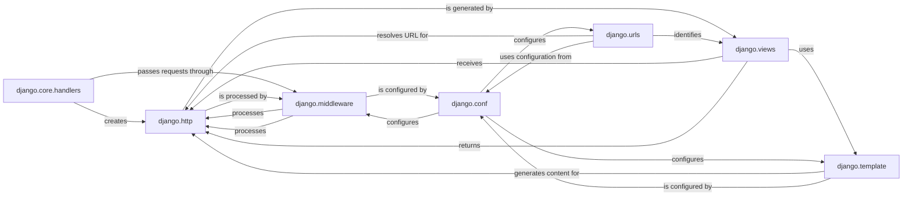

## Details

The `HTTP Request/Response Pipeline` in Django is a core subsystem responsible for managing the entire lifecycle of web communication. It efficiently processes incoming HTTP requests, routes them to the appropriate application logic, and constructs HTTP responses.

### django.core.handlers
This module acts as the primary entry point for all web requests into the Django framework. It initializes the request-response cycle by receiving raw HTTP requests from the web server (via `WSGIHandler` for synchronous applications or `ASGIHandler` for asynchronous ones), converting them into `HttpRequest` objects, and orchestrating their journey through the middleware stack and ultimately to the appropriate view.

**Related Classes/Methods**:

- <a href="https://github.com/django/django/django/core/handlers/wsgi.py#L0-L0" target="_blank" rel="noopener noreferrer">`django/core/handlers/wsgi.py` (0:0)</a>
- <a href="https://github.com/django/django/django/core/handlers/asgi.py#L0-L0" target="_blank" rel="noopener noreferrer">`django/core/handlers/asgi.py` (0:0)</a>
- <a href="https://github.com/django/django/django/core/handlers/base.py#L0-L0" target="_blank" rel="noopener noreferrer">`django/core/handlers/base.py` (0:0)</a>

### django.http
This package defines the fundamental data structures for web communication: `HttpRequest` and `HttpResponse`. `HttpRequest` encapsulates all details of an incoming client request (headers, body, GET/POST data, files), while `HttpResponse` and its specialized subclasses (`JsonResponse`, `HttpResponseRedirect`, `StreamingHttpResponse`) are used to construct and send responses back to the client.

**Related Classes/Methods**:

- <a href="https://github.com/django/django/django/http/request.py#L0-L0" target="_blank" rel="noopener noreferrer">`django/http/request.py` (0:0)</a>
- <a href="https://github.com/django/django/django/http/response.py#L0-L0" target="_blank" rel="noopener noreferrer">`django/http/response.py` (0:0)</a>

### django.middleware
This component provides a flexible, pluggable system for global processing of requests and responses. Middleware classes can intercept and modify `HttpRequest` objects before they reach the view, and/or `HttpResponse` objects before they are sent back to the client. This allows for the implementation of cross-cutting concerns such as session management, authentication, CSRF protection, and caching.

**Related Classes/Methods**:

- <a href="https://github.com/django/django/django/middleware/common.py#L0-L0" target="_blank" rel="noopener noreferrer">`django/middleware/common.py` (0:0)</a>
- <a href="https://github.com/django/django/django/middleware/csrf.py#L0-L0" target="_blank" rel="noopener noreferrer">`django/middleware/csrf.py` (0:0)</a>
- `django/middleware/sessions.py` (0:0)
- <a href="https://github.com/django/django/django/middleware/cache.py#L0-L0" target="_blank" rel="noopener noreferrer">`django/middleware/cache.py` (0:0)</a>
- <a href="https://github.com/django/django/django/middleware/security.py#L0-L0" target="_blank" rel="noopener noreferrer">`django/middleware/security.py` (0:0)</a>
- <a href="https://github.com/django/django/django/middleware/locale.py#L0-L0" target="_blank" rel="noopener noreferrer">`django/middleware/locale.py` (0:0)</a>

### django.urls
This component is dedicated to URL routing, which involves matching an incoming URL to a specific view function or class. It defines URL patterns (`URLPattern`) and manages the URL resolution process, including support for URL namespaces and including other URL configurations (`URLResolver`). It also handles cases where no URL match is found by raising `Resolver404`.

**Related Classes/Methods**:

- <a href="https://github.com/django/django/django/urls/resolvers.py#L0-L0" target="_blank" rel="noopener noreferrer">`django/urls/resolvers.py` (0:0)</a>
- <a href="https://github.com/django/django/django/urls/exceptions.py#L0-L0" target="_blank" rel="noopener noreferrer">`django/urls/exceptions.py` (0:0)</a>
- <a href="https://github.com/django/django/django/urls/converters.py#L0-L0" target="_blank" rel="noopener noreferrer">`django/urls/converters.py` (0:0)</a>

### django.views
This layer contains the application's core logic for handling requests and generating responses. It provides the base `View` class for building custom class-based views and a comprehensive set of generic class-based views (e.g., `TemplateView`, `ListView`, `DetailView`, `FormView`, `CreateView`, `UpdateView`, `DeleteView`). These generic views abstract common web patterns, simplifying development by handling typical request processing, data retrieval, and response generation.

**Related Classes/Methods**:

- <a href="https://github.com/django/django/django/views/generic/base.py#L0-L0" target="_blank" rel="noopener noreferrer">`django/views/generic/base.py` (0:0)</a>
- <a href="https://github.com/django/django/django/views/generic/list.py#L0-L0" target="_blank" rel="noopener noreferrer">`django/views/generic/list.py` (0:0)</a>
- <a href="https://github.com/django/django/django/views/generic/detail.py#L0-L0" target="_blank" rel="noopener noreferrer">`django/views/generic/detail.py` (0:0)</a>
- <a href="https://github.com/django/django/django/views/generic/edit.py#L0-L0" target="_blank" rel="noopener noreferrer">`django/views/generic/edit.py` (0:0)</a>

### django.template
This component provides Django's powerful template engine, used for rendering dynamic content, primarily HTML. It facilitates the separation of presentation logic from business logic, allowing views to pass data to templates for display. Key elements include the `TemplateResponse` class (a specialized `HttpResponse`), the `Engine` for rendering, and various `Loader` classes for discovering template files.

**Related Classes/Methods**:

- <a href="https://github.com/django/django/django/template/response.py#L0-L0" target="_blank" rel="noopener noreferrer">`django/template/response.py` (0:0)</a>
- <a href="https://github.com/django/django/django/template/engine.py#L0-L0" target="_blank" rel="noopener noreferrer">`django/template/engine.py` (0:0)</a>
- <a href="https://github.com/django/django/django/template/backends/django.py#L0-L0" target="_blank" rel="noopener noreferrer">`django/template/backends/django.py` (0:0)</a>
- <a href="https://github.com/django/django/django/template/loaders/filesystem.py#L0-L0" target="_blank" rel="noopener noreferrer">`django/template/loaders/filesystem.py` (0:0)</a>
- <a href="https://github.com/django/django/django/template/context.py#L0-L0" target="_blank" rel="noopener noreferrer">`django/template/context.py` (0:0)</a>
- <a href="https://github.com/django/django/django/template/base.py#L0-L0" target="_blank" rel="noopener noreferrer">`django/template/base.py` (0:0)</a>

### django.conf
This module manages the project's settings, typically defined in a `settings.py` file. It provides a centralized configuration system for various aspects of the Django project, including the list of active `MIDDLEWARE` classes and the `ROOT_URLCONF` that points to the main URL configuration.

**Related Classes/Methods**:

- <a href="https://github.com/django/django/django/conf/__init__.py#L0-L0" target="_blank" rel="noopener noreferrer">`django/conf/__init__.py` (0:0)</a>

### [FAQ](https://github.com/CodeBoarding/GeneratedOnBoardings/tree/main?tab=readme-ov-file#faq)