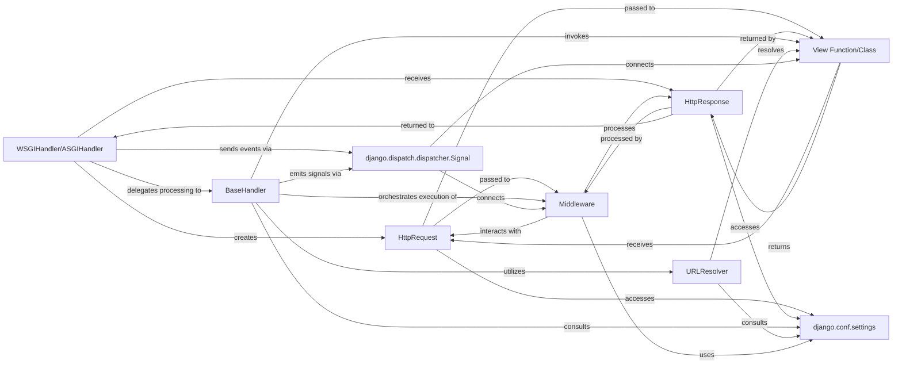

## Component Details

This composite component is the heart of Django's web-serving capabilities, orchestrating the entire flow from an incoming HTTP request to the outgoing HTTP response. It ensures that requests are properly handled, processed by various layers of logic, and ultimately result in a well-formed response sent back to the client.

### WSGIHandler/ASGIHandler
These are the server-specific entry points that initiate and conclude the request-response cycle. They translate raw server environment data into Django's `HttpRequest` object and format the `HttpResponse` back for the server. They are the bridge between the web server and the Django application.

**Related Classes/Methods**:

- <a href="https://github.com/django/django/blob/master/django/core/handlers/wsgi.py#L112-L143" target="_blank" rel="noopener noreferrer">`django.core.handlers.wsgi.WSGIHandler` (112:143)</a>
- <a href="https://github.com/django/django/blob/master/django/core/handlers/asgi.py#L138-L380" target="_blank" rel="noopener noreferrer">`django.core.handlers.asgi.ASGIHandler` (138:380)</a>

### HttpRequest
An object encapsulating all details of an incoming HTTP request (headers, GET/POST data, cookies, session, body). It provides a standardized interface for all subsequent components (middleware, views) to interact with the client's request.

**Related Classes/Methods**:

- <a href="https://github.com/django/django/blob/master/django/http/request.py#L52-L469" target="_blank" rel="noopener noreferrer">`django.http.request.HttpRequest` (52:469)</a>

### HttpResponse
An object representing the outgoing HTTP response. It holds the content, status code, and headers that will be sent back to the client. It's the standardized output of the request processing.

**Related Classes/Methods**:

- <a href="https://github.com/django/django/blob/master/django/http/response.py#L364-L434" target="_blank" rel="noopener noreferrer">`django.http.response.HttpResponse` (364:434)</a>

### BaseHandler
The abstract base class that defines the core request/response processing logic. It acts as the orchestrator, managing the middleware chain, URL resolution, view invocation, and exception handling. It's the central control flow for a request within Django.

**Related Classes/Methods**:

- <a href="https://github.com/django/django/blob/master/django/core/handlers/base.py#L19-L364" target="_blank" rel="noopener noreferrer">`django.core.handlers.base.BaseHandler` (19:364)</a>

### URLResolver
Responsible for mapping an incoming URL path to the appropriate view function or class. It parses URL patterns defined in `urlpatterns` and resolves the corresponding callable, extracting any URL parameters.

**Related Classes/Methods**:

- <a href="https://github.com/django/django/blob/master/django/urls/resolvers.py#L1-L1" target="_blank" rel="noopener noreferrer">`django.urls.resolvers.URLResolver` (1:1)</a>

### Middleware
Pluggable components that can process requests before they reach the view and responses before they are sent back. They enable cross-cutting concerns like authentication, session management, and CSRF protection.

**Related Classes/Methods**:

- <a href="https://github.com/django/django/blob/master/django/middleware/common.py#L12-L114" target="_blank" rel="noopener noreferrer">`django.middleware.common.CommonMiddleware` (12:114)</a>

### View Function/Class
The application-specific callable (a Python function or a method of a class-based view) that receives an `HttpRequest` object, processes its data (often interacting with models), and returns an `HttpResponse` object. This is where the application's core business logic resides for a specific URL.

**Related Classes/Methods**:

- `myapp.views.my_view` (1:1)

### django.conf.settings
A module providing access to all Django project settings. Various components rely on these configurations (e.g., `MIDDLEWARE` list, `ROOT_URLCONF`, `ALLOWED_HOSTS`, `DEBUG`). It's the central configuration hub.

**Related Classes/Methods**:

- <a href="https://github.com/django/django/blob/master/django/template/backends/django.py#L1-L1" target="_blank" rel="noopener noreferrer">`django.conf.settings` (1:1)</a>

### django.dispatch.dispatcher.Signal
A mechanism for decoupled communication between different parts of Django or third-party applications. It allows components to "hook into" specific events during the request lifecycle (e.g., `request_started`, `request_finished`), enabling extensibility.

**Related Classes/Methods**:

- <a href="https://github.com/django/django/blob/master/django/dispatch/dispatcher.py#L24-L487" target="_blank" rel="noopener noreferrer">`django.dispatch.dispatcher.Signal` (24:487)</a>

### [FAQ](https://github.com/CodeBoarding/GeneratedOnBoardings/tree/main?tab=readme-ov-file#faq)