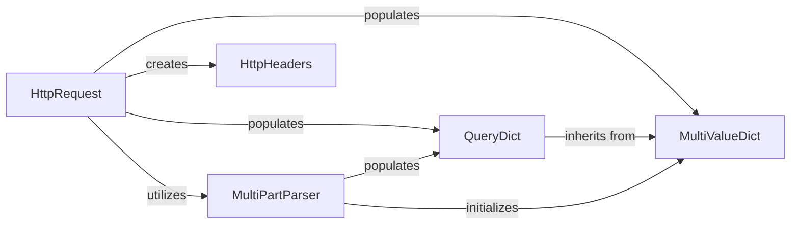

## Component Details

This subsystem is at the heart of how Django processes incoming web requests. It provides a structured and consistent way to access all data sent by a client, from URL parameters to uploaded files.

### HttpRequest
This is the fundamental object representing an incoming HTTP request from a client. It encapsulates all request-specific data, including headers, GET/POST parameters, cookies, the request body, and file uploads. It provides a consistent interface for accessing this information throughout the request-response cycle. Its primary purpose is to standardize and centralize access to all aspects of an HTTP request, making it easy for Django applications to interact with incoming data.

**Related Classes/Methods**:

- `HttpRequest` (1:1)

### QueryDict
A specialized dictionary subclass designed to handle HTTP query strings and form data, where a single key can be associated with multiple values (e.g., from HTML <select multiple> fields). By default, QueryDict instances are immutable, but mutable copies can be created. Its purpose is to efficiently store and retrieve GET and POST parameters, accommodating the possibility of multiple values for a single key, and handling character encoding. This is fundamental because HTTP requests often contain parameters with repeated keys (e.g., item=apple&item=banana).

**Related Classes/Methods**:

- `QueryDict` (1:1)

### MultiValueDict
A base dictionary subclass that allows a single key to be associated with multiple values, stored as a list. It's a more general-purpose data structure than QueryDict and serves as its parent class. Its purpose is to provide a fundamental data structure for scenarios where a key can map to a list of values, which is common in web request data (e.g., form submissions, query parameters).

**Related Classes/Methods**:

- `MultiValueDict` (1:1)

### MultiPartParser
This component is responsible for parsing multipart/form-data requests, which are commonly used for file uploads and complex form submissions. It extracts individual parts (form fields and files) from the raw request body. Its purpose is to correctly interpret and process multipart/form-data content, separating regular form fields from file uploads and making them available to the application through the HttpRequest object.

**Related Classes/Methods**:

- `MultiPartParser` (1:1)

### HttpHeaders
A case-insensitive mapping (dictionary-like object) that provides a convenient way to access and manipulate HTTP headers from the META dictionary of an HttpRequest. It handles the conversion between standard HTTP header names (e.g., Content-Type) and their WSGI/ASGI equivalents (e.g., CONTENT_TYPE). Its purpose is to offer a robust and user-friendly interface for accessing HTTP request headers, abstracting away the underlying storage format in the META dictionary.

**Related Classes/Methods**:

- `HttpHeaders` (1:1)

### [FAQ](https://github.com/CodeBoarding/GeneratedOnBoardings/tree/main?tab=readme-ov-file#faq)