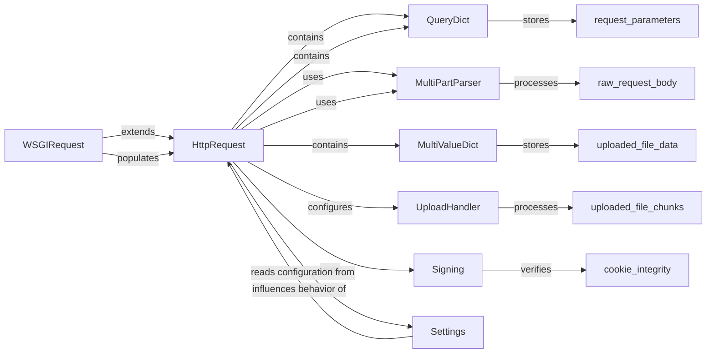

## Component Details

The `HttpRequest` component is fundamental to how Django processes incoming web requests. It acts as the primary interface for views and middleware to interact with the details of an HTTP request. Its purpose is to encapsulate all aspects of an incoming request, from headers and URL parameters to cookies and uploaded files, and to provide a consistent and convenient API for accessing this information.

### HttpRequest
The core object that encapsulates an incoming HTTP request. It provides a comprehensive interface to access request details such as headers, GET/POST parameters, cookies, and uploaded files. It is responsible for parsing raw request data and making it accessible to Django views and middleware.

**Related Classes/Methods**:

- `HttpRequest` (0:0)

### WSGIRequest
A concrete subclass of `HttpRequest` specifically designed for the WSGI environment. It is responsible for populating the `HttpRequest` instance with data extracted from the raw WSGI environment variables and input stream.

**Related Classes/Methods**:

- `WSGIRequest` (0:0)

### QueryDict
A specialized dictionary-like class used by Django to handle HTTP GET and POST parameters. It can store multiple values for the same key, which is common in web forms (e.g., multiple checkboxes with the same name).

**Related Classes/Methods**:

- `QueryDict` (0:0)

### MultiValueDict
A general-purpose dictionary subclass that can store multiple values for the same key. `HttpRequest` uses it specifically for handling uploaded files (`request.FILES`).

**Related Classes/Methods**:

- `MultiValueDict` (0:0)

### MultiPartParser
Responsible for parsing `multipart/form-data` content, which is typically used for file uploads in HTTP POST requests. It extracts both form fields and file data from the raw request body.

**Related Classes/Methods**:

- `MultiPartParser` (0:0)

### UploadHandler
An abstract base class for handling uploaded files. Concrete implementations determine how files are stored (e.g., in memory or on disk). `HttpRequest` uses a chain of these handlers during file upload processing.

**Related Classes/Methods**:

- `UploadHandler` (0:0)

### Signing
Provides cryptographic signing and unsigning utilities. `HttpRequest` uses this component to verify the integrity and authenticity of signed cookies.

**Related Classes/Methods**:

- <a href="https://github.com/django/django/blob/master/django/core/signing.py#L0-L0" target="_blank" rel="noopener noreferrer">`Signing` (0:0)</a>

### Settings
The central configuration object for a Django project. `HttpRequest` consults `Settings` for various operational parameters, such as allowed hosts, SSL header configuration, and file upload handlers.

**Related Classes/Methods**:

- <a href="https://github.com/django/django/blob/master/tests/flatpages_tests/settings.py#L0-L0" target="_blank" rel="noopener noreferrer">`Settings` (0:0)</a>

### [FAQ](https://github.com/CodeBoarding/GeneratedOnBoardings/tree/main?tab=readme-ov-file#faq)