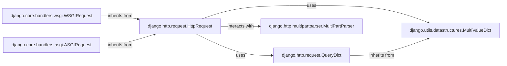

## Component Details

This subsystem is centered around the `HttpRequest` object, which is the cornerstone of how Django processes incoming web requests. It provides a unified, high-level interface for all request-related data, abstracting away the complexities of the underlying server protocols (WSGI and ASGI).

### django.http.request.HttpRequest
The fundamental object representing an incoming HTTP request. It acts as a standardized container for all request-related data, including GET/POST parameters, headers, cookies, and file uploads. It provides a consistent interface for middleware, views, and other Django components to interact with the client's request, regardless of the server type (WSGI or ASGI).

**Related Classes/Methods**:

- <a href="https://github.com/django/django/blob/master/django/http/request.py#L523-L691" target="_blank" rel="noopener noreferrer">`django.http.request.QueryDict` (523:691)</a>
- <a href="https://github.com/django/django/blob/master/django/utils/datastructures.py#L48-L216" target="_blank" rel="noopener noreferrer">`django.utils.datastructures.MultiValueDict` (48:216)</a>
- <a href="https://github.com/django/django/blob/master/django/http/multipartparser.py#L1-L1" target="_blank" rel="noopener noreferrer">`django.http.multipartparser.MultiPartParser` (1:1)</a>

### django.http.request.QueryDict
A specialized dictionary-like class designed to handle HTTP query string parameters (GET) and POST data. Its key feature is the ability to store multiple values for the same key, which is common in web forms (e.g., multiple checkboxes with the same name). `HttpRequest` uses instances of `QueryDict` for its `GET` and `POST` attributes.

**Related Classes/Methods**:

- <a href="https://github.com/django/django/blob/master/django/utils/datastructures.py#L48-L216" target="_blank" rel="noopener noreferrer">`django.utils.datastructures.MultiValueDict` (48:216)</a>

### django.utils.datastructures.MultiValueDict
A foundational utility class that provides the core functionality for storing and retrieving multiple values associated with a single key. `QueryDict` inherits from this class, and `HttpRequest` directly uses it for the `FILES` attribute, making it crucial for handling various HTTP request data types, especially file uploads and multi-select form fields.

**Related Classes/Methods**: _None_

### django.http.multipartparser.MultiPartParser
This component is specifically responsible for parsing `multipart/form-data` requests, which are primarily used for file uploads in web applications. It extracts both file data and regular form fields from the raw request body, working in conjunction with `HttpRequest` to populate the `POST` and `FILES` attributes when files are uploaded.

**Related Classes/Methods**: _None_

### django.core.handlers.wsgi.WSGIRequest
A concrete subclass of `HttpRequest` that adapts synchronous (WSGI) server requests into the standard `HttpRequest` format. It translates WSGI environment variables and input streams into the attributes of `HttpRequest`, ensuring compatibility with traditional Python web servers.

**Related Classes/Methods**:

- <a href="https://github.com/django/django/blob/master/django/http/request.py#L52-L469" target="_blank" rel="noopener noreferrer">`django.http.request.HttpRequest` (52:469)</a>

### django.core.handlers.asgi.ASGIRequest
A concrete subclass of `HttpRequest` designed to adapt asynchronous (ASGI) server requests into the standard `HttpRequest` format. It bridges the gap between the ASGI specification and Django's request processing, handling asynchronous input streams and making them accessible through the `HttpRequest` interface.

**Related Classes/Methods**:

- <a href="https://github.com/django/django/blob/master/django/http/request.py#L52-L469" target="_blank" rel="noopener noreferrer">`django.http.request.HttpRequest` (52:469)</a>

### [FAQ](https://github.com/CodeBoarding/GeneratedOnBoardings/tree/main?tab=readme-ov-file#faq)