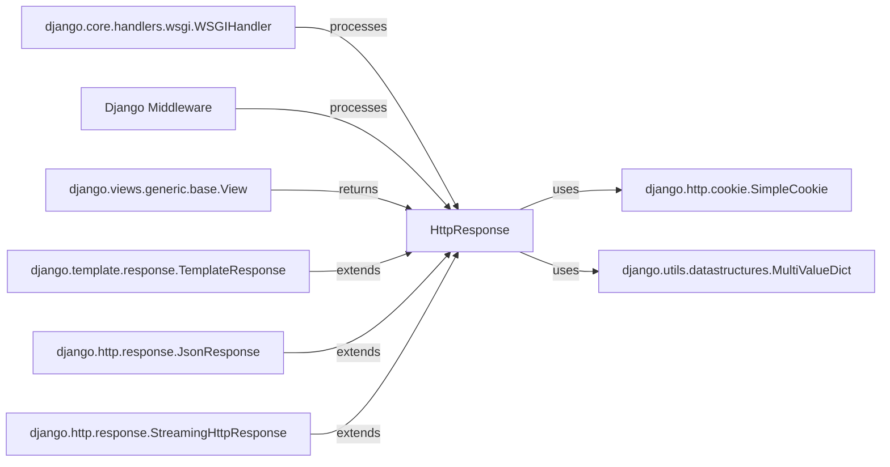

## Component Details

HttpResponse Subsystem

### HttpResponse
The foundational class for all HTTP responses in Django. It encapsulates the response content, status code, and headers, providing methods for manipulation and serialization. It's the ultimate output of a Django request-response cycle.

**Related Classes/Methods**:

- <a href="https://github.com/django/django/blob/master/django/http/response.py#L364-L434" target="_blank" rel="noopener noreferrer">`django.http.response.HttpResponse` (364:434)</a>

### django.core.handlers.wsgi.WSGIHandler
The primary entry point for handling WSGI requests in Django. It orchestrates the entire request-response lifecycle, including invoking middleware and views, and ultimately serializing and sending the HttpResponse back to the client.

**Related Classes/Methods**:

- <a href="https://github.com/django/django/blob/master/django/core/handlers/wsgi.py#L112-L143" target="_blank" rel="noopener noreferrer">`django.core.handlers.wsgi.WSGIHandler` (112:143)</a>

### Django Middleware
A generic representation of middleware components that intercept requests and responses. Middleware can modify incoming requests, process responses before they are sent, or handle exceptions.

**Related Classes/Methods**: _None_

### django.views.generic.base.View
The base class for all Django views. Views are callable objects that receive a web request and are responsible for returning an HttpResponse object.

**Related Classes/Methods**:

- <a href="https://github.com/django/django/blob/master/django/views/generic/base.py#L36-L180" target="_blank" rel="noopener noreferrer">`django.views.generic.base.View` (36:180)</a>

### django.http.cookie.SimpleCookie
A utility class used by HttpResponse to manage and serialize HTTP cookies. It provides a dictionary-like interface for setting and retrieving cookie values.

**Related Classes/Methods**:

- <a href="https://github.com/django/django/blob/master/django/http/cookie.py#L1-L1" target="_blank" rel="noopener noreferrer">`django.http.cookie.SimpleCookie` (1:1)</a>

### django.utils.datastructures.MultiValueDict
A specialized dictionary-like class that allows multiple values to be associated with a single key. HttpResponse uses this for managing HTTP headers, where a header might appear multiple times (e.g., Set-Cookie).

**Related Classes/Methods**:

- <a href="https://github.com/django/django/blob/master/django/utils/datastructures.py#L48-L216" target="_blank" rel="noopener noreferrer">`django.utils.datastructures.MultiValueDict` (48:216)</a>

### django.template.response.TemplateResponse
A subclass of HttpResponse that defers the rendering of a template until the response is about to be sent. This allows middleware to modify the template context or template name before rendering.

**Related Classes/Methods**:

- <a href="https://github.com/django/django/blob/master/django/template/response.py#L146-L163" target="_blank" rel="noopener noreferrer">`django.template.response.TemplateResponse` (146:163)</a>

### django.http.response.JsonResponse
A subclass of HttpResponse specifically designed for returning JSON data. It automatically sets the Content-Type header to application/json and handles the serialization of Python data structures to JSON.

**Related Classes/Methods**:

- <a href="https://github.com/django/django/blob/master/django/http/response.py#L720-L751" target="_blank" rel="noopener noreferrer">`django.http.response.JsonResponse` (720:751)</a>

### django.http.response.StreamingHttpResponse
A subclass of HttpResponse optimized for streaming content. Instead of loading the entire response into memory, it sends content in chunks, making it suitable for large files or real-time data streams.

**Related Classes/Methods**:

- <a href="https://github.com/django/django/blob/master/django/http/response.py#L437-L541" target="_blank" rel="noopener noreferrer">`django.http.response.StreamingHttpResponse` (437:541)</a>

### [FAQ](https://github.com/CodeBoarding/GeneratedOnBoardings/tree/main?tab=readme-ov-file#faq)