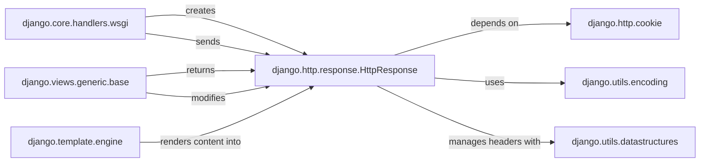

## Component Details

This analysis focuses on the `HttpResponse` component within Django, detailing its structure, purpose, and interactions with other fundamental parts of the framework. `HttpResponse` is central to Django's request-response cycle, encapsulating the data sent back to the client.

### django.http.response.HttpResponse
This is the core object representing the HTTP response sent back to the client. It holds the response content (as bytes), status code, and HTTP headers. It provides methods for setting content, headers, and serializing the response for transmission.

**Related Classes/Methods**:

- <a href="https://github.com/django/django/blob/master/django/http/response.py#L364-L434" target="_blank" rel="noopener noreferrer">`django.http.response.HttpResponse` (364:434)</a>

### django.core.handlers.wsgi
This module contains the WSGI handler, which is the entry point for all incoming HTTP requests in a WSGI environment. It orchestrates the entire request-response cycle, including dispatching the request to the appropriate view and ultimately sending the `HttpResponse` back to the client.

**Related Classes/Methods**:

- <a href="https://github.com/django/django/blob/master/django/core/handlers/wsgi.py#L0-L0" target="_blank" rel="noopener noreferrer">`django.core.handlers.wsgi` (0:0)</a>

### django.views.generic.base
This module provides base classes for Django's generic views. Views are the primary components responsible for processing requests and generating `HttpResponse` objects. Generic views offer reusable patterns for common response types (e.g., rendering templates, redirecting), making them a common source of `HttpResponse` instances.

**Related Classes/Methods**:

- <a href="https://github.com/django/django/blob/master/django/views/generic/base.py#L0-L0" target="_blank" rel="noopener noreferrer">`django.views.generic.base` (0:0)</a>

### django.template.engine
This module provides the core functionality for Django's template rendering system. Many Django applications generate dynamic HTML content using templates, and the template engine is responsible for processing these templates and producing the final output, which then populates the content of an `HttpResponse`.

**Related Classes/Methods**:

- <a href="https://github.com/django/django/blob/master/django/template/engine.py#L0-L0" target="_blank" rel="noopener noreferrer">`django.template.engine` (0:0)</a>

### django.http.cookie
This module provides utilities for handling HTTP cookies. `HttpResponse` objects interact with this module to set, modify, and delete cookies by manipulating the `Set-Cookie` headers.

**Related Classes/Methods**:

- <a href="https://github.com/django/django/blob/master/django/http/cookie.py#L0-L0" target="_blank" rel="noopener noreferrer">`django.http.cookie` (0:0)</a>

### django.utils.encoding
This utility module provides functions for encoding and decoding strings and bytes. `HttpResponse` relies heavily on this module to ensure that content is correctly encoded (e.g., to UTF-8) before being sent over the network, and to handle various character sets.

**Related Classes/Methods**:

- <a href="https://github.com/django/django/blob/master/django/utils/encoding.py#L0-L0" target="_blank" rel="noopener noreferrer">`django.utils.encoding` (0:0)</a>

### django.utils.datastructures
This module provides specialized data structures used throughout Django, including those for handling HTTP headers (e.g., `MultiValueDict`). `HttpResponse` uses these structures to manage its headers, which are essentially key-value pairs that can have multiple values for a single key.

**Related Classes/Methods**:

- <a href="https://github.com/django/django/blob/master/django/utils/datastructures.py#L0-L0" target="_blank" rel="noopener noreferrer">`django.utils.datastructures` (0:0)</a>

### [FAQ](https://github.com/CodeBoarding/GeneratedOnBoardings/tree/main?tab=readme-ov-file#faq)