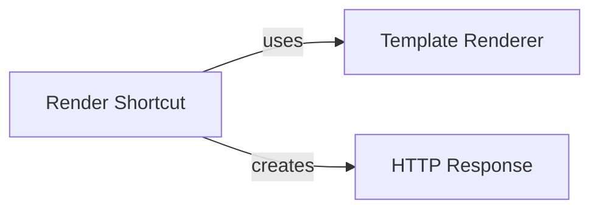

## Component Details

This analysis focuses on three fundamental components within Django that are crucial for generating and delivering dynamic web content: HTTP Response, Template Renderer, and Render Shortcut. These components collectively manage the lifecycle of an HTTP response, from content generation to final delivery. They are fundamental to Django's web request-response cycle because HTTP Response is the output foundation, Template Renderer handles dynamic content generation, and Render Shortcut provides developer convenience and workflow orchestration by integrating the other two.

### HTTP Response
The HTTP Response component, primarily embodied by the django.http.response.HttpResponse class, is the foundational element for constructing and sending HTTP responses from a Django application to a client. It serves as a container for the response's content (e.g., HTML, JSON, binary data), the HTTP status code (e.g., 200 OK, 404 Not Found), and HTTP headers. It provides a standardized interface for manipulating these aspects of the outgoing response, including methods for setting content, headers, and cookies, and for serializing the response into a complete HTTP message.

**Related Classes/Methods**:

- <a href="https://github.com/django/django/blob/master/django/http/response.py#L364-L434" target="_blank" rel="noopener noreferrer">`django.http.response.HttpResponse` (364:434)</a>
- <a href="https://github.com/django/django/blob/master/django/http/response.py#L1-L1" target="_blank" rel="noopener noreferrer">`django.http.response.HttpResponse:set_cookie` (1:1)</a>
- <a href="https://github.com/django/django/blob/master/django/http/response.py#L1-L1" target="_blank" rel="noopener noreferrer">`django.http.response.HttpResponse:delete_cookie` (1:1)</a>
- <a href="https://github.com/django/django/blob/master/django/http/response.py#L1-L1" target="_blank" rel="noopener noreferrer">`django.http.response.HttpResponse:make_bytes` (1:1)</a>
- <a href="https://github.com/django/django/blob/master/django/http/response.py#L392-L393" target="_blank" rel="noopener noreferrer">`django.http.response.HttpResponse:content` (392:393)</a>
- <a href="https://github.com/django/django/blob/master/django/http/response.py#L385-L387" target="_blank" rel="noopener noreferrer">`django.http.response.HttpResponse:serialize` (385:387)</a>
- <a href="https://github.com/django/django/blob/master/django/http/response.py#L420-L421" target="_blank" rel="noopener noreferrer">`django.http.response.HttpResponse:write` (420:421)</a>
- <a href="https://github.com/django/django/blob/master/django/http/response.py#L432-L434" target="_blank" rel="noopener noreferrer">`django.http.response.HttpResponse:writelines` (432:434)</a>

### Template Renderer
The Template Renderer component, centered around django.template.loader.render_to_string, is responsible for the core logic of processing Django templates. It takes a template identifier (name or list of names) and a context dictionary, then loads the appropriate template and renders it into a final string output. This component abstracts the complexities of template lookup, parsing, variable resolution, and tag execution, producing the dynamic content that often forms the body of an HTTP response.

**Related Classes/Methods**:

- <a href="https://github.com/django/django/blob/master/django/template/loader.py#L51-L61" target="_blank" rel="noopener noreferrer">`django.template.loader.render_to_string` (51:61)</a>

### Render Shortcut
The Render Shortcut component, represented by the django.shortcuts.render function, provides a convenient, high-level interface for common web development tasks involving template rendering. Its primary role is to orchestrate the process: it takes an HTTP request object, a template name, and context data, delegates the rendering to the Template Renderer, and then wraps the resulting HTML string in an HTTP Response object, which it returns. This component simplifies the developer's interaction with the template and HTTP response systems by handling the boilerplate of creating an HttpResponse instance with the rendered content.

**Related Classes/Methods**:

- <a href="https://github.com/django/django/blob/master/django/shortcuts.py#L1-L1" target="_blank" rel="noopener noreferrer">`django.shortcuts.render` (1:1)</a>

### [FAQ](https://github.com/CodeBoarding/GeneratedOnBoardings/tree/main?tab=readme-ov-file#faq)