```mermaid
graph LR
    django_utils_translation["django.utils.translation"]
    django_utils_translation_trans_real["django.utils.translation.trans_real"]
    django_utils_translation_trans_real_DjangoTranslation["django.utils.translation.trans_real.DjangoTranslation"]
    django_utils_translation_trans_real_TranslationCatalog["django.utils.translation.trans_real.TranslationCatalog"]
    django_utils_translation_override["django.utils.translation.override"]
    django_utils_functional_lazy["django.utils.functional.lazy"]
    django_conf_settings["django.conf.settings"]
    django_apps_registry_Apps["django.apps.registry.Apps"]
    django_dispatch_dispatcher["django.dispatch.dispatcher"]
    django_utils_translation_reloader["django.utils.translation.reloader"]
    django_utils_translation -- "delegates to" --> django_utils_translation_trans_real
    django_utils_translation -- "uses" --> django_utils_functional_lazy
    django_utils_translation -- "defines" --> django_utils_translation_override
    django_utils_translation_trans_real -- "implements logic for" --> django_utils_translation
    django_utils_translation_trans_real -- "manages instances of" --> django_utils_translation_trans_real_DjangoTranslation
    django_utils_translation_trans_real -- "depends on" --> django_apps_registry_Apps
    django_utils_translation_trans_real -- "sends signals via" --> django_dispatch_dispatcher
    django_utils_translation_trans_real -- "reads configuration from" --> django_conf_settings
    django_utils_translation_trans_real_DjangoTranslation -- "uses" --> django_utils_translation_trans_real_TranslationCatalog
    django_utils_translation_override -- "controls" --> django_utils_translation
    django_conf_settings -- "configures" --> django_utils_translation_trans_real
    django_conf_settings -- "emits signals to" --> django_dispatch_dispatcher
    django_apps_registry_Apps -- "provides locale paths to" --> django_utils_translation_trans_real_DjangoTranslation
    django_dispatch_dispatcher -- "notifies" --> django_utils_translation_reloader
    django_utils_translation_reloader -- "listens to" --> django_dispatch_dispatcher
    django_utils_translation_reloader -- "triggers reload in" --> django_utils_translation_trans_real
```

## Component Details

This subsystem provides comprehensive tools for enabling multi-language support in Django applications, facilitating the translation of strings, locale activation, and locale-aware formatting. It is crucial for developing applications that serve a global user base.

### django.utils.translation
The primary public interface for Django's internationalization utilities. It exposes functions for marking strings for translation (`gettext`, `gettext_lazy`), activating and deactivating languages, and managing the overall translation context. It acts as a high-level orchestrator, delegating the core translation logic to `trans_real`.

**Related Classes/Methods**:

- `django.utils.translation.gettext` (1:1)
- `django.utils.translation.gettext_lazy` (1:1)
- <a href="https://github.com/django/django/blob/master/django/utils/translation/trans_real.py#L1-L1" target="_blank" rel="noopener noreferrer">`django.utils.translation.trans_real` (1:1)</a>

### django.utils.translation.trans_real
This module contains the concrete, low-level implementation of Django's translation machinery. It is responsible for loading, caching, and performing actual lookups of translated strings from `.mo` files, and managing the active translation objects.

**Related Classes/Methods**:

- <a href="https://github.com/django/django/blob/master/django/utils/translation/trans_real.py#L128-L282" target="_blank" rel="noopener noreferrer">`django.utils.translation.trans_real.DjangoTranslation` (128:282)</a>

### django.utils.translation.trans_real.DjangoTranslation
A class that extends Python's standard `gettext.GNUTranslations`. It represents a translation object for a specific language, managing its translation catalog. It handles the process of finding and merging translation files from various sources, including installed applications and specified locale paths.

**Related Classes/Methods**:

- `gettext.GNUTranslations` (1:1)
- <a href="https://github.com/django/django/blob/master/django/utils/translation/trans_real.py#L72-L125" target="_blank" rel="noopener noreferrer">`django.utils.translation.trans_real.TranslationCatalog` (72:125)</a>

### django.utils.translation.trans_real.TranslationCatalog
A specialized dictionary-like class used internally by `DjangoTranslation`. Its purpose is to efficiently store and retrieve translated messages, particularly handling complexities like plural forms and merging catalogs from different sources while preserving correct pluralization rules.

**Related Classes/Methods**: _None_

### django.utils.translation.override
A context manager that provides a convenient and safe way to temporarily switch the active language for a specific block of code. This ensures that all translation lookups within that block adhere to the overridden language, reverting to the previous language upon exit.

**Related Classes/Methods**: _None_

### django.utils.functional.lazy
A utility function that enables lazy evaluation of callables. In the context of i18n, it's used to create "lazy" versions of translation functions (e.g., `gettext_lazy`). This defers the actual translation of a string until it is absolutely necessary (e.g., when rendered in a template or explicitly accessed), optimizing performance and ensuring the correct language is applied at the point of use.

**Related Classes/Methods**:

- `django.utils.translation.gettext_lazy` (1:1)

### django.conf.settings
Django's central configuration system. It holds critical settings that govern the i18n subsystem's behavior, such as `USE_I18N` (enabling/disabling i18n), `LANGUAGE_CODE` (default language), and `LOCALE_PATHS` (additional directories for translation files).

**Related Classes/Methods**:

- `django.conf.settings.USE_I18N` (1:1)
- `django.conf.settings.LANGUAGE_CODE` (1:1)
- `django.conf.settings.LOCALE_PATHS` (1:1)

### django.apps.registry.Apps
The application registry that maintains a record of all installed Django applications and their configurations. The i18n system relies on this registry to discover and load translation files that are bundled within individual Django applications' `locale` directories.

**Related Classes/Methods**: _None_

### django.dispatch.dispatcher
Django's signal dispatching framework. The i18n subsystem utilizes signals to communicate state changes, such as when settings related to languages are altered (`setting_changed` signal) or when translation files are updated, allowing other components to react accordingly (e.g., clearing caches).

**Related Classes/Methods**:

- <a href="https://github.com/django/django/blob/master/django/dispatch/dispatcher.py#L1-L1" target="_blank" rel="noopener noreferrer">`django.dispatch.dispatcher.setting_changed` (1:1)</a>

### django.utils.translation.reloader
This module integrates with Django's development server autoreloader. Its primary responsibility is to monitor changes in translation source files (`.po`, `.mo`) and trigger a reload of the translation catalog when updates are detected. This ensures that translation changes are immediately reflected during development without requiring a server restart.

**Related Classes/Methods**: _None_

### [FAQ](https://github.com/CodeBoarding/GeneratedOnBoardings/tree/main?tab=readme-ov-file#faq)