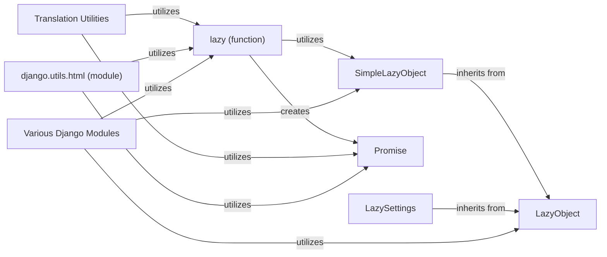

## Component Details

This subsystem in Django provides a robust and flexible mechanism for "lazy evaluation," deferring the computation or loading of an object until it is actually needed. This is crucial for optimizing performance by avoiding unnecessary work, especially during application startup or for infrequently accessed resources.

### LazyObject
The foundational abstract base class (`django.utils.functional.LazyObject`) for implementing lazy loading. It acts as a transparent proxy, intercepting attribute access and method calls to trigger the deferred initialization of an encapsulated object. Subclasses *must* implement the `_setup()` method to define how the wrapped object is initialized. This class handles the core proxying logic, including special methods like `__getattribute__`, `__setattr__`, `__delattr__`, and various dunder methods (`__bytes__`, `__str__`, `__bool__`, `__dir__`, `__eq__`, `__lt__`, `__gt__`, `__ne__`, `__hash__`, `__getitem__`, `__setitem__`, `__delitem__`, `__iter__`, `__len__`, `__contains__`) to ensure the `LazyObject` behaves exactly like the wrapped object once initialized. It also includes custom `__reduce__`, `__copy__`, and `__deepcopy__` methods for proper serialization and copying.

**Related Classes/Methods**:

- <a href="https://github.com/django/django/blob/master/django/utils/functional.py#L258-L371" target="_blank" rel="noopener noreferrer">`django.utils.functional.LazyObject` (258:371)</a>

### SimpleLazyObject
A concrete subclass of `LazyObject` (`django.utils.functional.SimpleLazyObject`) that simplifies the creation of lazy objects. It takes a callable (function or lambda) during its initialization. This callable is then executed by the `_setup()` method (which `SimpleLazyObject` implements) only when the object's attributes or methods are first accessed. This provides a straightforward way to implement lazy evaluation for various data types or configurations without complex custom `_setup()` implementations. It also overrides `__repr__`, `__copy__`, `__deepcopy__`, `__add__`, and `__radd__` for more specific lazy behavior.

**Related Classes/Methods**:

- <a href="https://github.com/django/django/blob/master/django/utils/functional.py#L382-L436" target="_blank" rel="noopener noreferrer">`django.utils.functional.SimpleLazyObject` (382:436)</a>

### lazy (function)
A utility function (`django.utils.functional.lazy`) that acts as a decorator or factory to create lazy-evaluated callable wrappers. It returns an instance of an internal proxy class (`__proxy__`) that inherits from `Promise`. This mechanism defers the execution of the wrapped function until its result is explicitly needed. It dynamically adds proxy methods for all methods found in the specified `resultclasses`, ensuring that calling any method on the lazy object triggers the underlying function's execution.

**Related Classes/Methods**:

- <a href="https://github.com/django/django/blob/master/django/utils/functional.py#L76-L196" target="_blank" rel="noopener noreferrer">`django.utils.functional.lazy` (76:196)</a>

### Promise
A lightweight base class (`django.utils.functional.Promise`) that serves as a marker interface for objects that represent a "promise" of a future value. It's primarily used internally by the `lazy` function to identify and handle lazy-evaluated objects consistently across Django's codebase. It defines basic dunder methods like `__repr__`, `__str__`, `__eq__`, `__ne__`, `__lt__`, `__le__`, `__gt__`, `__ge__`, `__hash__`, `__format__`, `__add__`, `__radd__`, and `__mod__` to ensure the lazy object behaves like the eventual result.

**Related Classes/Methods**:

- <a href="https://github.com/django/django/blob/master/django/utils/functional.py#L67-L73" target="_blank" rel="noopener noreferrer">`django.utils.functional.Promise` (67:73)</a>

### LazySettings
A specialized implementation of `LazyObject` (`django.conf.LazySettings`) used to manage Django's project settings. It defers the loading and processing of the actual settings object until any setting is first accessed. This is a critical component for allowing dynamic and environment-dependent settings without immediate overhead, contributing significantly to Django's flexible and configurable nature.

**Related Classes/Methods**:

- <a href="https://github.com/django/django/blob/master/django/template/backends/django.py#L100-L170" target="_blank" rel="noopener noreferrer">`django.conf.LazySettings` (100:170)</a>

### Translation Utilities
This module contains the core implementation for Django's internationalization (i18n) and localization (l10n) functionalities. It extensively utilizes lazy evaluation, particularly through functions like `gettext_lazy`, to defer string translation until the translated string is actually needed (e.g., when rendered in a template). This prevents unnecessary translation lookups for strings that might never be displayed.

**Related Classes/Methods**:

- <a href="https://github.com/django/django/blob/master/django/utils/translation/trans_real.py#L1-L10000" target="_blank" rel="noopener noreferrer">`django.utils.translation.trans_real` (1:10000)</a>

### django.utils.html (module)
This module provides utilities for working with HTML, including functions that leverage lazy evaluation for performance. For instance, `format_html_lazy` defers the HTML formatting operation until the resulting string is actually accessed. This is beneficial in scenarios where HTML might be constructed but not always rendered, avoiding premature and potentially costly string manipulations.

**Related Classes/Methods**:

- <a href="https://github.com/django/django/blob/master/django/utils/html.py#L1-L10000" target="_blank" rel="noopener noreferrer">`django.utils.html` (1:10000)</a>

### Various Django Modules
Represents various Django modules that utilize lazy evaluation components.

**Related Classes/Methods**: _None_

### [FAQ](https://github.com/CodeBoarding/GeneratedOnBoardings/tree/main?tab=readme-ov-file#faq)