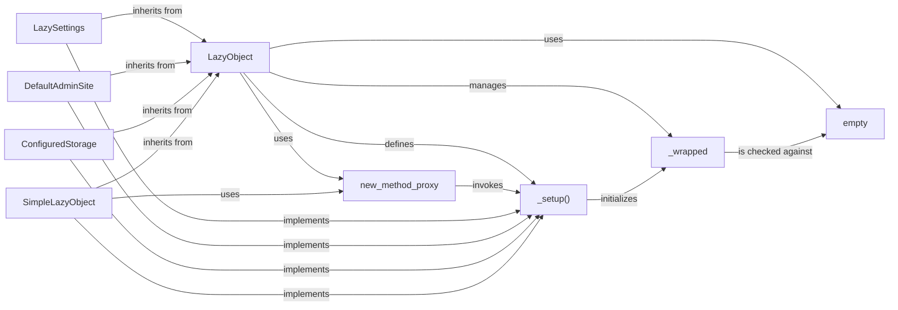

## Component Details

The `LazyObject` subsystem in Django provides a powerful and flexible mechanism for lazy loading, deferring the initialization of objects until they are actually needed. This approach significantly improves application startup performance and resource efficiency by avoiding unnecessary computations or resource allocations.

### LazyObject
The abstract base class (`django.utils.functional.LazyObject`) that forms the core of Django's lazy loading. It acts as a transparent proxy, intercepting attribute access and method calls to trigger the deferred initialization of an underlying "wrapped" object.

**Related Classes/Methods**:

- <a href="https://github.com/django/django/blob/master/django/utils/functional.py#L258-L371" target="_blank" rel="noopener noreferrer">`django.utils.functional.LazyObject` (258:371)</a>

### _wrapped
An internal attribute within `LazyObject` that stores the actual object being lazily loaded. It is initially set to the `empty` sentinel and populated by the `_setup()` method when the object is first accessed.

**Related Classes/Methods**:

- <a href="https://github.com/django/django/blob/master/django/utils/functional.py#L1-L1" target="_blank" rel="noopener noreferrer">`django.utils.functional.LazyObject:_wrapped` (1:1)</a>

### _setup()
An abstract method defined in `LazyObject` that *must* be overridden by concrete subclasses. This method contains the specific logic for instantiating the real object and assigning it to `self._wrapped`. It's the hook for custom lazy loading behavior.

**Related Classes/Methods**:

- <a href="https://github.com/django/django/blob/master/django/utils/functional.py#L304-L310" target="_blank" rel="noopener noreferrer">`django.utils.functional.LazyObject:_setup` (304:310)</a>

### new_method_proxy
A utility function (`django.utils.functional.new_method_proxy`) that dynamically creates proxy methods for `LazyObject`. These proxies ensure that when a method of the `LazyObject` is called, the `_setup()` method is first invoked (if the object hasn't been initialized yet), and then the call is delegated to the corresponding method on the underlying `_wrapped` object.

**Related Classes/Methods**:

- <a href="https://github.com/django/django/blob/master/django/utils/functional.py#L247-L255" target="_blank" rel="noopener noreferrer">`django.utils.functional.new_method_proxy` (247:255)</a>

### empty
A unique sentinel object (`django.utils.functional.empty`) used by `LazyObject` to indicate that its `_wrapped` attribute has not yet been initialized. This prevents conflicts with `None` if `None` is a valid value for the wrapped object.

**Related Classes/Methods**:

- <a href="https://github.com/django/django/blob/master/django/utils/functional.py#L1-L1" target="_blank" rel="noopener noreferrer">`django.utils.functional.empty` (1:1)</a>

### LazySettings
A concrete subclass of `LazyObject` (`django.conf.LazySettings`) specifically designed to lazily load Django's project settings. It overrides `_setup()` to import and configure the settings module only when a setting is first accessed.

**Related Classes/Methods**:

- <a href="https://github.com/django/django/blob/master/django/template/backends/django.py#L1-L1" target="_blank" rel="noopener noreferrer">`django.conf.LazySettings` (1:1)</a>

### DefaultAdminSite
A concrete subclass of `LazyObject` (`django.contrib.admin.sites.DefaultAdminSite`) used to lazily load the default Django Admin site instance. This defers the import and instantiation of the `AdminSite` class until it's actually accessed, which can be beneficial if the admin is not always used.

**Related Classes/Methods**:

- <a href="https://github.com/django/django/blob/master/django/contrib/admin/sites.py#L608-L614" target="_blank" rel="noopener noreferrer">`django.contrib.admin.sites.DefaultAdminSite` (608:614)</a>

### ConfiguredStorage
A concrete subclass of `LazyObject` (`django.contrib.staticfiles.storage.ConfiguredStorage`) responsible for lazily loading the configured static files storage backend. This prevents the storage backend from being initialized until static files are actually accessed.

**Related Classes/Methods**:

- <a href="https://github.com/django/django/blob/master/django/contrib/staticfiles/storage.py#L540-L542" target="_blank" rel="noopener noreferrer">`django.contrib.staticfiles.storage.ConfiguredStorage` (540:542)</a>

### SimpleLazyObject
A simpler, more generic concrete implementation of `LazyObject` (`django.utils.functional.SimpleLazyObject`). It takes a callable function during initialization and uses this callable in its `_setup()` method to get the actual object. It's suitable for general-purpose lazy evaluation when no complex setup logic is required beyond calling a function.

**Related Classes/Methods**:

- <a href="https://github.com/django/django/blob/master/django/utils/functional.py#L382-L436" target="_blank" rel="noopener noreferrer">`django.utils.functional.SimpleLazyObject` (382:436)</a>

### [FAQ](https://github.com/CodeBoarding/GeneratedOnBoardings/tree/main?tab=readme-ov-file#faq)