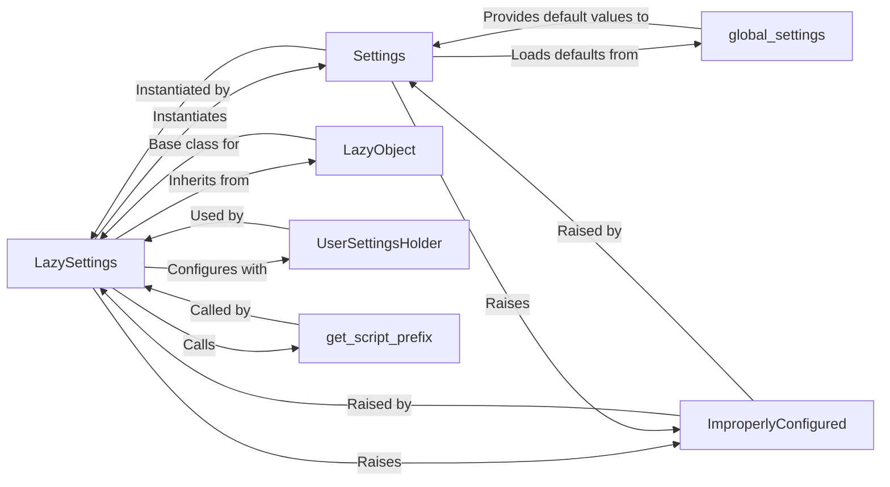

## Component Details

This overview details the core components responsible for managing Django's project settings, focusing on their structure, flow, and purpose. These components are fundamental to how a Django application initializes and operates, providing a flexible and efficient configuration mechanism.

### LazySettings
The primary interface for accessing Django's project settings. It acts as a proxy, delaying the actual loading of settings until an attribute is first accessed. This "lazy" evaluation prevents unnecessary imports and computations during application initialization. It also handles the merging of default and user-defined settings and applies specific transformations like adding script prefixes to URLs.

**Related Classes/Methods**: _None_

### Settings
This class represents the concrete, loaded configuration of the Django project. When `LazySettings` is first accessed, it instantiates a `Settings` object. This object is responsible for loading default settings from `global_settings.py` and then overriding them with values from the user-defined settings module (specified by the `DJANGO_SETTINGS_MODULE` environment variable). It also performs basic type validation for certain settings.

**Related Classes/Methods**: _None_

### LazyObject
A foundational utility class from `django.utils.functional` that provides the generic mechanism for lazy evaluation. It acts as a proxy for another object, deferring its instantiation until one of its attributes is accessed. `LazySettings` inherits from `LazyObject` to implement its lazy loading behavior, delegating attribute access to the underlying `Settings` object once it's initialized.

**Related Classes/Methods**: _None_

### global_settings
This is a Python module that defines all the default configuration values for a Django project. It serves as the baseline for all Django applications, providing sensible defaults that can be overridden by a project's specific `settings.py` file.

**Related Classes/Methods**: _None_

### ImproperlyConfigured
A custom exception class within Django's core exceptions. It is raised when Django detects a critical configuration error, such as missing required settings or incorrect setting types. This helps developers identify and resolve configuration issues early.

**Related Classes/Methods**: _None_

### UserSettingsHolder
A simple internal class used by `LazySettings.configure()` to hold and manage user-defined settings when they are provided programmatically (e.g., in tests or specific deployment setups) rather than through the `DJANGO_SETTINGS_MODULE` environment variable. It allows for overriding default settings with custom values.

**Related Classes/Methods**: _None_

### get_script_prefix
A utility function from `django.urls.base` that determines the script prefix for URLs. This is particularly relevant when a Django application is served from a subpath (e.g., `/myapp/`) rather than the root of a domain. `LazySettings` uses this function to automatically adjust `MEDIA_URL` and `STATIC_URL` if they are relative paths.

**Related Classes/Methods**: _None_

### [FAQ](https://github.com/CodeBoarding/GeneratedOnBoardings/tree/main?tab=readme-ov-file#faq)