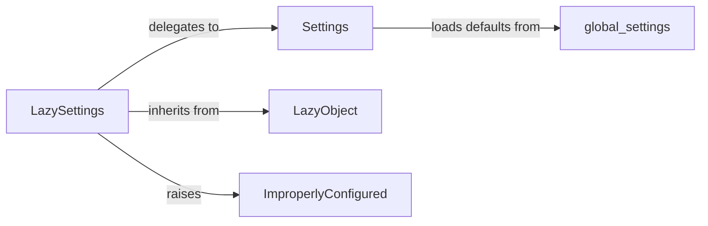

## Component Details

The `LazySettings` subsystem in Django is a critical part of its configuration management, designed to optimize application startup by deferring the loading of settings until they are actually needed. It acts as a proxy, providing a unified interface to all configuration variables while ensuring that the underlying settings are only loaded on first access.

### LazySettings
This is the primary interface for accessing Django's project settings. It defers the actual loading of settings until an attribute is accessed, improving application startup performance. It acts as a proxy to the concrete `Settings` object.

**Related Classes/Methods**:

- <a href="https://github.com/django/django/blob/master/django/template/backends/django.py#L0-L0" target="_blank" rel="noopener noreferrer">`django.conf.LazySettings` (0:0)</a>
- `LazySettings:_setup` (0:0)
- `LazySettings:__getattr__` (0:0)
- `LazySettings:__setattr__` (0:0)

### Settings
The concrete class that holds the actual configuration values. When `LazySettings` is initialized, it instantiates this class. It's responsible for loading default settings from `global_settings` and then overriding them with values from the user-defined settings module (e.g., `settings.py`).

**Related Classes/Methods**:

- <a href="https://github.com/django/django/blob/master/django/template/backends/django.py#L0-L0" target="_blank" rel="noopener noreferrer">`django.conf.Settings` (0:0)</a>

### global_settings
A Python module that defines the default configuration for any Django project. It provides sensible baseline values for a wide range of settings, which can then be overridden by project-specific settings.

**Related Classes/Methods**:

- <a href="https://github.com/django/django/blob/master/django/conf/global_settings.py#L0-L0" target="_blank" rel="noopener noreferrer">`django.conf.global_settings` (0:0)</a>

### LazyObject
A utility class in Django's functional utilities that provides the core mechanism for lazy initialization. `LazySettings` inherits from `LazyObject`, leveraging its `_setup` method and attribute access interception (`__getattr__`, `__setattr__`) to implement deferred loading.

**Related Classes/Methods**:

- <a href="https://github.com/django/django/blob/master/django/utils/functional.py#L258-L371" target="_blank" rel="noopener noreferrer">`django.utils.functional.LazyObject` (258:371)</a>
- `LazyObject:_setup` (0:0)
- `LazyObject:__getattr__` (0:0)
- `LazyObject:__setattr__` (0:0)

### ImproperlyConfigured
A specific exception class raised by Django when critical settings are missing or incorrectly configured. `LazySettings` raises this exception if `DJANGO_SETTINGS_MODULE` is not defined or if essential settings like `SECRET_KEY` are empty.

**Related Classes/Methods**:

- <a href="https://github.com/django/django/blob/master/django/core/exceptions.py#L0-L0" target="_blank" rel="noopener noreferrer">`django.core.exceptions.ImproperlyConfigured` (0:0)</a>

### [FAQ](https://github.com/CodeBoarding/GeneratedOnBoardings/tree/main?tab=readme-ov-file#faq)