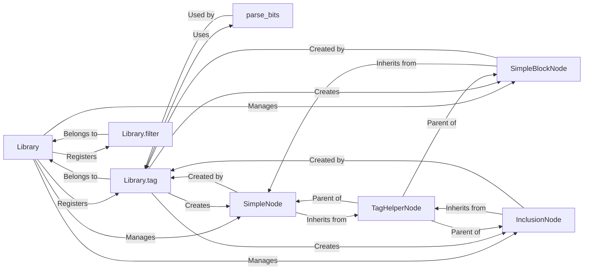

## Component Details

Django Template Library Subsystem

### Library
The Library class serves as the central registry for all custom template tags and filters. It initializes and maintains internal dictionaries (self.tags and self.filters) to store registered callables. It provides the primary API (tag, filter, simple_tag, simple_block_tag, inclusion_tag) for developers to define and register various types of tags and filters, making them available for use in Django templates.

**Related Classes/Methods**:

- <a href="https://github.com/django/django/blob/master/django/template/library.py#L15-L287" target="_blank" rel="noopener noreferrer">`django.template.library.Library` (15:287)</a>

### Library.tag
This method within the Library class acts as both a function and a decorator to register a callable as a *compiled* template tag. It handles various registration syntaxes (e.g., @register.tag, @register.tag('name')). Internally, it stores the provided compile_function (which is responsible for returning a Node instance) in the self.tags dictionary. This method is a lower-level mechanism often utilized by higher-level tag registration helpers like simple_tag, simple_block_tag, and inclusion_tag.

**Related Classes/Methods**:

- <a href="https://github.com/django/django/blob/master/django/template/library.py#L27-L49" target="_blank" rel="noopener noreferrer">`django.template.library.Library:tag` (27:49)</a>

### Library.filter
Similar to Library.tag, this method registers a callable as a template filter. It supports different registration syntaxes and stores the filter function in the self.filters dictionary. Crucially, it handles setting specific flags (expects_localtime, is_safe, needs_autoescape) on the registered filter function, which dictate how the filter interacts with Django's auto-escaping mechanism and timezone handling during template rendering.

**Related Classes/Methods**:

- <a href="https://github.com/django/django/blob/master/django/template/library.py#L55-L96" target="_blank" rel="noopener noreferrer">`django.template.library.Library:filter` (55:96)</a>

### parse_bits
This is a utility function responsible for parsing the raw arguments ("bits") provided to template tags within a template. It extracts positional and keyword arguments, performs rigorous syntax validation (e.g., ensuring no positional arguments follow keyword arguments, checking for unexpected or duplicate arguments), and compiles any filter expressions present in the arguments. This function is essential for converting the raw string input from a template into structured Python arguments that the tag's underlying function can process.

**Related Classes/Methods**:

- <a href="https://github.com/django/django/blob/master/django/template/library.py#L383-L468" target="_blank" rel="noopener noreferrer">`django.template.library.parse_bits` (383:468)</a>

### TagHelperNode
This serves as an abstract base class for various types of template nodes that are created by the Library's tag registration methods (e.g., simple_tag, simple_block_tag, inclusion_tag). It inherits from Django's Node class and provides common functionality for resolving arguments from the template context (get_resolved_arguments) before they are passed to the decorated Python function. It encapsulates the logic for managing the tag's associated function, context awareness, and arguments.

**Related Classes/Methods**:

- <a href="https://github.com/django/django/blob/master/django/template/library.py#L290-L308" target="_blank" rel="noopener noreferrer">`django.template.library.TagHelperNode` (290:308)</a>

### SimpleNode
A concrete implementation of TagHelperNode specifically designed for simple template tags (those registered via Library.simple_tag). Its render method is responsible for resolving the tag's arguments using get_resolved_arguments, executing the associated Python function (self.func), and optionally storing the output in a specified context variable (as var_name). It also applies conditional HTML escaping to the output based on the template's auto-escape settings.

**Related Classes/Methods**:

- <a href="https://github.com/django/django/blob/master/django/template/library.py#L311-L326" target="_blank" rel="noopener noreferrer">`django.template.library.SimpleNode` (311:326)</a>

### SimpleBlockNode
This class inherits from SimpleNode and is tailored for block template tags (registered via Library.simple_block_tag). Unlike simple tags, block tags enclose a section of the template (a "nodelist"). SimpleBlockNode manages this nodelist and, within its get_resolved_arguments method, renders the enclosed content. This rendered content is then passed as a specific "content" argument to the tag's Python function, allowing the function to process or manipulate the block's inner content.

**Related Classes/Methods**:

- <a href="https://github.com/django/django/blob/master/django/template/library.py#L329-L343" target="_blank" rel="noopener noreferrer">`django.template.library.SimpleBlockNode` (329:343)</a>

### InclusionNode
This class handles the rendering of inclusion tags (registered via Library.inclusion_tag). It inherits from TagHelperNode. Its render method resolves arguments, calls the tag's Python function to obtain a context dictionary, and then renders a *separate template file* (specified during registration) using this newly created context. It also includes logic for caching the rendered template object and propagating the CSRF token to the included template.

**Related Classes/Methods**:

- <a href="https://github.com/django/django/blob/master/django/template/library.py#L346-L380" target="_blank" rel="noopener noreferrer">`django.template.library.InclusionNode` (346:380)</a>

### [FAQ](https://github.com/CodeBoarding/GeneratedOnBoardings/tree/main?tab=readme-ov-file#faq)