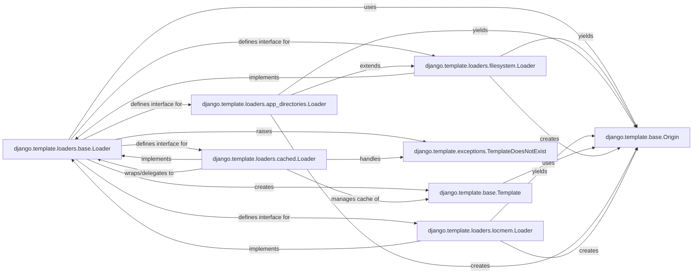

## Component Details

The `Loader` subsystem in Django's template engine is responsible for locating, reading, and compiling template files into usable `Template` objects. It provides a flexible and extensible mechanism for managing template sources from various locations.

### django.template.loaders.base.Loader
This is the abstract base class that defines the fundamental interface for all template loaders. It provides the core logic for `get_template`, which orchestrates the template loading process by iterating through potential template sources (`Origin` objects) and compiling the first found content into a `Template` object. It mandates that concrete subclasses implement `get_template_sources` to specify how they find template files.

**Related Classes/Methods**:

- <a href="https://github.com/django/django/blob/master/django/template/loaders/base.py#L7-L34" target="_blank" rel="noopener noreferrer">`django.template.loaders.base.Loader:get_template` (7:34)</a>
- <a href="https://github.com/django/django/blob/master/django/template/loaders/base.py#L36-L43" target="_blank" rel="noopener noreferrer">`django.template.loaders.base.Loader:get_template_sources` (36:43)</a>

### django.template.loaders.filesystem.Loader
A concrete implementation of `Loader` that searches for templates within a predefined list of file system directories (typically configured in `TEMPLATES['DIRS']`). It implements `get_template_sources` to yield `Origin` objects representing file paths and `get_contents` to read the template content from disk.

**Related Classes/Methods**:

- <a href="https://github.com/django/django/blob/master/django/template/loaders/filesystem.py#L1-L1" target="_blank" rel="noopener noreferrer">`django.template.loaders.filesystem.Loader:get_template_sources` (1:1)</a>
- <a href="https://github.com/django/django/blob/master/django/template/loaders/filesystem.py#L1-L1" target="_blank" rel="noopener noreferrer">`django.template.loaders.filesystem.Loader:get_contents` (1:1)</a>

### django.template.loaders.app_directories.Loader
Another concrete `Loader` implementation that extends `FilesystemLoader`. It specializes in discovering templates located in the `templates` subdirectory of installed Django applications, providing a standard way to organize reusable templates within Django projects.

**Related Classes/Methods**:

- <a href="https://github.com/django/django/blob/master/django/template/loaders/app_directories.py#L1-L1" target="_blank" rel="noopener noreferrer">`django.template.loaders.app_directories.Loader:get_dirs` (1:1)</a>

### django.template.loaders.cached.Loader
A specialized `Loader` that acts as a wrapper around other loaders. Its primary function is to cache compiled `Template` objects in memory after they are loaded by its wrapped loaders. This significantly improves performance by avoiding repeated parsing and compilation of frequently accessed templates. It also handles caching of `TemplateDoesNotExist` exceptions.

**Related Classes/Methods**: _None_

### django.template.loaders.locmem.Loader
A simple in-memory loader primarily used for testing or when templates are dynamically generated and stored in a dictionary. Unlike other loaders, it does not load from files but retrieves template content directly from an internal dictionary.

**Related Classes/Methods**: _None_

### django.template.base.Template
Represents a compiled template. Loaders are responsible for taking raw template content (obtained from an `Origin`) and transforming it into instances of this class. The `Template` object then handles parsing the template string into a node list and rendering it with a given context.

**Related Classes/Methods**: _None_

### django.template.base.Origin
An object that encapsulates information about the source of a template, such as its name (path), the original template name, and the `Loader` instance that found it. This is crucial for debugging and error reporting, as it helps pinpoint where a template was loaded from.

**Related Classes/Methods**: _None_

### django.template.exceptions.TemplateDoesNotExist
A specific exception raised by loaders when they are unable to find a requested template. This allows for graceful error handling and fallback mechanisms in the template loading process, providing detailed information about the `tried` sources.

**Related Classes/Methods**:

- <a href="https://github.com/django/django/blob/master/django/template/exceptions.py#L1-L1" target="_blank" rel="noopener noreferrer">`django.template.exceptions.TemplateDoesNotExist:tried` (1:1)</a>

### [FAQ](https://github.com/CodeBoarding/GeneratedOnBoardings/tree/main?tab=readme-ov-file#faq)