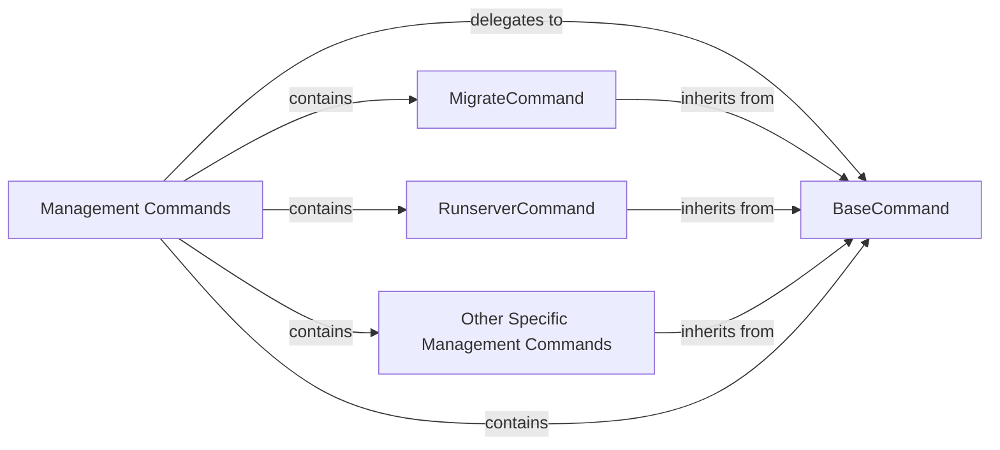

## Details

The Django management command subsystem provides a robust and extensible command-line interface for administrative tasks. The core flow begins with the `Management Commands` component, which acts as a dispatcher, receiving command-line input and delegating it to specific concrete command implementations. All concrete commands, such as `MigrateCommand`, `RunserverCommand`, and `Other Specific Management Commands` (e.g., `makemigrations`), inherit from the `BaseCommand` abstract class. This `BaseCommand` defines the common structure and lifecycle for all commands, including argument parsing and the `handle()` method where the command's primary logic resides. This inheritance pattern ensures consistency and promotes code reuse across various administrative functionalities.

### Management Commands [[Expand]](./Management_Commands.md)
This is the overarching component that provides a structured command-line interface for executing administrative tasks within a Django project. It acts as the entry point for various project-specific and framework-provided commands, embodying the Command pattern.

**Related Classes/Methods**:

- <a href="https://github.com/django/django//blob/django/core/management/base.py#L187-L619" target="_blank" rel="noopener noreferrer">`django.core.management.base.BaseCommand`:187-619</a>

### BaseCommand
The abstract base class for all Django management commands. It defines the common interface, argument parsing mechanisms, and boilerplate logic (e.g., `add_arguments()`, `handle()`) that all concrete commands must implement or override. It serves as the foundation for extensibility.

**Related Classes/Methods**:

- <a href="https://github.com/django/django//blob/django/core/management/base.py#L187-L619" target="_blank" rel="noopener noreferrer">`django.core.management.base.BaseCommand`:187-619</a>

### MigrateCommand
A concrete implementation of `BaseCommand` specifically responsible for applying and unapplying database migrations. It interacts with Django's ORM and database backend to manage schema changes.

**Related Classes/Methods**:

- <a href="https://github.com/django/django//blob/django/core/management/commands/migrate.py#L17-L509" target="_blank" rel="noopener noreferrer">`django.core.management.commands.migrate.Command`:17-509</a>

### RunserverCommand
A concrete implementation of `BaseCommand` that starts a lightweight development web server. It handles serving static files and processing HTTP requests during development.

**Related Classes/Methods**:

- <a href="https://github.com/django/django//blob/django/core/management/commands/runserver.py#L27-L201" target="_blank" rel="noopener noreferrer">`django.core.management.commands.runserver.Command`:27-201</a>

### Other Specific Management Commands
This represents the collection of other concrete management commands provided by Django (e.g., `makemigrations`, `collectstatic`, `createsuperuser`, `test`). Each command extends `BaseCommand` to perform a specific administrative function.

**Related Classes/Methods**: _None_

### [FAQ](https://github.com/CodeBoarding/GeneratedOnBoardings/tree/main?tab=readme-ov-file#faq)