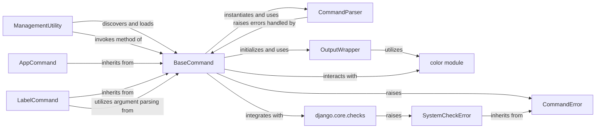

## Component Details

The Management Commands Framework in Django provides the foundational structure for creating and executing command-line utilities. It's crucial because it offers the primary interface for developers to automate and manage various aspects of their Django projects from the command line, such as running the development server, applying database migrations, or collecting static files.

### BaseCommand
This is the abstract base class from which all Django management commands inherit. It defines the core lifecycle of a command, including argument parsing, option handling, system checks, and the execution flow (`run_from_argv`, `execute`, `handle`). It provides the essential blueprint for any custom command.

**Related Classes/Methods**: _None_

### CommandParser
A specialized subclass of `argparse.ArgumentParser` tailored for Django management commands. It handles the parsing of command-line arguments, ensuring that commands receive their inputs correctly and consistently.

**Related Classes/Methods**: _None_

### OutputWrapper
A utility class designed to provide consistent output formatting and styling for management commands. It wraps standard output and error streams, allowing for features like colored text.

**Related Classes/Methods**: _None_

### CommandError
The base exception class for all errors raised by Django management commands. It provides a standardized way for commands to signal failures and allows the `ManagementUtility` to gracefully handle and display error messages.

**Related Classes/Methods**: _None_

### ManagementUtility
This is the main entry point for executing Django management commands. It is responsible for discovering available commands, parsing the initial command-line arguments (like `manage.py runserver`), and dispatching the execution to the appropriate `BaseCommand` subclass.

**Related Classes/Methods**: _None_

### color module
This module provides utilities for adding ANSI color codes to terminal output, enabling management commands to display styled and more readable messages (e.g., errors in red, warnings in yellow).

**Related Classes/Methods**: _None_

### AppCommand
A concrete subclass of `BaseCommand` specifically designed for commands that operate on one or more Django application labels (e.g., `makemigrations myapp`). It provides built-in argument parsing for app labels.

**Related Classes/Methods**: _None_

### LabelCommand
Another concrete subclass of `BaseCommand` for commands that accept arbitrary string arguments, referred to as "labels." It's a more general-purpose command type than `AppCommand`.

**Related Classes/Methods**: _None_

### django.core.checks
Django's system check framework, which allows applications to register checks to validate the project's configuration, models, and other aspects. Management commands often run these checks before execution.

**Related Classes/Methods**: _None_

### SystemCheckError
A specific exception class that inherits from `CommandError`, raised when the Django system check framework identifies critical issues that prevent a command from safely proceeding.

**Related Classes/Methods**: _None_

### [FAQ](https://github.com/CodeBoarding/GeneratedOnBoardings/tree/main?tab=readme-ov-file#faq)