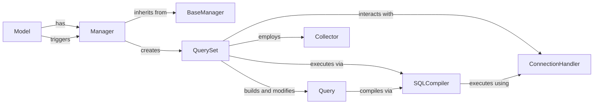

## Component Details

The `Manager` subsystem in Django's ORM provides the primary interface for interacting with the database through models. It orchestrates the process of building, executing, and retrieving results from database queries, abstracting away the complexities of SQL. These components form the backbone of Django's Object-Relational Mapper (ORM), enabling developers to interact with databases using Python objects rather than raw SQL. The **Manager** and **QuerySet** are fundamental because they provide the high-level, Pythonic API that developers use daily. They abstract away the complexities of database interactions, allowing for intuitive query construction and data manipulation. The **Model** is the core definition of the data structure and its mapping to the database. It's the starting point for all ORM operations, as it's where the `Manager` is attached. The **Query** object is crucial as the intermediate representation. It allows the `QuerySet` to build complex queries incrementally and independently of the specific SQL dialect, before handing it off for translation. The **SQLCompiler** is the essential bridge between the abstract `Query` and the concrete database. It ensures that the generated SQL is correct and optimized for the chosen database backend. The **ConnectionHandler** is vital because it manages the actual communication channels with the database. Without it, no SQL could be sent or results received. The **Collector** is critical for maintaining data integrity during deletion operations, especially in models with complex relationships, preventing orphaned records or unintended data loss. Together, these components provide a robust, flexible, and efficient system for database interaction in Django applications.

### Manager
The public-facing entry point for performing database query operations and creating new model instances. Every Django `Model` has at least one `Manager` instance (commonly `objects`). It delegates most of its work to a `QuerySet` instance.

**Related Classes/Methods**:

- <a href="https://github.com/django/django/blob/master/django/db/models/manager.py#L1-L1" target="_blank" rel="noopener noreferrer">`django/db/models/manager.py` (1:1)</a>

### BaseManager
An abstract base class that provides the foundational methods and common logic for all concrete `Manager` implementations. It defines the crucial `get_queryset()` method, which is responsible for returning the initial `QuerySet` instance, and the `from_queryset` class method used for flexible manager creation.

**Related Classes/Methods**:

- <a href="https://github.com/django/django/blob/master/django/db/models/manager.py#L1-L1" target="_blank" rel="noopener noreferrer">`django/db/models/manager.py` (1:1)</a>

### QuerySet
The workhorse of the ORM, representing a collection of database objects. It provides a rich, chainable API for filtering, ordering, annotating, and performing various database operations. `QuerySet` instances are "lazy," meaning they construct an internal `Query` object but don't execute it until results are explicitly needed (e.g., iteration, `list()`, `len()`, `get()`).

**Related Classes/Methods**:

- <a href="https://github.com/django/django/blob/master/django/db/models/query.py#L1-L1" target="_blank" rel="noopener noreferrer">`django/db/models/query.py` (1:1)</a>

### Model
The base class for all Django models, representing a database table. Each `Model` class automatically has a `Manager` instance attached, enabling database interactions. It defines the structure of the data and provides methods like `save()` and `delete()` that trigger ORM operations.

**Related Classes/Methods**:

- <a href="https://github.com/django/django/blob/master/django/db/models/base.py#L1-L1" target="_blank" rel="noopener noreferrer">`django/db/models/base.py` (1:1)</a>

### Query
A low-level, internal representation of an SQL query. It encapsulates all components of an SQL statement (e.g., SELECT, FROM, WHERE, ORDER BY, JOINs). `QuerySet` methods manipulate this object to build the desired query structure before it's passed to the `SQLCompiler`.

**Related Classes/Methods**:

- <a href="https://github.com/django/django/blob/master/django/db/models/sql/query.py#L1-L1" target="_blank" rel="noopener noreferrer">`django/db/models/sql/query.py` (1:1)</a>

### SQLCompiler
Responsible for taking a `Query` object and translating it into a raw SQL string and a set of parameters that can be executed by the specific database backend. It handles database-specific syntax, optimizations, and the final preparation of the query for execution.

**Related Classes/Methods**:

- <a href="https://github.com/django/django/blob/master/django/db/models/sql/compiler.py#L1-L1" target="_blank" rel="noopener noreferrer">`django/db/models/sql/compiler.py` (1:1)</a>

### ConnectionHandler
A global utility that manages all configured database connections. It provides the direct interface to the underlying database drivers (e.g., psycopg2 for PostgreSQL, sqlite3 for SQLite), allowing `SQLCompiler` to execute the generated SQL.

**Related Classes/Methods**:

- <a href="https://github.com/django/django/blob/master/django/db/utils.py#L1-L1" target="_blank" rel="noopener noreferrer">`django/db/utils.py` (1:1)</a>

### Collector
An internal utility primarily used during model deletion operations. It efficiently traverses and gathers all related objects that need to be deleted, nullified, or otherwise handled according to the `on_delete` rules defined in the model's relationships, ensuring data integrity during complex deletions.

**Related Classes/Methods**:

- <a href="https://github.com/django/django/blob/master/django/db/models/deletion.py#L1-L1" target="_blank" rel="noopener noreferrer">`django/db/models/deletion.py` (1:1)</a>

### [FAQ](https://github.com/CodeBoarding/GeneratedOnBoardings/tree/main?tab=readme-ov-file#faq)