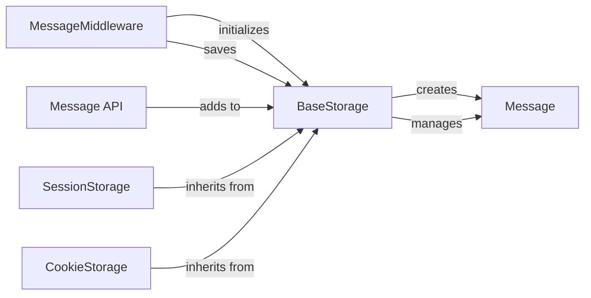

## Component Details

The Messaging Framework in Django provides a robust mechanism for displaying "one-off" notification messages to users, typically after a redirect or on the next page load. It's essential for providing immediate user feedback in web applications.

### MessageMiddleware
This middleware is the core integration point of the messaging system with Django's request-response cycle. It intercepts incoming requests to initialize the message storage backend and outgoing responses to save any new or updated messages. This ensures message persistence across redirects and subsequent page loads.

**Related Classes/Methods**:

- <a href="https://github.com/django/django/blob/master/django/contrib/messages/middleware.py#L1-L1" target="_blank" rel="noopener noreferrer">`django/contrib/messages/middleware.py` (1:1)</a>

### Message API
This component provides a high-level, user-friendly interface for developers to add messages to the current request. It acts as a facade, abstracting the complexities of the underlying storage mechanism and allowing messages of various levels (e.g., debug, info, success, warning, error) to be easily queued.

**Related Classes/Methods**:

- <a href="https://github.com/django/django/blob/master/django/contrib/messages/api.py#L1-L1" target="_blank" rel="noopener noreferrer">`django/contrib/messages/api.py` (1:1)</a>

### BaseStorage
This is an abstract base class that defines the contract and common logic for all message storage backends. It provides fundamental methods for loading, adding, and storing messages, and handles shared logic like message preparation and management of loaded messages. Concrete implementations (like `SessionStorage` or `CookieStorage`) extend this class.

**Related Classes/Methods**:

- <a href="https://github.com/django/django/blob/master/django/contrib/messages/storage/base.py#L1-L1" target="_blank" rel="noopener noreferrer">`django/contrib/messages/storage/base.py` (1:1)</a>

### SessionStorage
A concrete implementation of `BaseStorage` that stores messages in the user's session. This is a common default, leveraging Django's session framework to persist messages server-side across multiple HTTP requests.

**Related Classes/Methods**:

- <a href="https://github.com/django/django/blob/master/django/contrib/messages/storage/session.py#L1-L1" target="_blank" rel="noopener noreferrer">`django/contrib/messages/storage/session.py` (1:1)</a>

### CookieStorage
A concrete implementation of `BaseStorage` that stores messages directly in a client-side cookie. This backend uses cryptographic signing to ensure the integrity and authenticity of the messages stored in the cookie. It's an alternative to session-based storage, particularly useful for stateless applications or when session usage is undesirable.

**Related Classes/Methods**:

- <a href="https://github.com/django/django/blob/master/django/contrib/messages/storage/cookie.py#L1-L1" target="_blank" rel="noopener noreferrer">`django/contrib/messages/storage/cookie.py` (1:1)</a>

### Message
A simple data class that encapsulates the content and level of a single user notification message. It's the fundamental data structure used throughout the messaging framework, representing the actual message to be displayed.

**Related Classes/Methods**:

- <a href="https://github.com/django/django/blob/master/django/contrib/messages/storage/base.py#L1-L1" target="_blank" rel="noopener noreferrer">`django/contrib/messages/storage/base.py` (1:1)</a>

### [FAQ](https://github.com/CodeBoarding/GeneratedOnBoardings/tree/main?tab=readme-ov-file#faq)